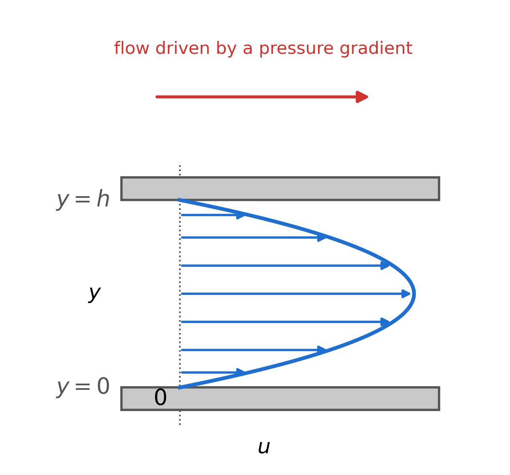

# Homework 1

Due: Friday 4 September, 2026 11:59PM. Submitted to GradeScope.

## 1. Some conceptual questions

State your answer and add a quick justification, if appropriate.

(a) In class we briefly looked at "pressure-driven flow" between two plates:

{width=50%}

I'll emphasize: this is *pressure-driven*... which direction is the pressure gradient? And which direction is the shear force from the walls on the fluid? (Hint: viscous forces are basically friction, which resists motion.)

(b) Look up the values for the viscosity of air and water at 10°C. How much more viscous is water than air? [Wolfram Alpha](https://www.wolframalpha.com) might have the answers...

(c) Look up the density of air and water at 10°C. How much more dense is water than air?

(d) The viscosity used in Newton's Law of Viscosity, $\mu$ is sometimes made more specific as the "dynamic viscosity". It has units of Pa∙s. We'll talk about another representation sometimes, the "kinematic viscosity", defined as $\nu = \mu/\rho$. Compute the values of $\nu$ for both air and water.

I think it is worthwhile to memorize these numbers, at least to the nearest power of 10. That way, if someone ever claims the density of water is 1 kg/m³, you'll immediately be able to point out the mistake!

## 2. The vector velocity function...

$$
\mathbf{u}(x,y)=\left<u_x(x,y),u_y(x,y),0\right> = \left<\sin{\pi x}\cos{\pi y},-\cos{\pi x}\sin{\pi y},0\right>.
$$
is defined on the domain $0\leq x\leq 1$, $0\leq y\leq 1$.

(a) Sketch the flow field. You can use Wolfram Alpha or similar to see it on your computer, but make the drawing by hand. Include numbers on your axes and directions for the flow.
(b) Calculate the **divergence** of this flow field.
(c) Calculate the **curl** of this flow field.

## 3. Flow passes over ...

... a flat, horizontal surface, with an $x$-velocity distribution given by

$$
u(x,y)=U\left[\frac{3}{2}\left(\frac{y}{5}\sqrt{\frac{\rho U}{\mu x}}\right)-\frac{1}{2}\left(\frac{y}{5}\sqrt{\frac{\rho U}{\mu x}}\right)^3\right].
$$

Here, $x$ is the coordinate along the surface in the flow direction, and it spans $0\rightarrow L$; $y$ is the distance above the surface, with $y=0$ being the surface and $y>0$ being in the flow; and $z$ is the coordinate along the surface perpendicular to the flow direction, spanning $0\rightarrow W$. $U$, $\rho$, and $\mu$ are constants.

(a) What is the shear stress on the surface, $\tau(x,z)$?
(b) The simple shear flow we discussed in class does not vary in $x$ or $z$, and so the conversion between shear stress and force was a simple multiplication by area: $F = \tau \cdot A$. In the present case, the flow varies with position, and so we will need to do an integration. What is the total shear force on the surface, $F_\text{shear}$?

Note: You may use [Wolfram Alpha](https://www.wolframalpha.com) in this class **as part of** your solution. Something like the following is appropriate.

"We integrate the shear stress equation over the surface to get the force

$$
F=\int\limits_0^{0.9}\int\limits_0^{0.14} 5x z^2 dx dz.
$$

Via Wolfram Alpha, this calculates as 0.0119 N."