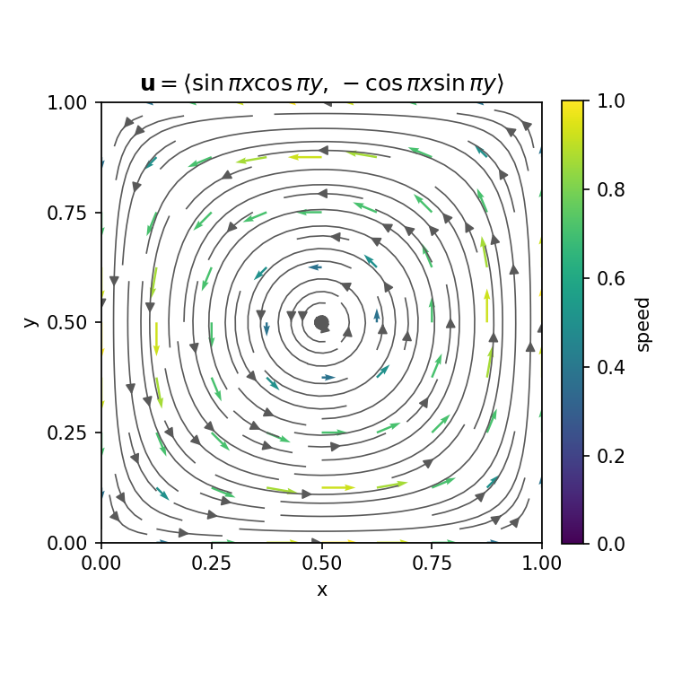

# Homework 1 Solutions

$$
\newcommand{\pd}[2]{\dfrac{\partial #1}{\partial #2}}
\newcommand{\bnabla}{\boldsymbol{\nabla}}
$$

## 1. Some conceptual questions

State your answer and add a quick justification, if appropriate.

(a) In class we briefly looked at "pressure-driven flow" between two plates:

{width=50%}

I'll emphasize: this is *pressure-driven*... which direction is the pressure gradient? And which direction is the shear force from the walls on the fluid? (Hint: viscous forces are basically friction, which resists motion.)

::: {.callout-tip title="Solution" collapse="true"}
Pressure is higher upstream and lower downstream, and so the **gradient points upstream**. However, note that this means the net force due to pressure points downstream. Once flow is occurring it is resisted by friction at the walls — the shear force at the walls points **upstream**. At steady-state, these forces balance each other.
:::

(b) Look up the values for the viscosity of air and water at 10°C. How much more viscous is water than air? [Wolfram Alpha](https://www.wolframalpha.com) might have the answers...

::: {.callout-tip title="Solution" collapse="true"}
At 10°C: $\mu_\text{water}\approx 1.31\times10^{-3}\ \text{Pa}\cdot\text{s}$, $\mu_\text{air}\approx1.77\times10^{-5}\ \text{Pa}\cdot\text{s}$.

$$
\frac{\mu_\text{water}}{\mu_\text{air}} \approx \frac{1.31\times10^{-3}}{1.77\times10^{-5}} \approx 74.
$$

So water is roughly 70–75 times more viscous than air.
:::

(c) Look up the density of air and water at 10°C. How much more dense is water than air?

::: {.callout-tip title="Solution" collapse="true"}
At 10°C: $\rho_\text{water}\approx 1000\ \text{kg/m}^3$, $\rho_\text{air}\approx 1.25\ \text{kg/m}^3$.

$$
\frac{\rho_\text{water}}{\rho_\text{air}} \approx \frac{1000}{1.25} \approx 800.
$$

Water is about 800 times denser than air — a much bigger ratio than the viscosity ratio in (b).
:::

(d) The viscosity used in Newton's Law of Viscosity, $\mu$ is sometimes made more specific as the "dynamic viscosity". It has units of Pa∙s. We'll talk about another representation sometimes, the "kinematic viscosity", defined as $\nu = \mu/\rho$. Compute the values of $\nu$ for both air and water.

I think it is worthwhile to memorize these numbers, at least to the nearest power of 10. That way, if someone ever claims the density of water is 1 kg/m³, you'll immediately be able to point out the mistake!

::: {.callout-tip title="Solution" collapse="true"}
$$
\nu_\text{water} = \frac{\mu_\text{water}}{\rho_\text{water}} \approx \frac{1.31\times10^{-3}}{1000} \approx 1.3\times10^{-6}\ \text{m}^2/\text{s},
$$

$$
\nu_\text{air} = \frac{\mu_\text{air}}{\rho_\text{air}} \approx \frac{1.77\times10^{-5}}{1.25} \approx 1.4\times10^{-5}\ \text{m}^2/\text{s}.
$$

Notice air's *dynamic* viscosity is much smaller than water's, but air's *kinematic* viscosity is about 10 times *larger*.
:::

## 2. The vector velocity function...

$$
\mathbf{u}(x,y)=\left<u_x(x,y),u_y(x,y),0\right> = \left<\sin{\pi x}\cos{\pi y},-\cos{\pi x}\sin{\pi y},0\right>.
$$
is defined on the domain $0\leq x\leq 1$, $0\leq y\leq 1$.

(a) Sketch the flow field. You can use Wolfram Alpha or similar to see it on your computer, but make the drawing by hand. Include numbers on your axes and directions for the flow.

::: {.callout-tip title="Solution" collapse="true"}
A few points anchor the sketch: $(0.5,0.5)$ is a stagnation point ($u_x=\sin(0.5\pi)\cos(0.5\pi)=0$, $u_y=0$), and so are all four corners. Along the bottom edge $y=0$, $u_x=\sin\pi x>0$ — flow moves in the $+x$ direction. Along the right edge $x=1$, $u_y=\sin\pi y>0$ — flow moves in the $+y$ direction. That's enough to see it's a single recirculating cell filling the unit square, turning counterclockwise.

{width=60%}
:::

(b) Calculate the **divergence** of this flow field.

::: {.callout-tip title="Solution" collapse="true"}
$$
\begin{align*}
    \bnabla \cdot \boldsymbol{u} &= \pd{u_i}{x_i} = \pd{u_x}{x} + \pd{u_y}{y} + \pd{u_z}{z} \\
    &= \pd{}{x}\left(\sin \pi x \cos \pi y\right) + \pd{}{y}\left(-\cos \pi x \sin \pi y\right) + \pd{}{z}(0) \\
    &= \pi \cos \pi x \cos \pi y - \pi \cos \pi x \cos \pi y = 0 
\end{align*}
$$

We will see that the conservation of mass equation for constant-density fluids is $\bnabla \cdot \boldsymbol{u} =0$.
:::

(c) Calculate the **curl** of this flow field.

::: {.callout-tip title="Solution" collapse="true"}
$$
\begin{align*}
    \bnabla \times \boldsymbol{u} &= \left(\pd{u_z}{y}-\pd{u_y}{z}\right)\hat{x} + \left(\pd{u_x}{z}-\pd{u_z}{x}\right)\hat{y} + \left(\pd{u_y}{x}-\pd{u_x}{y}\right)\hat{z} \\
    &= \left(\pd{u_y}{x}-\pd{u_x}{y}\right)\hat{z} \qquad \text{(since $u_z=0$ and nothing depends on $z$)}\\
    &= \left[\pd{}{x}\left(-\cos \pi x \sin \pi y\right) - \pd{}{y}\left(\sin \pi x \cos \pi y\right)\right]\hat{z} \\
    &= \left[\pi \sin \pi x \sin \pi y - (-\pi \sin \pi x \sin \pi y)\right]\hat{z} = 2\pi \sin \pi x \sin \pi y \,\hat{z}
\end{align*}
$$

The curl of a flow field has a special name in fluid mechanics: **the vorticity**. And it obeys the right-hand rule: can you justify why the curl is in the $+\hat{z}$-direction by looking at the flow field?
:::

## 3. Flow passes over ...

... a flat, horizontal surface, with an $x$-velocity distribution given by

$$
u(x,y)=U\left[\frac{3}{2}\left(\frac{y}{5}\sqrt{\frac{\rho U}{\mu x}}\right)-\frac{1}{2}\left(\frac{y}{5}\sqrt{\frac{\rho U}{\mu x}}\right)^3\right].
$$

Here, $x$ is the coordinate along the surface in the flow direction, and it spans $0\rightarrow L$; $y$ is the distance above the surface, with $y=0$ being the surface and $y>0$ being in the flow; and $z$ is the coordinate along the surface perpendicular to the flow direction, spanning $0\rightarrow W$. $U$, $\rho$, and $\mu$ are constants.

(a) What is the shear stress on the surface, $\tau(x,z)$?

::: {.callout-tip title="Solution" collapse="true"}
Shear stress at the surface is defined as:
$$\tau(x,z) = \mu \pd{u}{y}~\Bigg|_{y=0}$$
Solving for $\pd{u}{y}$ yields:
$$\pd{u}{y}=U\left[ \frac{3}{10}\sqrt{\frac{\rho U}{\mu x}} - \frac{3y^2}{2}\left(\frac{1}{5}\sqrt{\frac{\rho U}{\mu x}}\right)^3\right]$$
Evaluating at the surface, $y=0$:
$$\pd{u}{y} = \frac{3U}{10}\sqrt{\frac{\rho U}{\mu x}}$$
So, the shear stress acting on the surface from the fluid is:
$$\tau(x,z)=\mu\frac{3U}{10}\sqrt{\frac{\rho U}{\mu x}} = \frac{3U}{10}\sqrt{\frac{\rho U \mu}{x}}.$$
:::

(b) The simple shear flow we discussed in class does not vary in $x$ or $z$, and so the conversion between shear stress and force was a simple multiplication by area: $F = \tau \cdot A$. In the present case, the flow varies with position, and so we will need to do an integration. What is the total shear force on the surface, $F_\text{shear}$?

Note: You may use [Wolfram Alpha](https://www.wolframalpha.com) in this class **as part of** your solution. Something like the following is appropriate.

"We integrate the shear stress equation over the surface to get the force

$$
F=\int\limits_0^{0.9}\int\limits_0^{0.14} 5x z^2 dx dz.
$$

Via Wolfram Alpha, this calculates as 0.0119 N."

::: {.callout-tip title="Solution" collapse="true"}
Shear force is defined as the integral of the shear stress acting at a surface over the area of the surface.
$$F = \int \tau(x,z)\big|_{y=0}\,dA = \int \int \tau(x,z)\big|_{y=0}\,dx\,dz$$
Here our bounds of integration are $0<x<L$ and $0<z<W$. We've already calculated the shear stress at the surface in part (a).
$$F = \int_0^W \int_0^L \frac{3U}{10}\sqrt{\frac{\rho U \mu}{x}}\, dx\,dz$$
$$F = \frac{3U\sqrt{\rho U \mu}}{10} \int_0^W \int_0^L \frac{1}{\sqrt{x}}\, dx\,dz$$
$$F = \frac{6WU\sqrt{\rho \mu L U}}{10}$$
:::
