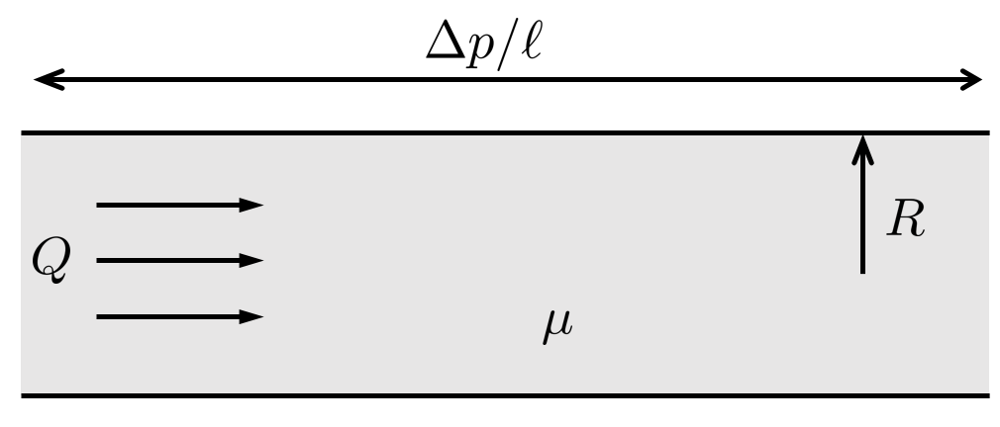
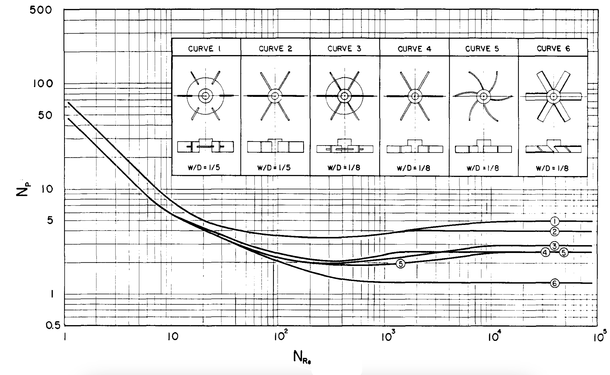

# Homework 2

Due: Friday 11 September, 2026 11:59PM. Submitted to GradeScope.

## 1. A liquid drop ...

... of density $\rho$ and radius $R$ may bounce when it impacts a surface. An interesting question: How long is the drop in contact with the interface? Call this $t_\text{c}$. Experiments show that $t_c$ is independent of the incoming velocity. Strong deformations definitely occur, signaling the surface tension $\gamma$ is important. How does the contact time scale with the drop radius?

## 2. Pressure-drop scaling

A fluid with density $\rho$ and viscosity $\mu$ flows in a tube of constant radius $R$ with volumetric flow rate $Q$ (dimensions of length³/time). In steady flow the pressure drops uniformly with distance along the tube, i.e., $\Delta p/\ell$ is a (single) constant parameter.

{width=50%}

(a) What does the B-$\Pi$ Theorem say about the number of independent dimensionless groups in this problem?

(b) One of the dimensionless groups is the Reynolds Number. If we are being particular, the Reynolds Number is

$$
\text{Re}_D \equiv \frac{\rho \bar{U} D}{\mu}
$$

where $\bar{U} \equiv Q/A$ is the average velocity and $A=\pi D^2/4$ is the pipe cross-section. Plug in the definition of $\bar{U}$ to write $\text{Re}_D$ as a function of $Q$.

(c) Find another dimensionless group... I guess I have revealed the answer to (a) is 2. Let's choose to write it in terms of $\Delta p/\ell$ (upstairs with power 1), $Q$, $R$, and $\mu$.

(d) In our cardiovascular system, cholesterol buildup on artery walls may reduce the radius $R$ of a blood vessel. Let's assume that the parameter we described in part (c) is approximately constant for the relevant range of $\text{Re}_D$. For constant $\mu$ and $Q$ (i.e., your organs demand the same amount of the same blood), a 10\% reduction in $R$ (due to a cholesterol layer on the walls) will change $\Delta p/\ell$ by what factor? 

## 3. Similitude example

A chemical company is interested in the way drops of its new chemical will splash. The chemical, called "chemical X", is caustic, and the company is hoping you can explain the splashing behavior without creating too much of a hazard in the lab. You will try to understand the splash behavior using water instead. The relevant properties are listed in the table below.

| material | $U$ | $D$ | $\rho$ | $\gamma$ (Surface Tension) |
| --- | --- | --- | --- | --- |
| chemical X | 0.5 m/s | 1 mm | 800 kg/m$^3$ | 0.025 N/m |
| water | ??? | 1 mm | 1000 kg/m$^3$ | 0.070 N/m |

(a) Describe a dimensionless number that includes the four variables above, with $D$ raised to the power 1 in the numerator of this number.
(b) As you are designing your modeling experiment, you are wondering what the appropriate speed of the water droplets should be to correctly model the behavior of chemical X. Based on the given properties in the table, what speed should you select for your experiment with water?

## 4. The performance of an impeller ...
... is often characterized by two dimensionless numbers: a modified Reynolds Number (on the $x$-axis in the diagram below) and something called "The Power Number" (on the $y$-axis). This chart contains 6 different impeller designs.

{width=50%}

::: {.column-margin}
Chart from: Bates, Robert L., Philip L. Fondy, and Robert R. Corpstein. ``Examination of some geometric parameters of impeller power.'' Industrial \& Engineering Chemistry Process Design and Development 2, no. 4 (1963): 310-314.
:::

(a) Let's assume the list of variables/parameters in this problem includes: $\rho$, $\mu$, $D$, rotation speed $\Omega$ (units of rev/s), and power $\dot{W}$ (energy-per-time). Create an equivalent Reynolds Number out of $\rho$, $\mu$, $\Omega$, and $D$, with $\rho$ in the numerator with power 1; and a dimensionless Power Number Po, from $\dot{W}$, $\rho$, $\Omega$, and $D$, with $\dot{W}$ in the numerator with power 1.

(b) Suppose we are considering impeller design 1, operating in water with $\rho=1000$ kg/m$^3$ and $\mu=10^{-3}$ Pa$\cdot$s. The impeller has diameter 0.1 m and was originally intended to operate at 1 rev/s. What is the effect on power output if we increase the rotation speed by 30\%? Write your answer as $\dot{W}_\text{new}/\dot{W}_\text{old}$.