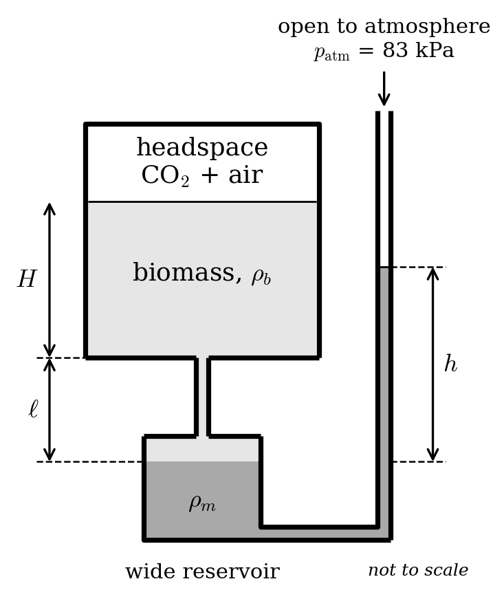
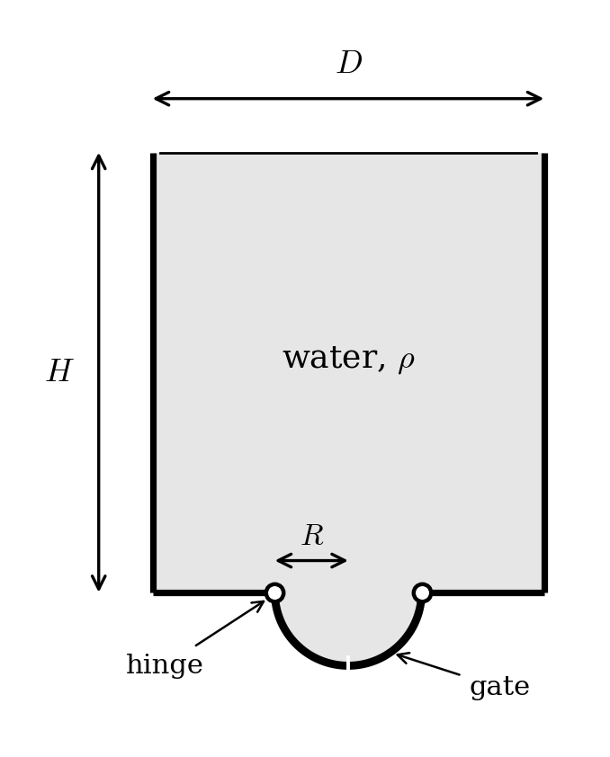

# Homework 3

Due: Friday 25 September, 2026 11:59PM. Submitted to GradeScope.

## 1. A liquid biomass ...

... with density $\rho_b = 1040$ kg/m$^3$ is fermenting in a sealed vessel in a lab in Boulder (local atmospheric pressure 83 kPa). The vessel holds 15 L of biomass, to a depth $H = 0.30$ m, with a 5 L gas headspace above it, and the whole thing is held in a 30 °C water bath. Bacteria in the biomass produce CO$_2$, which collects in the headspace on top of the air that was already there. (The biomass barely changes volume while this happens, and we'll pretend all the CO$_2$ ends up in the headspace rather than dissolving.)

To keep an eye on things, a well-type manometer is connected to a tap at the *bottom* of the vessel. The tube is filled with biomass from the tap down to the manometer fluid, which is dyed, doesn't mix with the biomass, and has density $\rho_m = 1750$ kg/m$^3$. The manometer's wide reservoir is a distance $\ell = 0.20$ m below the bottom of the vessel, and because the reservoir is wide and the tubes are narrow, the interface can be assumed to be stationary. The narrow leg is open to the atmosphere, and the reading $h$ is the height of the manometer fluid in that leg above the reservoir level.

{width=55%}

(a) Before any fermentation has happened, the headspace is at atmospheric pressure. What is the manometer reading $h_0$?

(b) The batch is "ready" once it has produced 0.002 mol of CO$_2$ **per liter** of biomass. Treat the CO$_2$ as an ideal gas at 30 °C. What are the gauge and absolute pressures in the headspace at that moment?

(c) What does the manometer read when the batch is ready?

## 2. A cylindrical container lies on its side.

It has radius $R$ and length $L$ and is filled up to a height $H$ with a fluid of density $\rho$. (That is, the circular base of the cylinder is more than half covered: $R<H<2R$.)

(a) Make a drawing of this situation, with all variables included.

(b) Determine the total force on one of the circular bases of the cylinder.

Hint: it is possible to do this by integrating over $r$ and $\theta$, but it's annoying. A better approach: define a coordinate $y:0\rightarrow H$ that starts where the cylinder touches the ground, and then define a new variable $w$, the width of the wetted part of the disk at height $y$. Hint within a hint: use the Pythagorean Theorem to write $w(y)$, and then integrate $pdwdy$.

## 3. A fire-fighting helicopter ...

... has a water bucket in the shape of a cylinder with $D=1.6$ m and $H=1.8$ m. Appended to the bottom is a gate that takes the form of two quarter-cylinders, each with $L=1.3$ m and radius $R= 0.3$ m.

{width=50%}

Note that, by symmetry, the two sides of the gate experience the same forces. Also note that forces on the flat part of the cylinder will not create a moment on the gate.

*You should work symbolically as much as you can, and then plug in the numbers only at the end of the calculation. E.g., calculate $M = ...$ symbolically, then plug in values for $\rho$, $g$, $L$, etc.*

(a) Let's focus on the left half of the gate. First: what coordinates describe the gate's surface/what coordinates will you be integrating over?

(b) Write an equation for the surface normal.

(c) Write an equation for the pressure on the gate's surface, assuming the bucket is filled to the top.

(d) Write an equation for the displacement vector from the hinge to an arbitrary location on the gate's surface. The hinge is located on the outer edge of the gate cylinder.

(e) Compute the moment that must be applied at the hinge to keep the left gate closed. Make a small sketch that shows the direction that this moment would be applied.