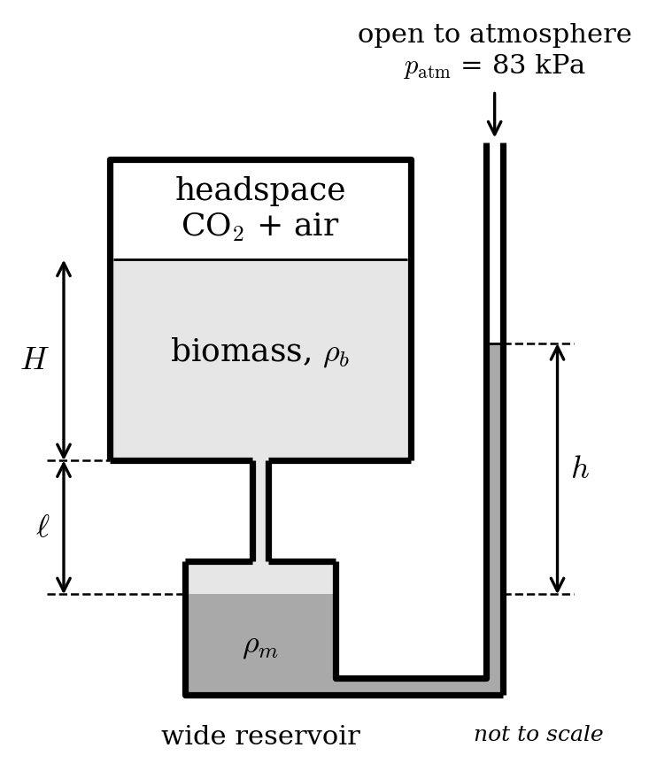
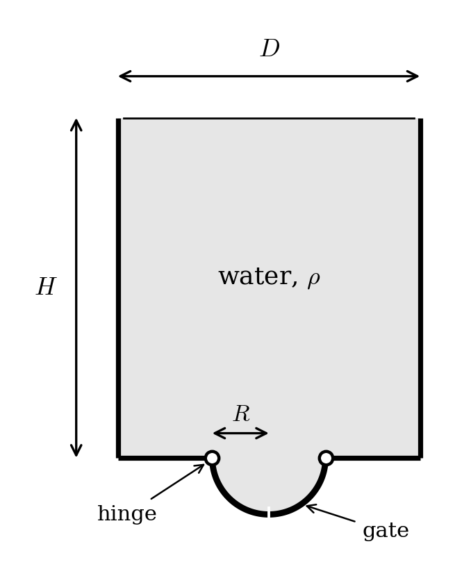

# Homework 3 Solutions

$$
\newcommand{\pd}[2]{\dfrac{\partial #1}{\partial #2}}
\newcommand{\bnabla}{\boldsymbol{\nabla}}
$$

## 1. A liquid biomass ...

... with density $\rho_b = 1040$ kg/m$^3$ is fermenting in a sealed vessel in a lab in Boulder (local atmospheric pressure 83 kPa). The vessel holds 15 L of biomass, to a depth $H = 0.30$ m, with a 5 L gas headspace above it, and the whole thing is held in a 30 °C water bath. Bacteria in the biomass produce CO$_2$, which collects in the headspace on top of the air that was already there. (The biomass barely changes volume while this happens, and we'll pretend all the CO$_2$ ends up in the headspace rather than dissolving.)

To keep an eye on things, a well-type manometer is connected to a tap at the *bottom* of the vessel. The tube is filled with biomass from the tap down to the manometer fluid, which is dyed, doesn't mix with the biomass, and has density $\rho_m = 1750$ kg/m$^3$. The manometer's wide reservoir is a distance $\ell = 0.20$ m below the bottom of the vessel, and because the tank is large and the tubes small, this surface can be assumed to be stationary. The narrow leg is open to the atmosphere, and the reading $h$ is the height of the manometer fluid in that leg above the reservoir level.

{width=55%}

(a) Before any fermentation has happened, the headspace is at atmospheric pressure. What is the manometer reading $h_0$?

::: {.callout-tip title="Solution" collapse="true"}
We'll keep track of the pressure, going from the vessel to the open end of the manometer. Starting in the headspace at $p_\text{head}$, we go down through the biomass ($H+\ell$ in total) to the reservoir level, and then up the narrow leg through the manometer fluid ($h$) to the atmosphere:

$$
p_\text{head} + \rho_b g (H+\ell) - \rho_m g h = p_\text{atm}.
$$

The weight of the air in the narrow leg is negligible, as is the gas in the headspace. The "stationary reservoir" assumption allows us to say $H+\ell$ is a fixed length and the only thing that moves is the manometer fluid in the narrow leg. Solving:

$$
h = \frac{\rho_b}{\rho_m}(H+\ell) + \frac{p_\text{head}-p_\text{atm}}{\rho_m g}. \qquad (*)
$$

Before fermentation $p_\text{head}=p_\text{atm}$, so only the first term survives, and

$$
h_0 = \frac{1040}{1750}(0.30+0.20)\ \text{m} = 0.30 \ \text{m}.
$$

This isn't zero because, even with the headspace at atmospheric pressure, the manometer fluid at the reservoir level is being pushed on by a 0.5 m column of biomass, and it responds by climbing the narrow leg until its own weight balances that. It is less than 0.5 m because $\rho_m>\rho_b$.
:::

(b) The batch is "ready" once it has produced 0.002 mol of CO$_2$ **per liter** of biomass. Treat the CO$_2$ as an ideal gas at 30 °C. What are the gauge and absolute pressures in the headspace at that moment?

::: {.callout-tip title="Solution" collapse="true"}
The amount of CO$_2$ produced is

$$
n = (0.002\ \text{mol/L})(15\ \text{L}) = 0.030\ \text{mol}.
$$

The air that was already in the headspace stays there (same amount, same volume, same temperature, so it still contributes $p_\text{atm}$). The CO$_2$ is *extra*, and it adds its own partial pressure:

$$
\Delta p = \frac{nRT}{V_\text{head}} = \frac{(0.030\ \text{mol})(8.314\ \text{J/mol K})(303\ \text{K})}{5\times 10^{-3}\ \text{m}^3} = 15.1\ \text{kPa}.
$$

That is the gauge pressure; the absolute pressure is

$$
p_\text{head} = 83 + 15.1 = 98.1\ \text{kPa}.
$$

Alternatively, we can count *all* the moles in the headspace: the air is $n_\text{air} = p_\text{atm}V/RT = 0.165$ mol, adding the CO$_2$ gives 0.195 mol, and $p = n_\text{total}RT/V = 98.1$ kPa. (Same answer, good.)
:::

(c) What does the manometer read when the batch is ready?

::: {.callout-tip title="Solution" collapse="true"}
We use $(*)$ again, now with a gauge pressure of 15.1 kPa:

$$
h = h_0 + \frac{\Delta p}{\rho_m g} = 0.297\ \text{m} + \frac{15{,}122\ \text{Pa}}{(1750\ \text{kg/m}^3)(9.81\ \text{m/s}^2)} = 0.297 + 0.881\ \text{m} = 1.18\ \text{m}.
$$

:::

## 2. A cylindrical container lays on its side.

It has radius $R$ and length $L$ and is filled up to a height $H$ with a fluid of density $\rho$. (That is, the circular base of the cylinder is more than half covered: $R<H<2R$.)

(a) Make a drawing of this situation, with all variables included.

::: {.callout-tip title="Solution" collapse="true"}
Looking at one of the circular ends head-on, we see a disk of radius $R$ with its center at height $R$ above the bottom (where the cylinder touches the ground). The free surface is a horizontal line at height $H$ above the bottom. Since $R<H<2R$, the free surface cuts the disk *above* its center, and the top sliver of the disk is dry. The variables to label are $R$, $H$, and a coordinate $y$ measured upward from the bottom of the disk.
:::

(b) Determine the total force on one of the circular bases of the cylinder.

Hint: it is possible to do this by integrating over $r$ and $\theta$, but it's annoying. A better approach: define a coordinate $y:0\rightarrow H$ that starts where the cylinder touches the ground, and then define a new variable $w$, the width. You can write $w$ as a function of $y$ (hint within a hint: Pythagorean Theorem), and then integrate $dwdy$.

::: {.callout-tip title="Solution" collapse="true"}
A point at height $y$ above the bottom is a depth $H-y$ below the free surface, so the gauge pressure there is

$$
p(y) = \rho g\,(H-y).
$$

By the Pythagorean theorem, the half-width of the disk at height $y$ satisfies $(w/2)^2 + (R-y)^2 = R^2$, so

$$
w(y) = 2\sqrt{R^2-(R-y)^2} = 2\sqrt{y(2R-y)}.
$$

(Above the center it is more intuitive to use $(y-R)^2$, but since it is squared it does not change the result.) The pressure acts perpendicular to the disk, so the total force is the integral of $p$ over the wet area. Slicing into horizontal strips of thickness $dy$ and width $w(y)$, and integrating across each strip first:

$$
F = \int_0^H\!\!\int_0^{w(y)} \rho g\,(H-y)\; dw\, dy = \rho g\int_0^H (H-y)\,2\sqrt{R^2-(y-R)^2}\; dy.
$$

Per my announcement: **this answer is sufficient for the problem**. (Note that this a completely set up integral that could be easily solved via a numerical integration, if we had parameter values.)

One way to solve, if curious: the inner integral is easy becaues $p$ doesn't depend on $w$. Shift to the height above the center of the disk, $z = y-R$. Then $H-y = a - z$ with $a\equiv H-R$, and $z$ runs from $-R$ to $a$:

$$
F = \rho g\int_{-R}^{a} (a - z)\; 2\sqrt{R^2-z^2}\; dz.
$$

We split it into two integrals. The first, with $a$ pulled out, is the area of the wet part of the disk (a circular segment):

$$
\int 2\sqrt{R^2-z^2}\,dz = z\sqrt{R^2-z^2} + R^2\arcsin\frac{z}{R},
$$

and the second is an exact derivative (substitute $u=R^2-z^2$):

$$
\int 2z\sqrt{R^2-z^2}\,dz = -\tfrac{2}{3}\left(R^2-z^2\right)^{3/2}.
$$

Evaluating between $-R$ and $a$ (note $\arcsin(-1)=-\pi/2$, and the strip width vanishes at $z=-R$):

$$
\boxed{F = \rho g\left[a^2\sqrt{R^2-a^2} + aR^2\left(\frac{\pi}{2}+\arcsin\frac{a}{R}\right) + \frac{2}{3}\left(R^2-a^2\right)^{3/2}\right]}, \qquad a = H - R.
$$

## 3. A fire-fighting helicopter ...

... has a water bucket in the shape of a cylinder with $D=1.6$ m and $H=1.8$ m. Appended to the bottom is a gate that takes the form of two quarter-cylinders, each with $L=1.3$ m and radius $R= 0.3$ m.

{width=50%}

Note that, by symmetry, the two sides of the gate experience the same forces. Also note that forces on the flat part of the cylinder will not create a moment on the gate.

*You should work symbolically as much as you can, and then plug in the numbers only at the end of the calculation. E.g., calculate $M_z = \rho g L H R$ (as an example... this is not the answer) symbolically, then plug in values for $\rho$, $g$, $L$, etc.*

(a) Let's focus on the left half of the gate. First: what coordinates describe the gate's surface/what coordinates will you be integrating over?

::: {.callout-tip title="Solution" collapse="true"}
Declare that the origin is at the center of the half-cylinder, in the plane of the bucket's bottom, with $x$ to the right, $y$ up, and $z$ out of the page (along the axis of the cylinder). The left quarter of the gate is a piece of a cylinder of radius $R$, so natural coordinates are the angle $\theta$ around the axis and the distance $z$ along it:

$$
\mathbf{r}_s = R\cos\varphi\,\hat{\mathbf{x}} + R\sin\varphi\,\hat{\mathbf{y}} + z\,\hat{\mathbf{z}}, \qquad \pi \le \varphi \le \tfrac{3\pi}{2}, \quad 0\le z \le L.
$$

(At $\varphi=\pi$ we're at the hinge at $x=-R$; at $\varphi=3\pi/2$ we're at the bottom of the gate.) The area element is $dA = R\,d\varphi\,dz$.
:::

(b) Write an equation for the surface normal.

::: {.callout-tip title="Solution" collapse="true"}
For a cylinder the normal is radial:

$$
\hat{\mathbf{n}} = \cos\varphi\,\hat{\mathbf{x}} + \sin\varphi\,\hat{\mathbf{y}}.
$$

We chose the one pointing *out of the fluid* (away from the axis), which is the direction the fluid pushes on the gate. So the force on the gate is $d\mathbf{F} = p\,\hat{\mathbf{n}}\,dA$.
:::

(c) Write an equation for the pressure on the gate's surface.

::: {.callout-tip title="Solution" collapse="true"}
The bucket is filled to $y=H$, so the gauge pressure at height $y$ is $\rho g (H-y)$. On the gate, $y=R\sin\varphi$ (which is negative), so

$$
p = \rho g (H - R\sin\varphi).
$$

Since the atmosphere acts on the top of the water *and* on the outside of the gate, it cancels and we only need gauge pressure.
:::

(d) Write an equation for the displacement vector.

::: {.callout-tip title="Solution" collapse="true"}
The moment is taken about the hinge, which is a line along $z$ through $(x,y)=(-R,0)$. The displacement from a point on the hinge (say at the same $z$) to the surface is

$$
\mathbf{d} = \mathbf{r}_s - (-R\,\hat{\mathbf{x}}) = R(1+\cos\varphi)\,\hat{\mathbf{x}} + R\sin\varphi\,\hat{\mathbf{y}}.
$$

(If we measured from a point on the hinge at a different $z$ there would be a $\hat{\mathbf{z}}$ component too, but it only contributes to $M_x$ and $M_y$, which the hinge supports. We only care about $M_z$, the rotation *about* the hinge.)
:::

(e) Compute the moment necessary to keep the left gate closed. Make a small sketch that shows the direction that this moment would be applied to keep the gate closed.

::: {.callout-tip title="Solution" collapse="true"}
The moment about the hinge is $\mathbf{M} = \int \mathbf{d}\times d\mathbf{F}$, and its $z$-component is $(\mathbf{d}\times\mathbf{F})_z = d_x F_y - d_y F_x$. Plugging in,

$$
\begin{align*}
d_x F_y - d_y F_x &= p\,dA\left[R(1+\cos\varphi)\sin\varphi - R\sin\varphi\cos\varphi\right] \\
&= p\,R\sin\varphi \; dA.
\end{align*}
$$

Nice: the $\cos\varphi\sin\varphi$ terms cancel. With $dA = R\,d\varphi\,dz$ and the pressure from (c),

$$
M_z = \int_0^L\!\!\int_\pi^{3\pi/2} \rho g (H-R\sin\varphi)\,R^2\sin\varphi \; d\varphi\, dz
= \rho g L R^2 \int_\pi^{3\pi/2} \left(H\sin\varphi - R\sin^2\varphi\right) d\varphi.
$$

The two integrals are $\int_\pi^{3\pi/2}\sin\varphi\,d\varphi = -1$ and $\int_\pi^{3\pi/2}\sin^2\varphi\,d\varphi = \pi/4$, so

$$
M_z = -\rho g L R^2\left(H + \frac{\pi R}{4}\right).
$$

The negative sign means the fluid's moment on the left gate is clockwise (it pushes the gate down and open, which makes sense). The moment needed to *hold it closed* is the same size and opposite in sign, so counterclockwise (in the view of the figure, with $z$ out of the page):

$$
|M_z| = \rho g L R^2\left(H + \frac{\pi R}{4}\right) = (1000)(9.81)(1.3)(0.3)^2\left(1.8+\frac{\pi (0.3)}{4}\right) \approx 2.3\ \text{kN}\cdot\text{m}.
$$

**Sketch.** Draw the left gate hanging below the bucket, hinged at its top-left corner, with a curved arrow around the hinge pointing *counterclockwise*: the free (bottom-center) end of the gate is being held up, into the bucket's bottom, and the fluid is trying to swing it down and to the left.

A quick sanity check that doesn't use the integral: the pressure force on a circular arc points radially, so it acts through the center of the circle, and only the *vertical* part of the total force has a moment about the hinge, with lever arm $R$. The vertical force is the weight of the water above the gate, a rectangular block of $R\times H\times L$ plus the quarter-disk $\pi R^2/4 \times L$ of the gate's own contents:

$$
F_y = \rho g L\left(RH + \frac{\pi R^2}{4}\right) \implies |M_z| = R F_y = \rho g L R^2\left(H+\frac{\pi R}{4}\right).
$$

Same answer, which is comforting. (We also integrated it numerically to be sure: 2336 N$\cdot$m.)
:::
