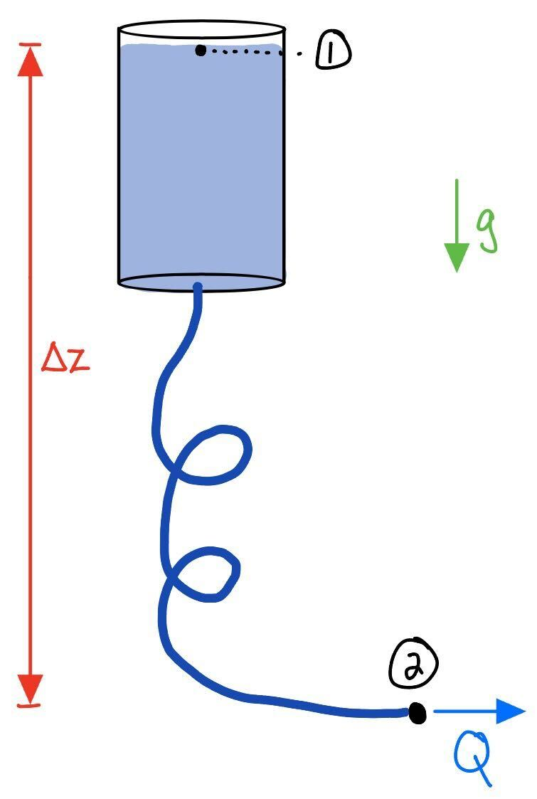

# Homework 4

Due: Friday 2 October, 2026 11:59PM. Submitted to GradeScope.

## 1. Water boils at 94°C in Boulder...

... lower than the 100°C boiling point at sea level. This is due to the lower ambient pressure here in Colorado. There is a related phenomenon known as "cavitation": a rapid decrease in pressure due to high-speed flow can cause the boiling point of a liquid to drop below the ambient temperature, causing the liquid to abruptly boil.

There is a shrimp in the ocean that uses this phenomenon as an attack strategy. The "snapping shrimp" snaps its claw so quickly that it locally boils water. As the vapor bubbles collapse they create an incredibly loud sound ($\sim 200$ dB) capable of stunning or killing a small fish.

Suppose one of these snapping shrimp is mad at a nearby crustacean and would like to express its feelings using fluid mechanics. Both animals are located 1 m under the surface of the sea where the water is 20°C. Look up the *saturation pressure* at this temperature — that is the pressure at which water will boil. How fast must the flow be, in m/s, to cause cavitation? Assume a steady process in which quiescent water is drawn into motion by the snap. Note: since we are dealing with a thermodynamic quantity, the boiling point, we need to use absolute pressures.

If interested, see: Versluis, Michel, et al. "How snapping shrimp snap: through cavitating bubbles." *Science* 289.5487 (2000): 2114–2117.

## 2. Last spring I had to deliver subcutaneous...

... ("under-skin") fluids to my dog every few days, basically creating a camel's hump that slowly delivered hydration over a few hours. The scenario is depicted below.

{width=50%}

Call the top of the fluids in the bag state 1 and the point where the tube meets the dog state 2. We will assume, at least preliminarily, that both locations have zero gauge pressure.

(a) Write out Bernoulli's equation and a conservation of mass statement.

(b) Determine the volumetric flow rate $Q$. Work symbolically until you have a final theoretical expression for $Q$, and then use: $\Delta z = 1$ m, a bag cross-section of 10 cm$^2$, a tube cross-section of 0.05 cm$^2$, and both pressures zero (gauge).

(c) There are two strategies to increase the fluid flow. One is to squeeze the fluids bag. Assume the pressure in the bag increases by 10 kPa, and remains zero at the end of the tube. What is the new volumetric flow rate?

(d) An easier strategy: lift the bag. Suppose we get tired of squeezing, so the added pressure goes back to zero, but instead we increase the elevation to $\Delta z = 2$ m. What is the new volumetric flow rate?

## 3. A barrel of oil...

... with density $\rho_\text{o}$, is accidentally left open during a rainstorm. Because water, density $\rho_\text{w}$, is denser than oil, it collects at the bottom of the barrel up to a height $H_\text{w}$. There is an oil layer with height $H_\text{o}$ on top of that. The cross-section of the barrel has area $A_\text{o}$. We will use a siphon with cross-section $A_\text{s}$ to extract the water from the barrel. The siphon exit is a distance $H_\text{s}$ below the bottom of the barrel.

(a) To what location must we fill the siphon in order to get it to flow freely? 

(b) Determine the time it takes to siphon the water from the barrel.
