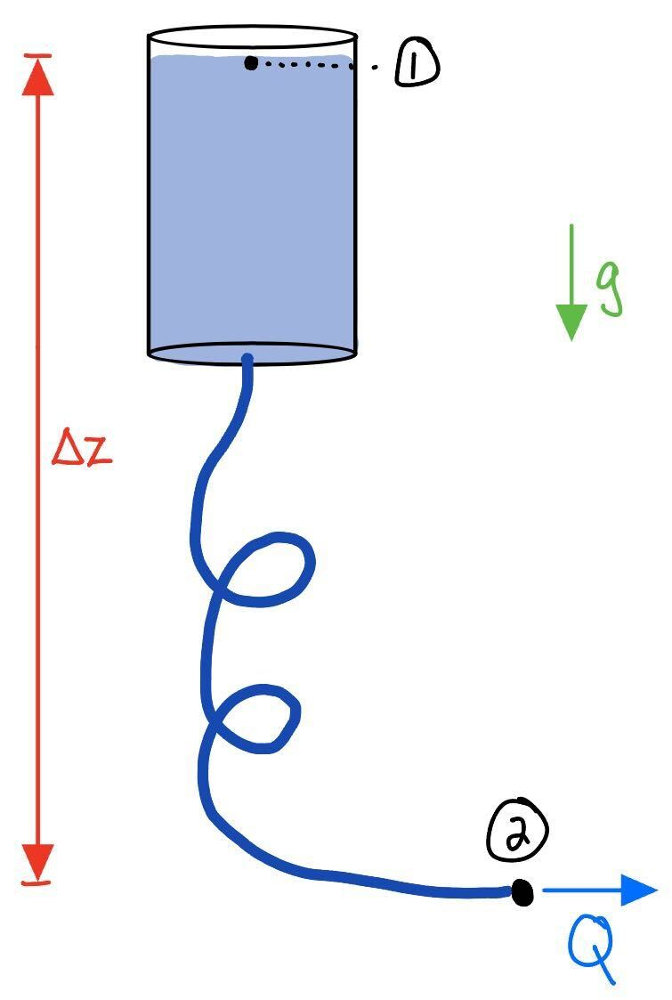

# Homework 4 Solutions

## 1. Water boils at 94°C in Boulder...

... lower than the 100°C boiling point at sea level. This is due to the lower ambient pressure here in Colorado. There is a related phenomenon known as "cavitation": a rapid decrease in pressure due to high-speed flow can cause the boiling point of a liquid to drop below the ambient temperature, causing the liquid to abruptly boil.

There is a shrimp in the ocean that uses this phenomenon as an attack strategy. The "snapping shrimp" snaps its claw so quickly that it locally boils water. As the vapor bubbles collapse they create an incredibly loud sound ($\sim 200$ dB) capable of stunning or killing a small fish.

Suppose one of these snapping shrimp is mad at a nearby crustacean and would like to express its feelings using fluid mechanics. Both animals are located 1 m under the surface of the sea where the water is 20°C. Look up the *saturation pressure* at this temperature — that is the pressure at which water will boil. How fast must the flow be, in m/s, to cause cavitation? Assume a steady process in which quiescent water is drawn into motion by the snap. Note: since we are dealing with a thermodynamic quantity, the boiling point, we need to use absolute pressures.

If interested, see: Versluis, Michel, et al. "How snapping shrimp snap: through cavitating bubbles." *Science* 289.5487 (2000): 2114–2117.

::: {.callout-tip title="Solution" collapse="true"}
A little bit different way of applying Bernoulli's Equation... we'll assume state "1" is the fluid before it enters the shrimp's jet, and state "2" is within the jet. Start with the full equation:

::: {.column-margin}
Technically there is an additional unsteady term in Bernoulli's Equation which would come in to play in this time-varying flow. It turns out the unsteady term is negligible though.
:::

$$
(p + \tfrac{\rho}{2} u^2 + \rho g z)_1 = (p + \tfrac{\rho}{2} u^2 + \rho g z)_2
$$

and then make some assumptions:

- "1" and "2" are at the same depth, $z_1 = z_2$.
- "1" begins stationary, $u_1 = 0.$

This leaves $p_1 = p_2 + \frac12 \rho u_2^2$ or

$$
u_2 = \sqrt{\frac{2(p_1 - p_2)}{\rho}}.
$$

At state "1" we will assume the pressure is entirely hydrostatic, and because we are considering a thermodynamics phenomenon (boiling), we need to use the **absolute pressure**. 

$$
p_1 = p_{\textrm{atm}} + \rho g z_1 = 101,325 \textrm{ Pa} + (1000 \textrm{kg/m$^3$})(9.81 \textrm{ m/s$^2$})(1 \textrm{ m}) = 111135 \textrm{ Pa} = 111.135 \textrm{ kPa}.
$$

Cavitation occurs when state "2" is at the boiling pressure $p_2 = 2.4$ kPa. Thus we compute the claw tip speed to be 

$$
u_2 = = \sqrt{\frac{2(111,135 \textrm{ Pa} - 2400 \textrm{ Pa})}{1000 \textrm{ kg/m$^3$}}} \approx 14.7\text{ m/s}.
$$
:::

## 2. Last spring I had to deliver subcutaneous...

... ("under-skin") fluids to my dog every few days, basically creating a camel's hump that slowly delivered hydration over a few hours. The scenario is depicted below.

{width=50%}

Call the top of the fluids in the bag state 1 and the point where the tube meets the dog state 2. We will assume, at least preliminarily, that both locations have zero gauge pressure.

(a) Write out Bernoulli's equation and a conservation of mass statement.

::: {.callout-tip title="Solution" collapse="true"}
Bernoulli's equation comparing state 1 to state 2 is

$$
p_1 + \tfrac{\rho}{2} u_1^2 + \rho g z_1 = p_2 + \tfrac{\rho}{2} u_2^2 + \rho g z_2,
$$

and our statement for the conservation of mass flow rate is

$$
\dot{m} = \rho u_1 A_1 = \rho u_2 A_2.
$$
:::

(b) Determine the volumetric flow rate $Q$. Work symbolically until you have a final theoretical expression for $Q$, and then use: $\Delta z = 1$ m, a bag cross-section of 10 cm$^2$, a tube cross-section of 0.05 cm$^2$, and both pressures zero (gauge).

::: {.callout-tip title="Solution" collapse="true"}
Using the above assumptions, Bernoulli's equation reduces to

$$
\tfrac{\rho}{2} u_1^2 + \rho g \Delta z = p_2 + \tfrac{\rho}{2} u_2^2.
$$

Since the density of the fluid is the same at both states, our conservation of mass statement gives us a statement about the flow rate,

$$
\dot{m} /\rho = Q = u_1 A_1 = u_2 A_2.
$$

This implies

$$
u_1 = Q/ A_1, \quad\quad u_2 = Q/A_2.
$$

Substituting these values into the reduced Bernoulli equation yields the following analytical representation of the volumetric flow rate,

$$
\begin{aligned}
    &\frac{1}{2} \left(\frac{Q}{A_1} \right)^2 + g \Delta z = \frac{1}{2} \left(\frac{Q}{A_2} \right)^2 \\[5pt]
    &\Rightarrow \quad 2 g \Delta z = Q^2 \left(\frac{1}{A_2^2} - \frac{1}{A_1^2} \right) \\[5pt]
    &\Rightarrow \quad Q = \sqrt{\frac{2 g \Delta z}{\frac{1}{A_2^2} - \frac{1}{A_1^2}}}
\end{aligned}
$$

Plugging in our given values for the parameters in $Q$ yields, 
$$Q = \sqrt{\frac{2 * 981\textrm{[cm/s$^2$]} * 100 \textrm{[cm]}}{\frac{1}{(0.05 \textrm{[cm$^2$]})^2} - \frac{1}{(10 \textrm{[cm$^2$]})^2}}} \approx 22.14 \textrm{ cm$^3$/s}.$$

:::

(c) There are two strategies to increase the fluid flow. One is to squeeze the fluids bag. Assume the pressure in the bag increases by 10 kPa, and remains zero at the end of the tube. What is the new volumetric flow rate?

::: {.callout-tip title="Solution" collapse="true"}

The Bernoulli equation becomes,

$$
\begin{aligned}
    &p_1 + \tfrac{\rho}{2} u_1^2 + \rho g \Delta z =  \tfrac{\rho}{2} u_2^2 \\[5pt]
    &\Rightarrow \quad \frac{p_1}{\rho} + \frac{1}{2} \left(\frac{Q}{A_1} \right)^2 + g \Delta z = \frac{1}{2} \left(\frac{Q}{A_2} \right)^2 \\[5pt]
    &\Rightarrow \quad \frac{2 p_1}{\rho} + 2 g \Delta z = Q^2 \left(\frac{1}{A_2^2} - \frac{1}{A_1^2} \right)\\[5pt]
    &\Rightarrow \quad Q = \sqrt{\frac{\frac{2 p_1}{\rho} + 2 g \Delta z}{\frac{1}{A_2^2} - \frac{1}{A_1^2}}}
\end{aligned}
$$

Plugging in our given values for the parameters in $Q$ yields, 
$$Q = \sqrt{\frac{2*100 \textrm{[kg/(cm $\cdot$ s$^2$)]}/0.001 \textrm{[kg/cm$^3$}] + 2 * 981\textrm{[cm/s$^2$]} * 100 \textrm{[cm]}}{\frac{1}{(0.05 \textrm{[cm$^2$]})^2} - \frac{1}{(10 \textrm{[cm$^2$]})^2}}} \approx 31.47 \textrm{ cm$^3$/s}.$$

:::

(d) An easier strategy: lift the bag. Suppose we get tired of squeezing, so the added pressure goes back to zero, but instead we increase the elevation to $\Delta z = 2$ m. What is the new volumetric flow rate?

::: {.callout-tip title="Solution" collapse="true"}
Under the same assumptions as part b., we can use the same equation for volumetric flow rate with an increased $\Delta z,$

$$Q = \sqrt{\frac{2 * 981\textrm{[cm/s$^2$]} * 200 \textrm{[cm]}}{\frac{1}{(0.05 \textrm{[cm$^2$]})^2} - \frac{1}{(10 \textrm{[cm$^2$]})^2}}} \approx 31.32 \textrm{ cm$^3$/s}.$$

Thus, we see an increase in flow rate as height increases. 

:::

## 3. A barrel of oil...

... with density $\rho_\text{o}$ is accidentally left open during a rainstorm. Water, with density $\rho_\text{w}$, collects at the bottom of the barrel, up to a height $H_\text{w}$, because it is denser than oil. The oil layer height, from the water interface to the free surface, is $H_\text{o}$. The cross-section of the barrel has area $A_\text{o}$. We will use a siphon with cross-section $A_\text{s}$ to extract the water from the barrel. The siphon exit is a distance $H_\text{s}$ below the bottom of the barrel.

(a) To what location must we fill the siphon in order to get it to flow freely? 

::: {.callout-tip title="Solution" collapse="true"}
We need to determine the height at which the hydrostatic pressure within the fluid matches the ambient pressure... technically on the "downslope" of the siphon, but since we are talking hydrostatics, that will be the same vertical location as the "upslope". Dealing in gauge pressure, we write the pressure at the bottom of the tank as
$$
p=\rho_\text{o} g H_\text{o} + \rho_\text{w} g H_\text{w}.
$$
As we move up the siphon (where the fluid will be water), we will lose hydrostatic pressure. The location $h_\text{start}$ (above the bottom of the tank) where we are back to atmospheric pressure will be given by 
$$
0=\rho_\text{o} g H_\text{o} + \rho_\text{w} g H_\text{w} - \rho_\text{w} g h_\text{start}
$$
i.e.
$$
h_\text{start}=\frac{\rho_\text{o}}{\rho_\text{w}} H_\text{o} + H_\text{w}.
$$
Because $\rho_\text{o}<\rho_\text{w}$, this will be located at an elevation somewhere between the air-oil and the oil-water interfaces.

:::

(b) Determine the time it takes to siphon the water from the barrel. (Just the water.)

::: {.callout-tip title="Solution" collapse="true"}
Starting off with the general Bernoulli Equation (where $\rho=\rho_\text{w}$):
$$
p_1 + \frac{1}{2}\rho U_1^2 + \rho g z_1 = 
p_2 + \frac{1}{2}\rho U_2^2 + \rho g z_2
$$
we specialize this to a streamline that connects a point on the oil-water interface to a point at the exit of the siphon. Let's recognize: because the siphon exit is exposed to ambient pressure, $p_2=0$ (gauge); let's call the siphon exit elevation zero, $z_2=0$; we can assume the kinetic energy of the interface is negligible, $U_1^2\approx 0$; and the pressure at the interface is due to hydrostatics, which comes from the oil layer, is $p_1=\rho_\text{o} g H_\text{o}$. Lastly, we rewrite the elevation of the interface relative to $z=0$ as $z_1=h_\text{w}+H_\text{s}$. Thus, we now have
$$
\rho_\text{o} g H_\text{o}+\rho_\text{w} g \left(h_\text{w}+H_\text{s}\right)= \frac{1}{2}\rho_\text{w} U_s^2.
$$
or, rearranging
$$
U_s=\sqrt{2g\left(\frac{\rho_\text{o}}{\rho_\text{w}} H_\text{o}+ (h_\text{w}+H_\text{s})\right)}.
$$
A key thing to remember: the interface height is a function of time, so $h_\text{w}=h_\text{w}(t)$.

With information about the exit speed as a function of water level, we turn to conservation of mass. Assuming a uniform flow speed, this can be simply stated as:
$$
U_1 A_\text{o} = U_s A_\text{s}.
$$
In this equation, we cannot neglect $U_1$.^[In Bernoulli's Equation, we are able to claim that the kinetic energy is small relative to the other terms in the equation. Here, there are only two terms, so if one of them is small, the other one has to be equally as small, and so neither can be neglected.] Recognize that the speed of the interface $U_1$ can be interpreted as the time-rate-of-change of the water height, $-dh_\text{w}/dt$, where the negative sign is important because $h_\text{w}$ is decreasing with increasing time. Thus, with the result from Bernoulli's Equation above,
$$
\frac{dh_\text{w}}{dt}=-\frac{A_\text{s}}{A_\text{o}}\sqrt{2g\left(\frac{\rho_\text{o}}{\rho_\text{w}} H_\text{o}+ (h_\text{w}+H_\text{s})\right)}.
$$
It may be helpful to rewrite this equation in terms of new placeholder variables. Let's do some quick algebra:
$$
\frac{dh_\text{w}}{dt}=
-\sqrt{2g\left(\frac{A_\text{s}}{A_\text{o}}\right)^2\left(\frac{\rho_\text{o}}{\rho_\text{w}} H_\text{o}+ H_\text{s}+h_\text{w}\right)}
$$
and write
$$
M\equiv 2g\left(\frac{A_\text{s}}{A_\text{o}}\right)^2\left(\frac{\rho_\text{o}}{\rho_\text{w}} H_\text{o}+ H_\text{s}\right),\qquad N\equiv 2g\left(\frac{A_\text{s}}{A_\text{o}}\right)^2
$$
such that
$$
\frac{dh_\text{w}}{dt}=-\sqrt{M+N h_\text{w}}.
$$
That is a lot more friendly! Now it is easy to do the separation:
$$
\frac{dh_\text{w}}{\sqrt{M+N h_\text{w}}}=-dt \implies \frac{2}{N}\sqrt{M+N h_\text{w}} = -t + c.
$$
We have the condition that $h_\text{w}(t=0)=H_\text{w}$. Plugging this in:
$$
c=\frac{2}{N}\sqrt{M+N H_\text{w}}.
$$
Then we are interested in the time $t^*$ such that $h_\text{w}=0$, i.e.:
$$
\frac{2}{N}\sqrt{M} = -t^* + \frac{2}{N}\sqrt{M+N H_\text{w}}\implies t^* = \frac{2}{N}\sqrt{M+N H_\text{w}} - \frac{2}{N}\sqrt{M}.
$$
Repopulating this with the definitions used above
$$
t^* = \frac{2}{2g\left(\frac{A_\text{s}}{A_\text{o}}\right)^2}\left[\sqrt{2g\left(\frac{A_\text{s}}{A_\text{o}}\right)^2\left(\frac{\rho_\text{o}}{\rho_\text{w}} H_\text{o}+ H_\text{s}\right)+2g\left(\frac{A_\text{s}}{A_\text{o}}\right)^2 H_\text{w}} - \sqrt{2g\left(\frac{A_\text{s}}{A_\text{o}}\right)^2\left(\frac{\rho_\text{o}}{\rho_\text{w}} H_\text{o}+ H_\text{s}\right)}\right]
$$
and simplifying
$$
t^* = \frac{A_\text{o}\sqrt{2}}{A_\text{s} g}\left[\sqrt{\left(\frac{\rho_\text{o}}{\rho_\text{w}} g H_\text{o}+g H_\text{s}\right)+g H_\text{w}} - \sqrt{\left(\frac{\rho_\text{o}}{\rho_\text{w}} g H_\text{o}+g H_\text{s}\right)}\right].
$$
Check the dimensions: each term within the square roots has dimensions of (L/T)$^2$, and the area ratio $A_\text{o}/A_\text{s}$ is dimensionless. We thus have (T$^2$/L)$\sqrt{\text{(L/T)}^2}$ = T... good.

There are a few other things made clear by this expression (which we maybe couldn't immediately see if we plugged-in numbers too soon):

- The contents of the left square-root are larger than the contents of the right square-root by $g H_\text{w}$.
- The time it takes to drain increases with the square-root of the initial height. This means doubling the height does not mean doubling the time -- a consequence of the fact that the flow speed increases with height.
- The time it takes to drain increases linearly with increasing tank size $A_\text{o}$, and is inversely proportional to the siphon area $A_\text{s}$.
- It is a bit hard to infer from these expressions, but the larger the values of $H_\text{o}$ and $H_\text{s}$, the shorter the time it takes to drain. For $H_\text{o}$, this is a consequence of the added interface pressure pushing the water out; for $H_\text{s}$, this is a consequence of the lower exit point, meaning greater exit speed.

:::