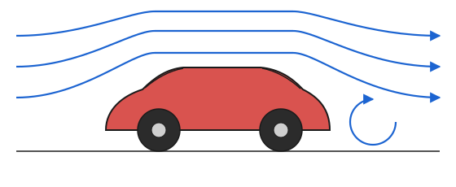



## The big idea

We have some intuition, and maybe some experience, with the variables of fluid mechanics: pressure pushes on things, something that is highly viscous is harder to move, denser objects weigh more. But, as I said in class on Day 0, this is arguably your first "applied math" course... if we are going to be putting those ideas into equations, we need to be precise about what they mean.

This week we will talk about some important variables in fluid mechanics. First: pressure.

## Think first

**Recall**

1. Units check: what are the SI units of pressure? How is it related to force and area?

**Look ahead**

1. Why does pressure act *only* normal to a surface, never along it?
2. Your tire gauge reads 0 psi when it's flat — is the *absolute* pressure inside really zero?
3. A sealed bag of chips puffs up on the drive up to the mountains. What's changing: the pressure inside the bag, or the pressure outside?


## A common fluid mechanics situation/experiment



Idea: This is a "wind tunnel experiment" that measures the "wind resistance" on an object. To be a bit more precise, it will measure the **drag force** on the object as a function of the wind **speed**.


The drag force, in general, comes from two sources:

**Pressure**: pressure leads to *normal* forces on the surfaces, and a difference in pressure between the nose and tail pushes the object backwards. (That is, if the object were moving, the pressure difference would be trying to slow it down.)

::: {.column-margin}
Recall: normal forces act into/out of the surface and shear forces act along the surface.
:::


**Viscous**: shear forces due to the fluid friction "grabbing" the surface. Relevant here is the fluid *viscosity*, given the symbol $\mu$... [more on that later](viscosity.qmd).


## Pressure origins


In the picture above: molecules (of, say, nitrogen) are bouncing off a surface with normal in the $-\hat{x}$-direction. What happens with the $\hat{x}$-component of velocity during one bounce? The velocity is positive, then negative, and so our $\Delta u$ (new minus old) is negative. Presumably that process takes some finite amount of time, $\Delta t$, and so we have

::: {.column-margin}
The story with liquids is very similar, but there are intermolecular forces and many more particle-particle collisions — trickier to describe.
:::

$$
\frac{\Delta u}{\Delta t}< 0.
$$

Change in velocity over time... that is an acceleration, and if we have an acceleration, we have a force by Newton's Second Law: $F=ma_x$. The force on the molecule is in the $-\hat{x}$-direction, but Newton's *Third* Law tells us that there is an equal and opposite force *on* the surface.

Not every molecule is traveling at the same speed, and they have a spectrum of angles that they collide with, but if we average over many many collisions, we can describe an average force per area at this location. This is our *pressure*.

::: {.column-margin}
**Continuum mechanics** is an approach where we treat fluids and solids as continuous masses. Rather than keeping track of the speeds and positions, and then the collisions, of countless individual molecules, we assume that their behavior can be averaged out and described by variables defined at points in space:

- the velocity at a certain point, $u(x,y,z,t)$
- the temperature, $T(x,y,z,t)$
- the pressure, $p(x,y,z,t)$
- the density, $\rho(x,y,z,t)$

etc. Assuming we have enough molecules in our system, this is a good approach — accurate enough, and comparatively easy to analyze.
:::

A couple truths:

1. The net force due to pressure always acts normal to the surface. (The velocity component that is changed by the collision is the one that is normal to the surface.)
2. Pressure is not a force, it is a scalar field. We can describe the value of pressure at every location within a fluid, but it manifests as a force at surfaces. The orientation of the surface sets the force direction (locally).


## Gauge vs. absolute pressure

When we think about inflating a car tire, the pressure is measured in psi (pounds per square inch, a force per area... a pressure). In my hatchback the pressure is usually reported as 34 psi, but there is a subtlety: that is **the gauge pressure**.

The gauge pressure is defined as the absolute pressure (the one that we would use in an ideal gas equation... related to the number of molecules present), minus some convenient reference pressure:

$$
p_\text{gauge} \equiv p_\text{absolute} - p_\text{reference}.
$$

Usually the reference pressure is the local atmospheric pressure (14.7 psi = 101 kPa at sea level, but only 12.0 psi = 83 kPa here in Boulder).

::: {.callout-caution}
Gauge pressure can be less than zero. What would it mean to use that in the ideal gas law... negative volume, or temperature, or number of molecules?! If we are doing a thermodynamics calculation, we must use the absolute pressure.
:::

When it comes to forces, the gauge pressure is more convenient. Compare these calculations:

**Use the absolute pressure** inside the tire (pushing out) and the absolute pressure outside the tire (pushing in). For a segment of tire with area $A$ the net force would be

$$
F_\text{net}=A p_\text{tire,abs}-A p_\text{ambient,abs}.
$$

**Use the gauge pressure** inside the tire (pushing out). The gauge pressure outside the tire is zero by definition. The net force ends up being

$$
F_\text{net}=A p_\text{tire,g}
$$

and I'll prove it using the definition of gauge pressure:

$$
F_\text{net}=A p_\text{tire,g} = A (p_\text{tire,abs} - p_\text{ref})
$$

where the reference pressure is $p_\text{ambient,abs}$, so

$$
F_\text{net}=A p_\text{tire,abs}-A p_\text{ambient,abs}.
$$

Same as our first calculation using absolute pressure, and a lot quicker!

### Example

The atmospheric pressure in Boulder is about 12.0 psi (83 kPa) and my tire pressure sensor reads 34 psi. What is the absolute pressure in my tire, in psi?

```{=html}
<div class="fl-checkpoint"
     data-prompt="Absolute pressure in the tire?"
     data-answer="46.0" data-tol="0.03" data-units="psi"
     data-hint="Absolute = gauge + local atmosphere."></div>
```

