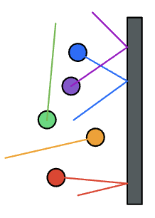
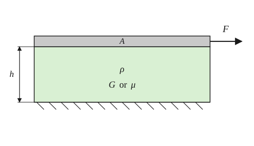



## The big idea

We have some intuition, and maybe some experience, with the variables of fluid mechanics: pressure pushes on things, something that is highly viscous is harder to move, denser objects weigh more. But, as I said in class on Day 0, this is arguably your first "applied math" course... if we are going to be putting those ideas into equations, we need to be precise about what they mean.

## Think first

**Recall**

1. From solid mechanics: what does shear stress do to a block of steel, and what happens when you remove it?
2. Units check: what are the SI units of stress? Of a velocity gradient $du/dy$?

**Look ahead**

1. What separates a "fluid" from a "solid"?
2. Honey and water both flow. What is different about them?
3. Why does the fluid touching a moving wall move *with* the wall?


## A common fluid mechanics situation/experiment


Idea: This is a "wind tunnel experiment" that measures the "wind resistance" on an object. To be a bit more precise, it will measure the **drag force** on the object, as a function of the wind **speed**.


The drag force, in general, comes from two sources:

**Pressure**: pressure leads to *normal* forces on the surfaces, and a difference in pressure between the nose and tail pushes the object backwards.

**Viscous**: shear forces due to the fluid friction "grabbing" the surface. Relevant here is the fluid *viscosity*, denoted $\mu$... more on that later.

::: {.column-margin}
Recall: shear forces act along a surface, and normal foces act into/out of the surface.
:::

## Pressure



From the picture above: molecules (say of nitrogen) are bouncing off a surface with normal in the $-\hat{x}$ direction. What happens with the $\hat{x}$-component of velocity during one bounce? It is positive, then negative, and so our $\Delta u$ (new minus old) is negative. Presumably that process takes some finite amount of time, $\Delta t$, and so we have

$$
\frac{\Delta u}{\Delta t}< 0.
$$

Change in velocity over time... that is an acceleration, and if we have an acceleration, we have a force: $F=ma_x$ (Newton's Second Law). The force on the molecule is in the $-\hat{x}$-direction, but Newton's Third Law tells us that there is an equal and opposite force on the surface.

Not every molecule is traveling at the same speed, and they have a spectrum of angles that they collide with, but if we average over many many collisions, we can describe an average force per area. This is our *pressure*.

A couple truths:
1. The net force due to pressure always acts normal to the surface. (The velocity component that is changed by the collision is the one that is normal to the surface.)
2. Pressure is not a force, it is a scalar field. We can describe the value of pressure at every location within a fluid, but it manifests as a force at surfaces. The orientation of the surface sets the force direction (locally).


### Gauge vs. absolute pressure

When we think about inflating a car tire, the pressure is measured in psi (pounds per square inch, a force per area). In my hatchback the pressure is reported as about 34 psi, but there is a subtlety: that is the gauge pressure.

The gauge pressure is defined relative to some reference pressure:

$$
p_\text{gauge} \equiv p_\text{absolute} - p_\text{reference}
$$

where usually the reference pressure is the local atmospheric pressure

::: {.callout-caution}
The absolute pressure is the one that is related to the number of molecules, and indeed it must be greater than or equal to zero. If we are doing a thermodynamics calculation, we must use the absolute pressure.
:::


The atmospheric pressure in Boulder is about 12.0 psi (83 kPa), and my tire pressure sensor reads 34 psi. What is the absolute pressure in my tire?

```{=html}
<div class="fl-checkpoint"
     data-prompt="Absolute pressure in the tire?"
     data-answer="46.0" data-tol="0.03" data-units="psi"
     data-hint="Absolute = gauge + local atmosphere."></div>
```


## Viscosity

A simple geometry, simple enough to study analytically, is the simple shear geometry




What happens when a constant force $F$ is applied to the top surface, holding the bottom surface in place? It's going to depend on whether the material is a solid or fluid.


**If it's a solid:**

The applied shear force to the right will be matched by an elastic force within the material that resists that motion. This occurs at a fixed amount of deformation, so the top surface will move in that initial moment the force is applied, then reach a certain displacement and just stay there.


**If it's a fluid:**

The applied shear force to the right will, after an initial transient, settle into a situation with a constant deformation *rate*. I.e., we will reach a point where the applied force is balanced by some sort of friction force.

### Newtonian viscosity

In this class we will focus on the Newtonian viscosity **model**. This applies to a lot of common fluids: water, oil, and gases are "Newtonian Fluids". We have some intuition about viscosity, I suspect: oils are *more viscous* than water, water is *more viscous* than air. So we recognize that the viscosity is a material property, and we give it the symbol $\mu$ ("mew").


::: {.column-margin}
I emphasize the word "model" here because it, along with everything scientists/engineers do, is an approximation of reality. There are an enormous number of molecules bouncing around in 3D space, with different speeds and different distances from their neighbors. It seems to be accurate enough to assume that there is constant of proportionality, $\mu$, that mathematically describes the relationship between shear force and speed for a given material in many cases.
:::

::: {.callout-note}
**Non-Newtonian fluids** have viscosity that varies with force/speed or time. We will talk about them a bit this semester, especially because that is what my PhD was about, but most of our analysis will be on Newtonian fluids.
:::

::: {.callout-caution}
Fluid viscosity is usually sensitive to temperature: engine oil is about 15 times more viscous when your car starts on a cold day vs. when it has had time to heat up. So the viscosity changes, but that does not mean that engine oil is "non-Newtonian".
:::

Let's try to imagine what an equation involving $\mu$ would look like. Thinking back to the shear geometry from above, what force $F$ would it take to achieve a top plate speed $U$ at steady state? We might expect that it involves all the variables in the schematic, so for starters we will think about $F(U,A,\rho,\mu,h)$.


For each checkpoint below: enter **+1** if $F$ increases, **−1** if $F$ decreases, or **0** if it has no effect.

```{=html}
<div class="fl-checkpoint"
     data-prompt="Increasing the speed $U$ (everything else fixed) — effect on $F$?"
     data-answer="1" data-tol="0.01" data-units=""
     data-hint="Think of the tire-tread-on-pavement feel: sliding faster over the same film means more resistance, not less."
     data-target="pressure-scaling-A"></div>
```

::: {#pressure-scaling-A .fl-hidden}
```{=html}
<div class="fl-checkpoint"
     data-prompt="Increasing the area $A$ (everything else fixed) — effect on $F$?"
     data-answer="1" data-tol="0.01" data-units=""
     data-hint="More plate touching the film means more friction to overcome, the same way a wider ski touches more snow."
     data-target="pressure-scaling-h"></div>
```
:::

::: {#pressure-scaling-h .fl-hidden}
```{=html}
<div class="fl-checkpoint"
     data-prompt="Increasing the gap $h$ (everything else fixed) — effect on $F$?"
     data-answer="-1" data-tol="0.01" data-units=""
     data-hint="A thicker film means the velocity changes more gently from plate to plate — a gentler gradient, a gentler force."
     data-target="pressure-scaling-mu"></div>
```
:::

::: {#pressure-scaling-mu .fl-hidden}
```{=html}
<div class="fl-checkpoint"
     data-prompt="Increasing the viscosity $\mu$ (everything else fixed) — effect on $F$?"
     data-answer="1" data-tol="0.01" data-units=""
     data-hint="This is the definition of viscosity in action: a thicker fluid resists the same motion with more force."
     data-target="pressure-scaling-rho"></div>
```
:::

::: {#pressure-scaling-rho .fl-hidden}
```{=html}
<div class="fl-checkpoint"
     data-prompt="Increasing the density $\rho$, holding $\mu$ fixed — effect on $F$?"
     data-answer="0" data-tol="0.01" data-units=""
     data-hint="There's a real correlation between how dense a fluid is and how viscous it is, but in this model the 'thickness' that resists shear is entirely captured by $\mu$. Once $\mu$ is fixed, $\rho$ has nothing left to do here."
     data-target="pressure-scaling-combine"></div>
```
:::

::: {#pressure-scaling-combine .fl-hidden}
We combine these observations into an equation involving a fraction:

::: {.column-margin}
Since increasing $U$ increases $F$, we expect $U$ to appear upstairs in this fraction.
:::

$$
F =\frac{\mu U A}{h}.
$$
:::


Note that $U/h$ is like a change in velocity (from $0$ to $U$) over a distance $h$. More generally, we are going to think about a derivative $\partial u/\partial y$ instead of $U/h$. 

Further, we are going to think about a "local" value of $F/A$. Forces per area are stresses, and when considering shear forces we think about shear stresses $\tau$. With these two considerations, we land on

::: {.column-margin}
When we talk about "local values", we are talking about values that have a value at a particular point. Ostensibly: $\tau(x,y,z,t)$, though actually $\tau$ is a **tensor**, which is like a vector of vectors. The complete picture involves the $\hat{x}$-direction force on a hypothetical surface with normal in the $\hat{y}$-direction, etc. This is grad-level stuff, we aren't going to dwell on it.
:::

$$
\tau = \mu \frac{\partial u}{\partial y}.
$$

This is **Newton's Law of Viscosity**.
