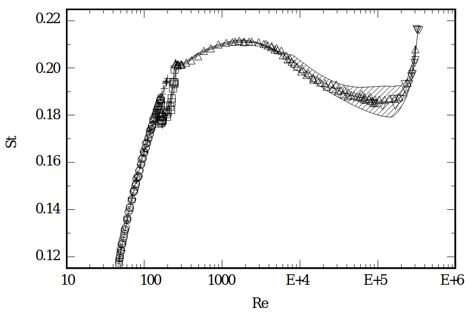



Just wrapping up the example from class.

Reminder of the setup:

Measuring flow speed is a difficult task! Placing a measurement device such as a vane or a drag-based flow meter will inhibit the nearby flow and may not provide a number representative of the flow in the entire domain. An interesting flow meter design relies on the [Von Kármán Vortex Street](https://en.wikipedia.org/wiki/Kármán_vortex_street) phenomenon: a cylinder placed in a uniform flow will "shed" counter-rotating vortices at a regular time interval. These vortices will generate enough fluid forces to cause the cylinder itself to oscillate, and maybe we have a piezoelectric core in the cylinder such that we can measure that oscillation rate.

::: {.column-margin}
Piezoelectric materials create electricity when deformed, and it is pretty easy to measure electricity.
:::

The variables in this problem are: $f$, the shedding frequency; $U$, the incoming flow speed; $D$, the cylinder diameter; $\rho$, the fluid density; and $\mu$, the fluid viscosity. That is, we have $n=5$ variables/parameters in the problem, and they use $r=3$ fundamental dimensions (MLT or FLT), and so $n-r=2$... we should expect two independent dimensionless groups.

This being a fluids problem, it is a very good guess that one of the dimensionless groups is the Reynolds Number:

$$
\text{Re}_D \equiv \frac{\rho U D}{\mu}.
$$

The other dimensionless group must include $f$ — we haven't used it yet. The dimensions of $f$ are $1/\text{T}$, so let's combine it with $U$ (dimensions of $\text{L}/\text{T}$) and $D$ (dimensions of $L$) to create a dimensionless number. We could write the system of equations, but we can probably also just guess:

$$
\text{St} \equiv \frac{f D}{U}.
$$

This is another important dimensionless number called "The Strouhal Number".

Experimental data on the vortex phenomenon is shown below, with the $x$-axis being the Reynolds Number and the $y$-axis is the Strouhal Number $\text{St}$.

{width=90%}

::: {.column-margin}
Figure from: Norberg "Fluctuating lift on a circular cylinder: review and new measurements," Journal of Fluids and Structures 17.1 (2003): 57-96.
:::

We should know our device geometry (we built it... maybe it's a long cylinder with diameter $D=0.02$ m) and we should know our fluid properties (maybe it's an oil with $\rho=800$ kg/m$^3$, $\mu=0.08$ Pa-s). Then we measure our electrical signal's oscillation frequency (maybe it's $f=25.6$ Hz), and then can determine our flow speed $U$ via an algorithm that looks something like

1. Guess a value for $U$. Compute $\text{Re}$ and $\text{St}$.
2. If that pair $(\text{Re},\text{St})$ indeed appears on the chart, you've found the correct flow speed $U$.
3. If not, guess a different $U$.

This is an "iterative scheme", and we will need to use a similar strategy later in the course!

::: {.callout-note}
This chart makes the variation seem a bit extreme — notice that the $y$-axis spans from 0.12 to 0.22, a relatively small range. Also notice that, from $\text{Re}_D\approx 10^2$ to $\text{Re}_D\approx 10^5$, the Strouhal Number is $0.20\pm 0.01$ (or so). The iterative scheme is probably not even necessary: we could simply claim $\text{St}\approx 0.20$, then

$$
\text{St}\approx \text{constant} = 0.20 = \frac{fD}{U} \implies U = 5 fD.
$$
:::
