

These are the ConceptTests from class for Unit 1 (fluid properties, units, and dimensions), in the order we asked them — so you can go back and vote again at your own pace. There are 49 of them, grouped by the reading they go with (vector-calculus notation, pressure, viscosity, units and dimensions, and Buckingham-Pi).

Here's how it works: click the option you'd pick. A wrong pick turns red and you can try again (no penalty, and talking it over on Slack is encouraged, not cheating). Land on the right one — or give up and hit *Show answer* — and you get the explanation. Nothing here is recorded or graded. (The answers are sitting in the page source, so this could never be an assessment anyway; it's just for practice.)

## Warm-up: vector calculus notation

### Warm-ups

::::::: {#vector-calculus-q1 .clicker data-answer="d" data-tempting="c"}

::: {.clicker-title}
Q1 · Notation
:::

::: {.stem}
Which of the following correctly represents the velocity field?
:::

::: {.opts}
- **(a)**  $\underline{u} = \langle u,\, v,\, w \rangle$
- **(b)**  $\underline{u} = u\,\hat{x} + v\,\hat{y} + w\,\hat{z}$
- **(c)**  $\mathbf{u} = \langle u\,\hat{x},\, v\,\hat{y},\, w\,\hat{z} \rangle$
- **(d)**  Both (a) and (b)
:::

:::::: {.clicker-answer}

::: {.stem}
Vectors can be described with scalars multiplying unit vectors or as components within $\langle ... \rangle$.
:::

::::::

:::::::

::::::: {#vector-calculus-q2 .clicker data-answer="c"}

::: {.clicker-title}
Q2 · Does this expression mean anything?
:::

::: {.stem}
Pressure $p$ is a scalar. Velocity $\mathbf{u}$ is a vector.
One of these is not a legal operation. Which one?
:::

::: {.opts}
- **(a)**  $\nabla P$
- **(b)**  $\nabla \cdot \mathbf{u}$
- **(c)**  $\nabla \cdot P$
- **(d)**  $\nabla \times \mathbf{u}$
:::

:::::: {.clicker-answer}

::: {.stem}
The divergence operator can only be applied to vectors.
:::

::::::

:::::::

### Discussion questions

::::::: {#vector-calculus-q3 .clicker data-answer="b"}

::: {.clicker-title}
Q3 · Which arrow is $\nabla p$?
:::

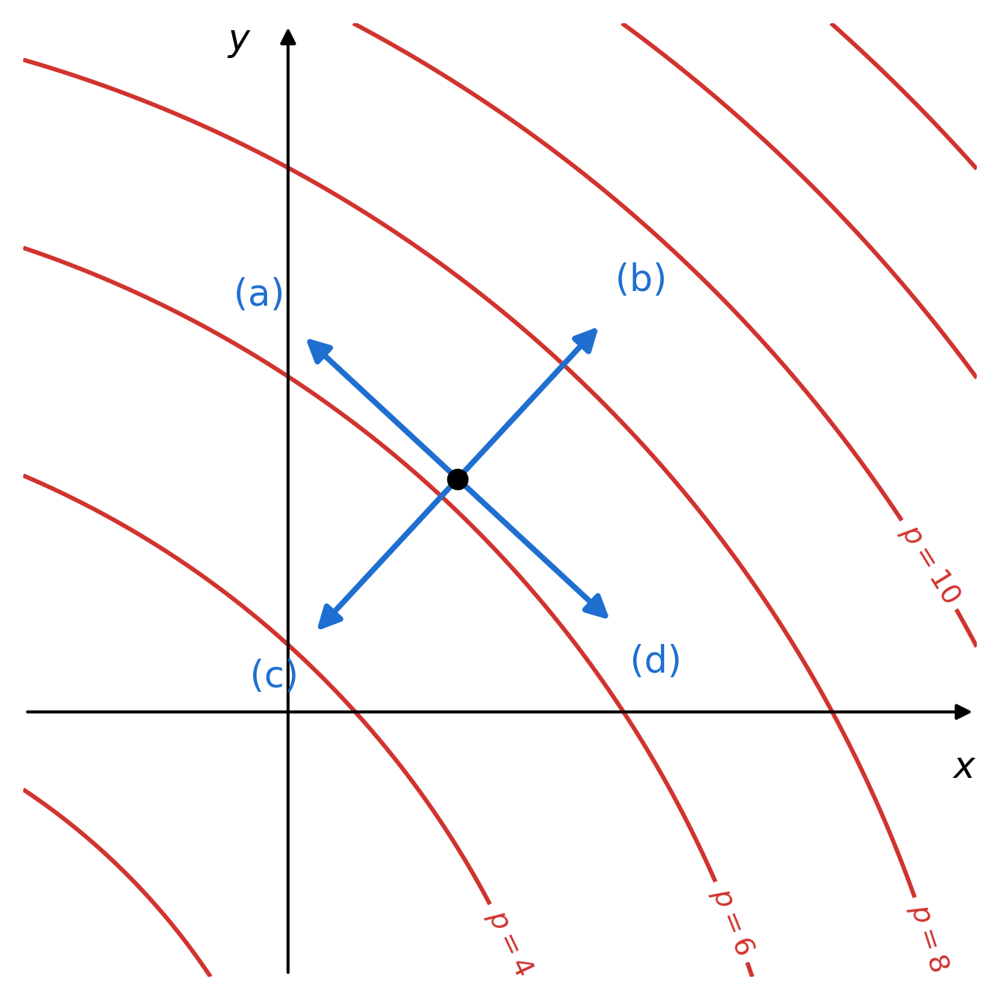{width="70%"}

::: {.aside-note}
Contours of a pressure field. Which arrow shows $\nabla p$ at the marked point?
:::

::: {.opts .letters}
- **(a)**
- **(b)**
- **(c)**
- **(d)**
:::

:::::: {.clicker-answer}

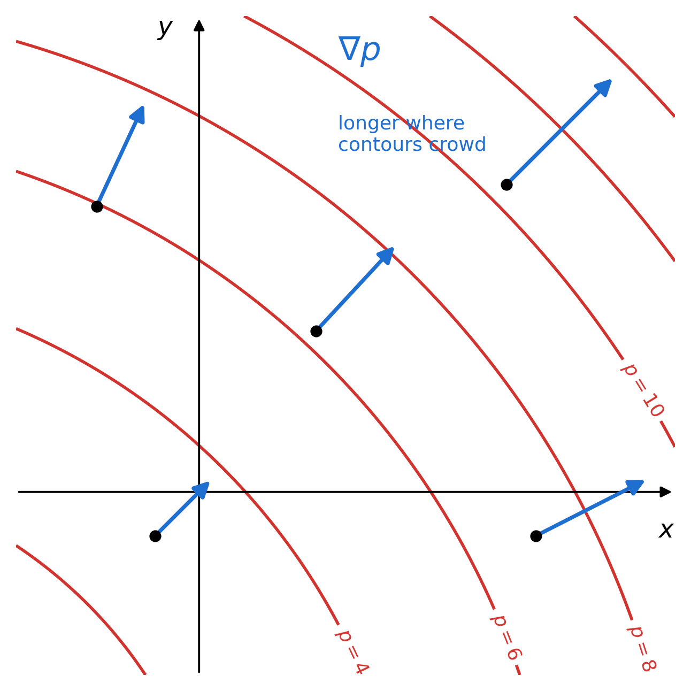{width="70%"}

::: {.stem}
Perpendicular to the contours, pointing toward **increasing** $p$.
:::

::::::

:::::::

::::::: {#vector-calculus-q4 .clicker data-answer="b"}

::: {.clicker-title}
Q4 · Where is $|\nabla p|$ largest?
:::

::: {.stem}
If contours occur in steps of 5 (i.e., at $p=0$, $p=5$, $p=10$, etc.), the gradient is largest where the contours are...
:::

::: {.opts}
- **(a)**  farthest apart
- **(b)**  closest together
- **(c)**  most sharply curved
- **(d)**  spacing has nothing to do with it
:::

:::::: {.clicker-answer}

::::::

:::::::

::::::: {#vector-calculus-q5 .clicker data-answer="b"}

::: {.clicker-title}
Q5 · Uniform is not the same as steady
:::

::: {.stem}
At one instant, a flow has $\nabla T = \mathbf{0}$ **everywhere**.
Which must be true?
:::

::: {.opts}
- **(a)**  $T$ is constant in time
- **(b)**  $T$ is the same everywhere in space at this instant
- **(c)**  Both
- **(d)**  Neither
:::

:::::: {.clicker-answer}

::: {.stem}
$\nabla$ collects the three **spatial** derivatives only. It says nothing
whatsoever about $\partial T/\partial t$.
:::

$$
T(x,y,z,t) = f(t) \qquad \Longrightarrow \qquad \nabla T = \underline{0}
\;\text{ for all } t
$$

::: {.aside-note}
**Uniform** = no variation in space.  **Steady** = no variation in time.
:::

::::::

:::::::

::::::: {#vector-calculus-q6 .clicker data-answer="b"}

::: {.clicker-title}
Q6 · Divergence in a nozzle
:::

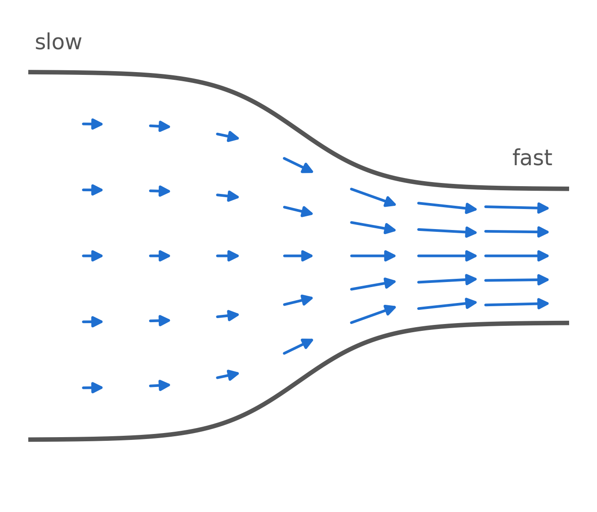{width="70%"}

::: {.stem}
Incompressible water speeds up through the nozzle, so
$\partial u / \partial x > 0$. Therefore $\nabla \cdot \mathbf{u}$ is:
:::

::: {.opts}
- **(a)**  $> 0$ — the fluid is a source
- **(b)**  $= 0$
- **(c)**  $< 0$
- **(d)**  not enough information
:::

:::::: {.clicker-answer}

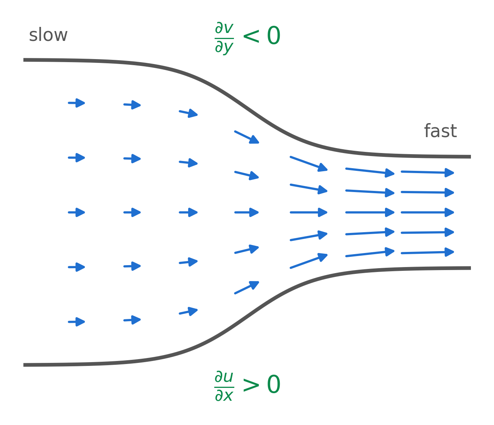{width="70%"}

::: {.stem}
The two terms cancel exactly. As the walls squeeze inward, $v$ decreases
with $y$ by precisely as much as $u$ increases with $x$.
:::

::::::

:::::::

::::::: {#vector-calculus-q7 .clicker data-answer="b"}

::: {.clicker-title}
Q7 · Straight streamlines, no curl?
:::

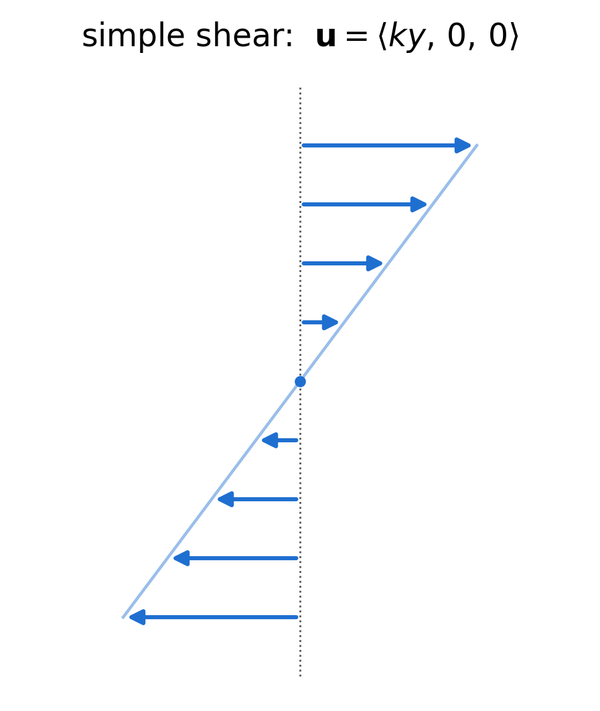{width="70%"}

::: {.stem}
The streamlines are straight and parallel. Is $\nabla \times \mathbf{u} = \mathbf{0}$?
:::

::: {.opts}
- **(a)**  Yes — nothing is going in circles
- **(b)**  No
- **(c)**  Only along $y = 0$
- **(d)**  Cannot tell without knowing $k$
:::

:::::: {.clicker-answer}

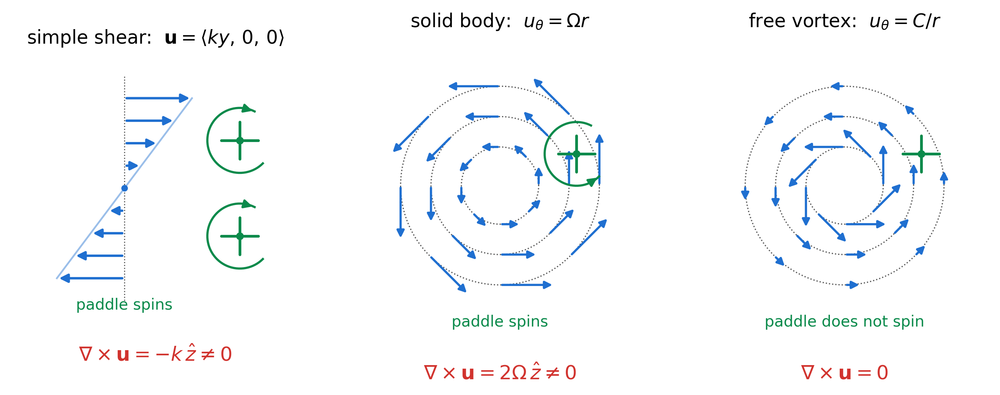{width="94%"}

::: {.stem}
Curl measures **local** spin, not whether the path curves.
:::

::::::

:::::::

## 1.1 Pressure

*Reading: [1.1 Pressure](pressure.qmd)*

### Warm-ups (a little calculus review)

::::::: {#pressure-q1 .clicker data-answer="b"}

::: {.clicker-title}
Q1 · Sign of a rate of change
:::

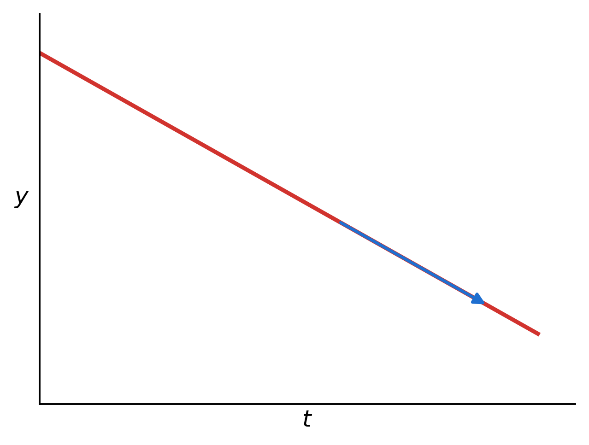{width="70%"}

::: {.stem}
A ball's height $y(t)$ looks like this. What is
the sign of $dy/dt$?
:::

::: {.opts}
- **(a)**  positive
- **(b)**  negative
- **(c)**  zero
- **(d)**  can't tell without a formula for $y(t)$
:::

:::::: {.clicker-answer}

::: {.stem}
$y$ is decreasing as $t$ increases, so the slope of the graph — and
therefore $dy/dt$ — is negative.
:::

::::::

:::::::

::::::: {#pressure-q2 .clicker data-answer="c"}

::: {.clicker-title}
Q2 · Units check
:::

::: {.stem}
Pressure is a force per area. What are its SI units?
:::

::: {.opts}
- **(a)**  N
- **(b)**  N/m
- **(c)**  N/m²
- **(d)**  N·m
:::

:::::: {.clicker-answer}

::: {.stem}
Force over area. N/m² is also known as the Pascal, Pa.
:::

::::::

:::::::

::::::: {#pressure-q3 .clicker data-answer="a" data-tempting="b"}

::: {.clicker-title}
Q3 · Scalar or vector?
:::

::: {.stem}
Pressure $p(x,y,z,t)$ is best described as a...
:::

::: {.opts}
- **(a)**  scalar field
- **(b)**  vector field
- **(c)**  tensor field
- **(d)**  constant
:::

:::::: {.clicker-answer}

::: {.stem}
Pressure has a value at every point in space and time, but no direction of
its own. It produces a force — a vector — once you pick a surface
for it to act on.
:::

::::::

:::::::

### Discussion questions

::::::: {#pressure-q4 .clicker data-answer="a"}

::: {.clicker-title}
Q4 · Molecule bounce
:::

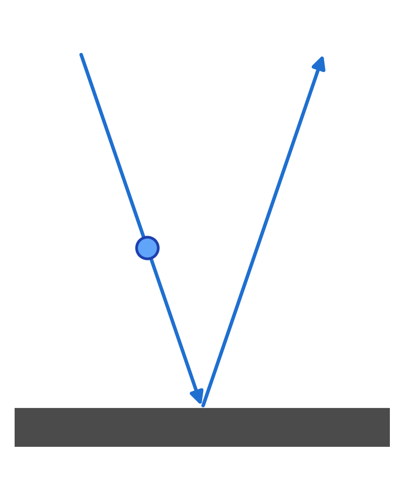{width="70%"}

::: {.stem}
A nitrogen molecule bounces off the floor, as shown. The floor's normal
points in the $+\hat{y}$ direction. What is the sign of $\Delta v$ (the
molecule's $y$-velocity, new minus old)?
:::

::: {.opts}
- **(a)**  $\Delta v > 0$
- **(b)**  $\Delta v < 0$
- **(c)**  $\Delta v = 0$
- **(d)**  depends on the bounce angle
:::

:::::: {.clicker-answer}

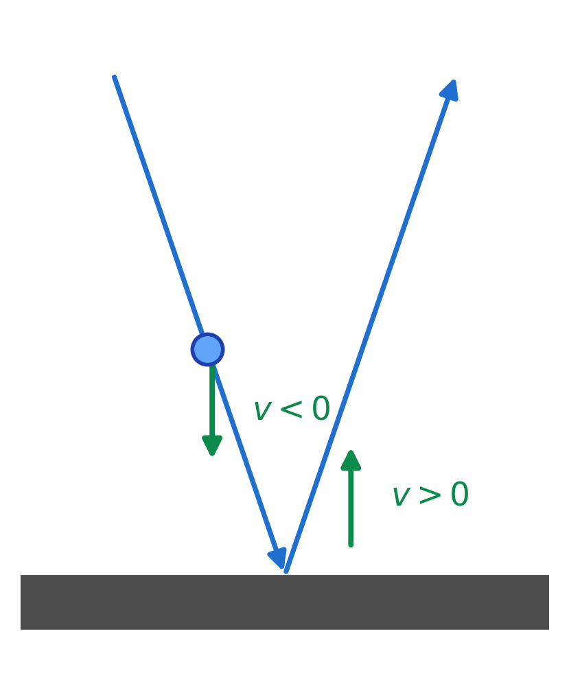{width="70%"}

::: {.stem}
$v$ goes from negative (heading down, toward the floor) to positive
(heading up, away from it), and we are focused on just the \hat{y}-component.
:::

::::::

:::::::

::::::: {#pressure-q5 .clicker data-answer="b"}

::: {.clicker-title}
Q5 · Newton's third law
:::

::: {.stem}
Same collision. The molecule feels a force in the $+\hat{y}$ direction
from the floor. What direction is the force **on the floor**, from this
one collision?
:::

::: {.opts}
- **(a)**  $+\hat{y}$
- **(b)**  $-\hat{y}$
- **(c)**  $0$ — floors don't feel individual collisions
- **(d)**  depends on the molecule's speed
:::

:::::: {.clicker-answer}

::: {.stem}
Equal and opposite.
:::

::::::

:::::::

::::::: {#pressure-q6 .clicker data-answer="c"}

::: {.clicker-title}
Q6 · Which arrows are which?
:::

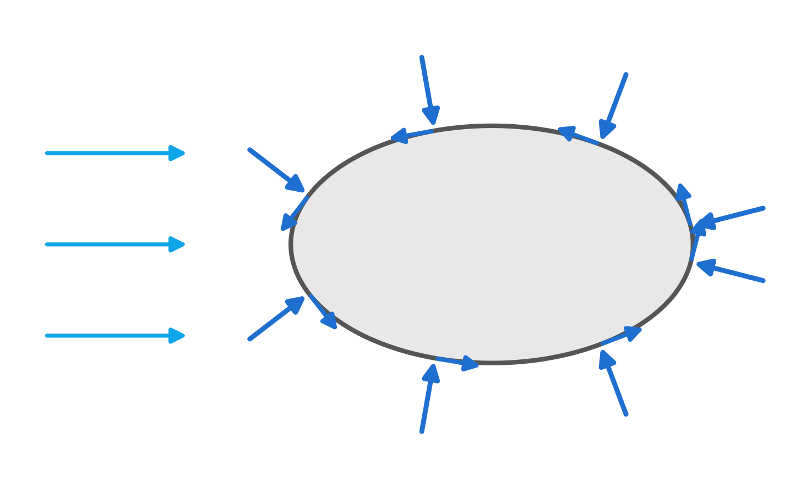{width="70%"}

::: {.stem}
Wind is blowing past this object, left to right. Some of these arrows on
the surface represent pressure forces, others represent viscous (shear)
forces. Which is which?
:::

::: {.opts}
- **(a)**  All of them are pressure forces
- **(b)**  All of them are viscous forces
- **(c)**  The ones pointing straight into the body are pressure; the rest are viscous
- **(d)**  There's no way to tell from this picture
:::

:::::: {.clicker-answer}

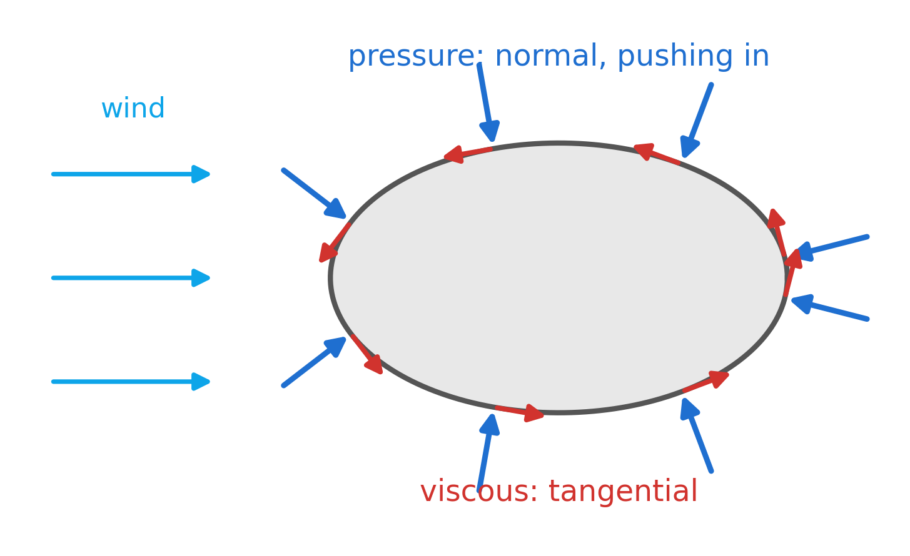{width="70%"}

::: {.stem}
Pressure always acts **normal** to the surface, and always pushes *in*
(compressing the body) — never out. Viscous (shear) forces act **tangent**
to it — along the surface, from the fluid "grabbing" as it slides past.
:::

::::::

:::::::

::::::: {#pressure-q7 .clicker data-answer="b"}

::: {.clicker-title}
Q7 · Pressure gradient, force on a cube
:::

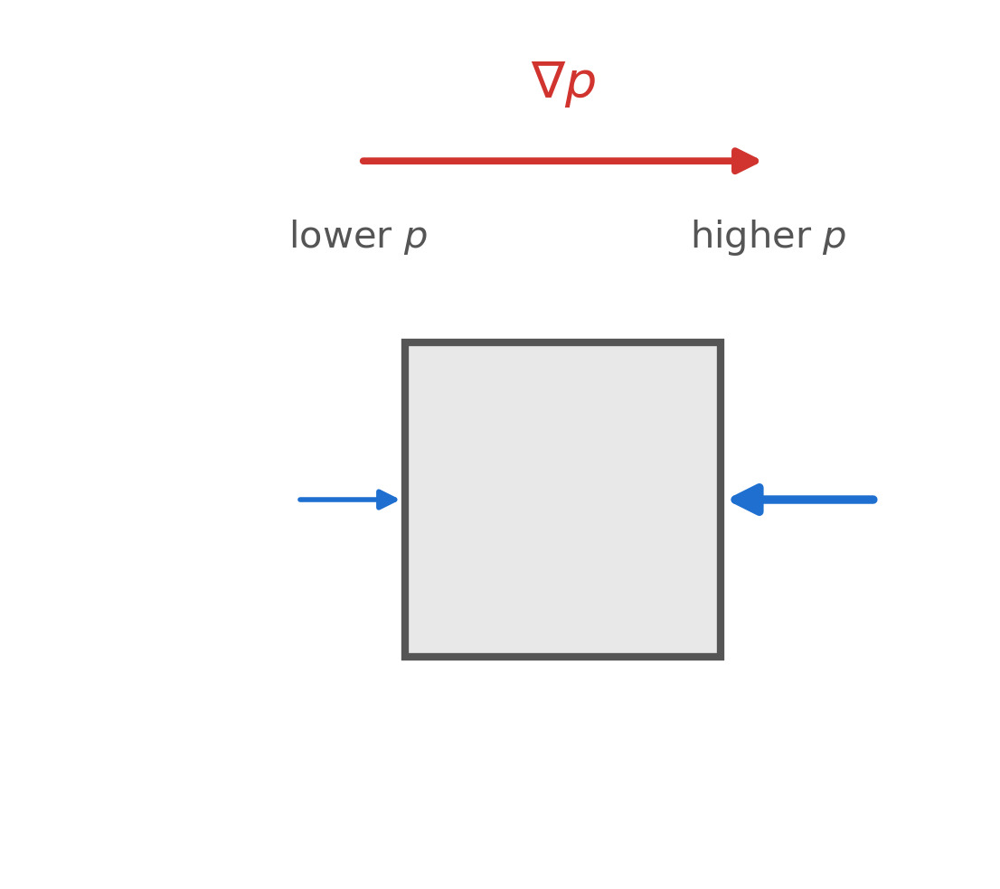{width="70%"}

::: {.stem}
A small cube of fluid sits in a region where $\nabla p$ points in the
$+\hat{x}$ direction, as shown — pressure is higher on the right face than
the left. What direction is the net pressure force on the cube?
:::

::: {.opts}
- **(a)**  $+\hat{x}$, same direction as $\nabla p$
- **(b)**  $-\hat{x}$, opposite $\nabla p$
- **(c)**  $0$ — the two faces' forces cancel
- **(d)**  Not enough information
:::

:::::: {.clicker-answer}

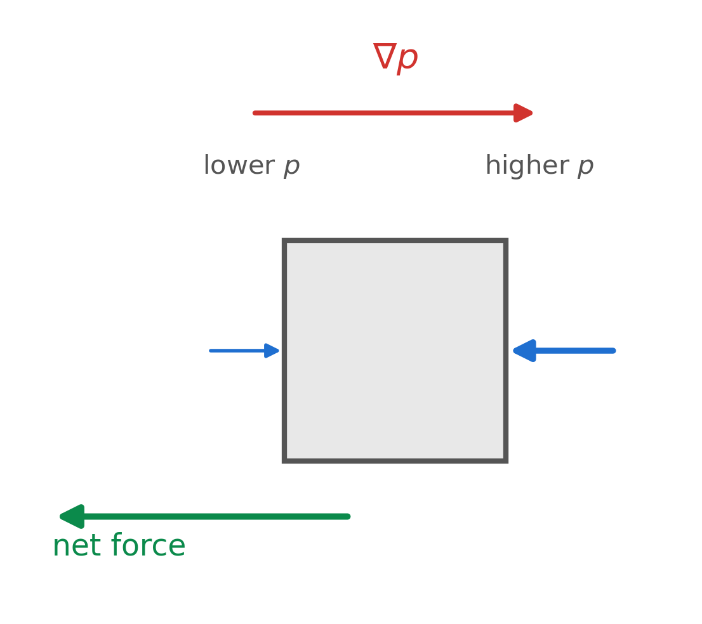{width="70%"}

::: {.stem}
Pressure pushes *in* on every face, and the pressure is increasing as we follow the gradient. So higher pressure on right, leading to a net force left.
:::

::::::

:::::::

::::::: {#pressure-q8 .clicker data-answer="a"}

::: {.clicker-title}
Q8 · Parked in the sun
:::

::: {.stem}
My car tire, when parked in the garage, is at $34$ psi. What happens to
the reading when I drive around in the sun for a while?
:::

::: {.opts}
- **(a)**  The reading increases
- **(b)**  The reading decreases
- **(c)**  The reading stays exactly $34$ psi
- **(d)**  Not enough information
:::

:::::: {.clicker-answer}

::: {.stem}
The tire is (roughly) a fixed volume with a fixed amount of air in it.
Driving heats the air, and by the ideal gas
law, more temperature at constant volume means more pressure.
:::

::::::

:::::::

::::::: {#pressure-q9 .clicker data-answer="b"}

::: {.clicker-title}
Q9 · Boulder to Illinois
:::

::: {.stem}
I leave Boulder, where the atmospheric pressure is $83$ kPa, and drive to
Illinois, where the atmospheric pressure is $101$ kPa. Assuming the tire
is the same temperature the whole way, and that gauge pressure is defined
relative to the *local* atmospheric pressure: what happens to the pressure
measurement?
:::

::: {.opts}
- **(a)**  The reading increases
- **(b)**  The reading decreases
- **(c)**  The reading stays the same
- **(d)**  Not enough information
:::

:::::: {.clicker-answer}

::: {.stem}
Same temperature, same amount of gas, same volume — the *absolute*
pressure inside the tire hasn't changed at all. But
$p_\text{gauge} = p_\text{absolute} - p_\text{reference}$... the reference pressure has increased.

So do you think I'll need to pump up my tires along the way?
:::

::::::

:::::::

## 1.2 Viscosity

*Reading: [1.2 Viscosity](viscosity.qmd)*

### Warm-ups

::::::: {#viscosity-q1 .clicker data-answer="b"}

::: {.clicker-title}
Q1 · Units check
:::

::: {.stem}
A velocity gradient $du/dy$ shows up in Newton's Law of Viscosity. What
are its SI units?
:::

::: {.opts}
- **(a)**  m/s
- **(b)**  1/s
- **(c)**  m²/s
- **(d)**  s
:::

:::::: {.clicker-answer}

::: {.stem}
Velocity over length: (m/s)/m = 1/s.
:::

::::::

:::::::

::::::: {#viscosity-q2 .clicker data-answer="a"}

::: {.clicker-title}
Q2 · Reading a velocity profile
:::

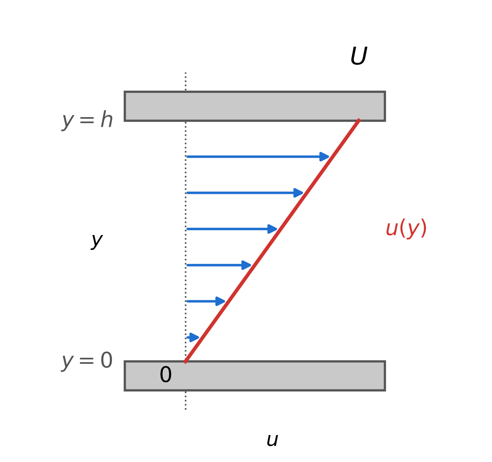{width="70%"}

::: {.stem}
Simple shear between two plates, no-slip at both. What are $u(0)$ and
$u(h)$?
:::

::: {.opts}
- **(a)**  $u(0)=0$, $u(h)=U$
- **(b)**  $u(0)=U$, $u(h)=0$
- **(c)**  $u(0)=u(h)=U/2$
- **(d)**  Can't tell without knowing $\mu$
:::

:::::: {.clicker-answer}

::: {.stem}
No-slip: the fluid speed matches the wall speed. The
bottom plate is fixed, so $u(0)=0$; the top plate moves at $U$, so
$u(h)=U$.
:::

::::::

:::::::

::::::: {#viscosity-q3 .clicker data-answer="a"}

::: {.clicker-title}
Q3 · Is the stress constant?
:::

{width="70%"}

::: {.stem}
For this particular (straight-line) profile, is $\tau$ the same at every
$y$ across the gap, or does it change?
:::

::: {.opts}
- **(a)**  Constant — the same at every $y$
- **(b)**  Largest in the middle, smaller near the walls
- **(c)**  Largest near the walls, smaller in the middle
- **(d)**  Zero everywhere except right at the walls
:::

:::::: {.clicker-answer}

::: {.stem}
A straight line has one slope, and $\tau \sim du/dy$.
:::

::: {.aside-note}
Not all flows have constant $du/dy$!
:::

::::::

:::::::

### Discussion questions

::::::: {#viscosity-q4 .clicker data-answer="a"}

::: {.clicker-title}
Q4 · Solid vs. fluid, under the same force
:::

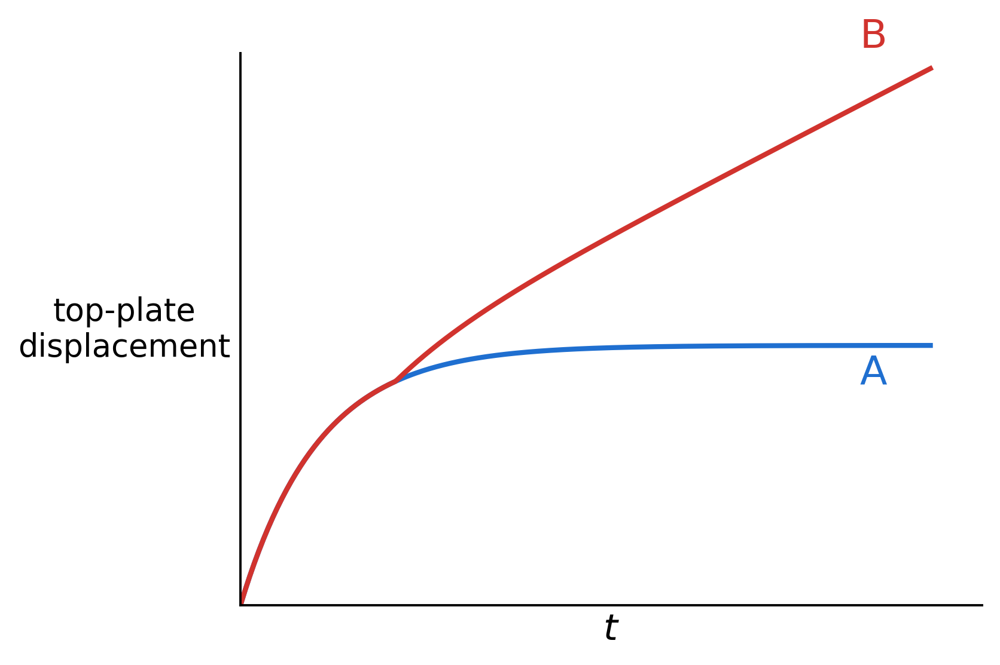{width="70%"}

::: {.stem}
Same constant shear force $F$, applied at $t=0$ to two different
materials in the simple shear geometry. Curve A and curve B show the top
plate's displacement over time. Which curve is the solid, and which is
the fluid?
:::

::: {.opts}
- **(a)**  A is the solid, B is the fluid
- **(b)**  A is the fluid, B is the solid
- **(c)**  Both are solids
- **(d)**  Both are fluids
:::

:::::: {.clicker-answer}

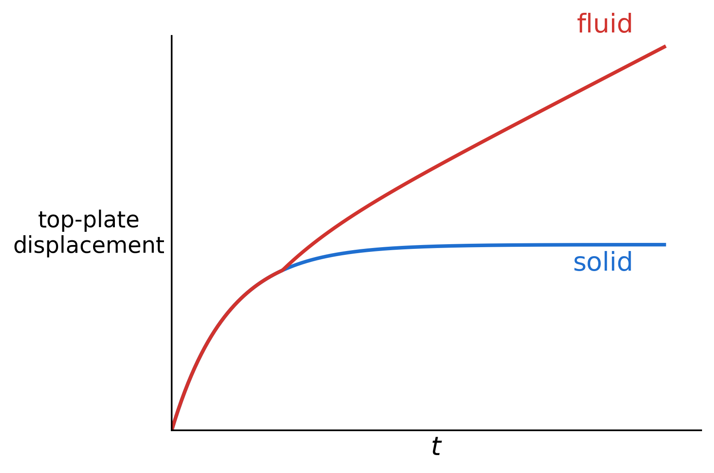{width="70%"}

::: {.stem}
The solid reaches a **fixed deformation** and stops — the elastic force
inside it grows until it balances $F$, then nothing more moves. The fluid
never stops: after a brief transient it settles into a **constant rate**
of deformation. The viscous force inside grows until it balances the applied force, and then the plate continues at that speed forever.
:::

::::::

:::::::

::::::: {#viscosity-q5 .clicker data-answer="b"}

::: {.clicker-title}
Q5 · Viscosity vs. shear rate
:::

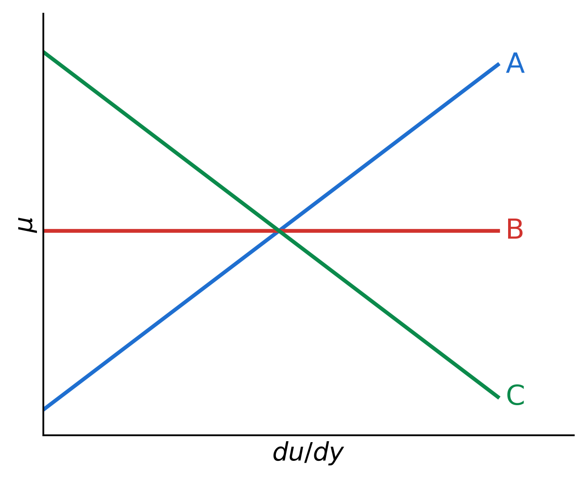{width="70%"}

::: {.stem}
Assume the simple shear geometry, with constant area $A$ and constant
temperature. Curves A, B, and C show three candidate materials' viscosity
$\mu$ plotted against $du/dy$. Which one describes a Newtonian fluid?
:::

::: {.opts}
- **(a)**  A
- **(b)**  B
- **(c)**  C
- **(d)**  All three could be Newtonian
:::

:::::: {.clicker-answer}

::: {.stem}
For an isothermal Newtonian fluid, $\mu$ is a **constant material property** — a constant. A and C show $\mu$ changing with $du/dy$.
:::

::: {.aside-note}
$\mu = \tau/(du/dy)$ in general. For a Newtonian fluid, that ratio stays constant.
:::

::::::

:::::::

::::::: {#viscosity-q6 .clicker data-answer="a"}

::: {.clicker-title}
Q6 · Shear stress vs. shear rate
:::

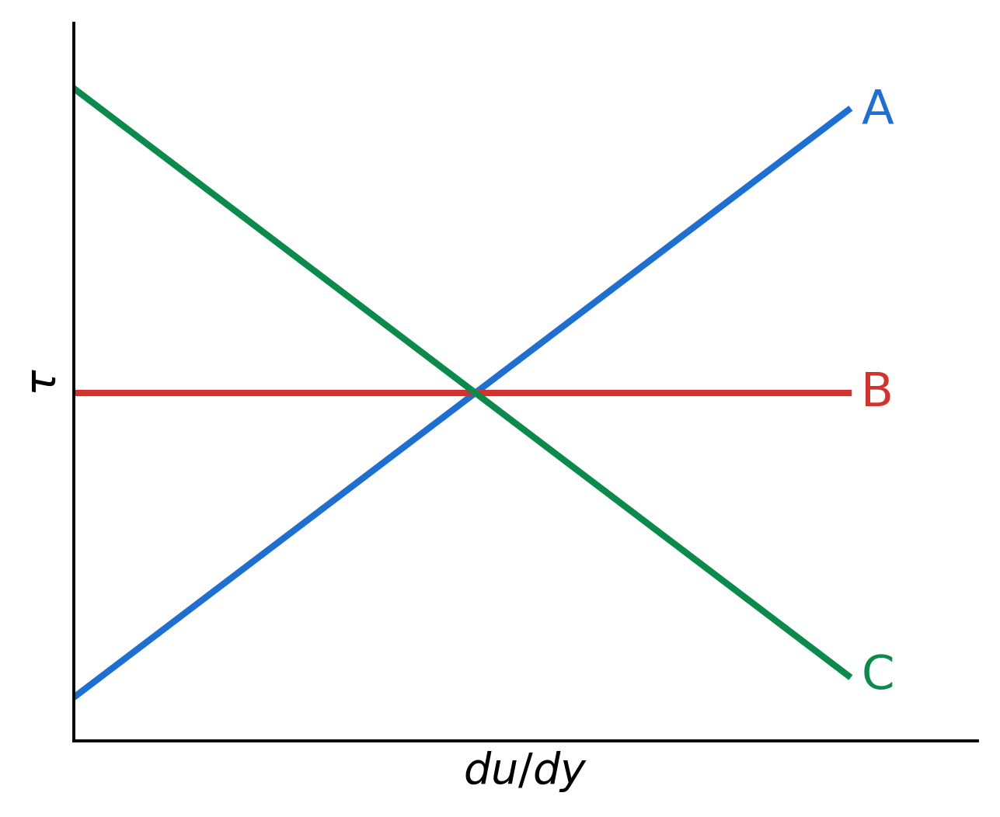{width="70%"}

::: {.stem}
Same three candidate materials, same simple shear geometry, constant area
$A$. This time the plot is shear stress $\tau$ against $du/dy$. Which one
describes a Newtonian fluid?
:::

::: {.opts}
- **(a)**  A
- **(b)**  B
- **(c)**  C
- **(d)**  All three could be Newtonian
:::

:::::: {.clicker-answer}

::: {.stem}
Newton's Law of Viscosity is $\tau = \mu\,(du/dy)$, so a plot of $\tau(du/dy)$ ("tau as a function of du/dy") is a straight line through the origin with constant (positive) slope $\mu$.
:::

::::::

:::::::

::::::: {#viscosity-q7 .clicker data-answer="b"}

::: {.clicker-title}
Q7 · A Bingham material
:::

::: {.stem}
This is the $\tau$ vs. $du/dy$ curve for a **Bingham plastic** — toothpaste, whipped cream, hand sanitizer: it behaves like a solid until the stress
exceeds a yield stress $\tau_0$, then flows like a viscous fluid. Which of
these $\mu$ vs. $du/dy$ curves contains the *same information*?
:::

:::: {.columns}
::: {.column width="45%"}
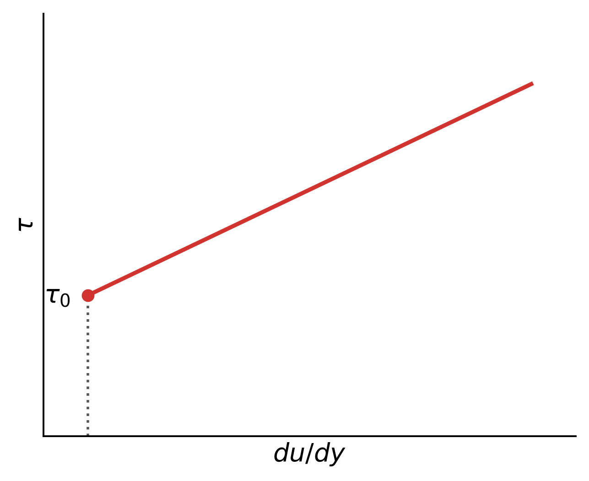
:::
::: {.column width="45%"}
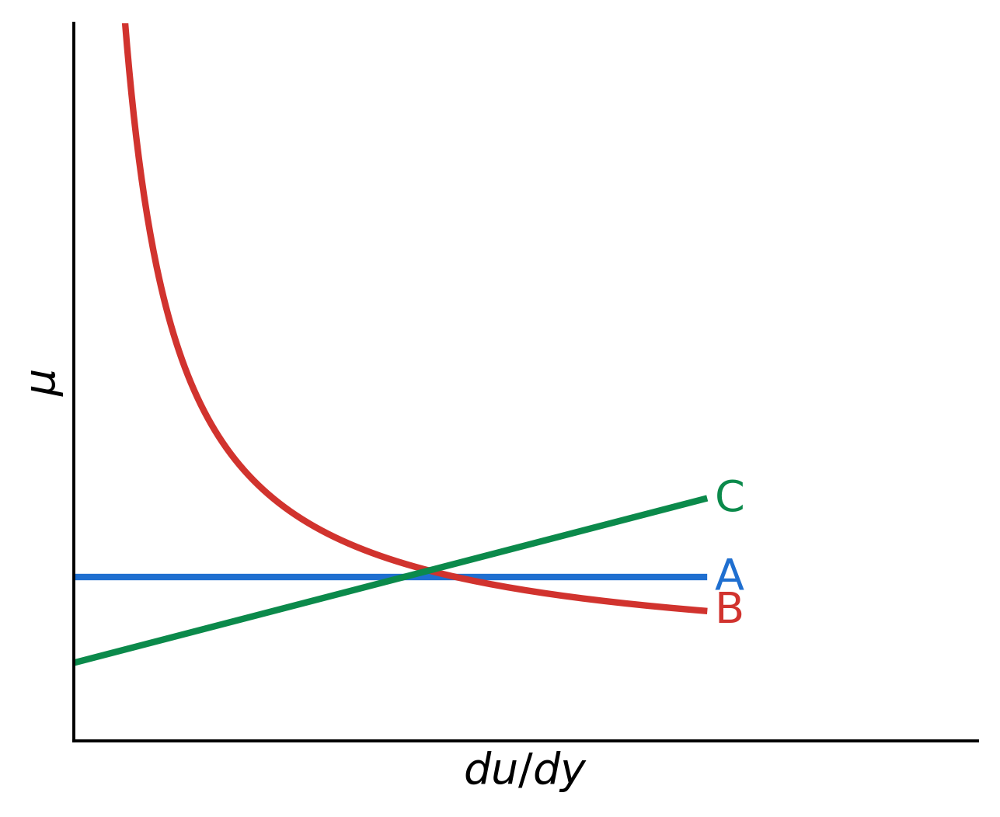
:::
::::

::: {.opts}
- **(a)**  A
- **(b)**  B
- **(c)**  C
- **(d)**  None of them — you can't get $\mu$ from this plot
:::

::: {.aside-note}
Hint: $\mu = \tau/(du/dy)$.
:::

:::::: {.clicker-answer}

:::: {.columns}
::: {.column width="45%"}
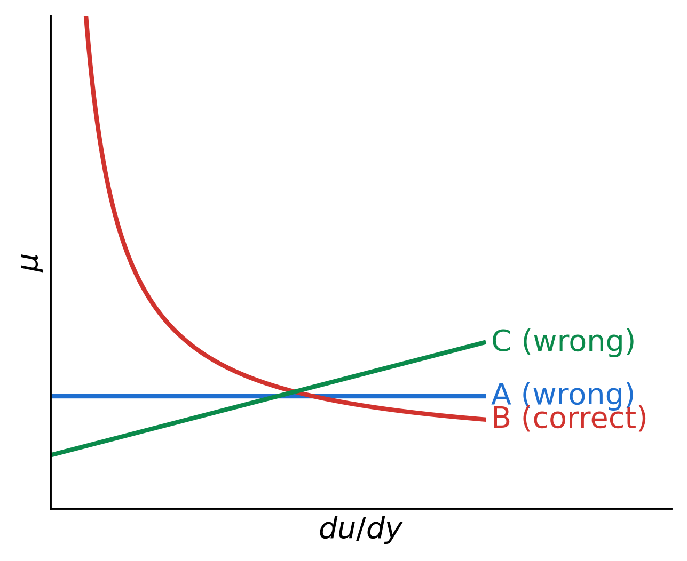
:::
::::

::: {.stem}
$\tau = \tau_0 + \mu_p\,(du/dy)$ for this material, so
$\mu = \tau/(du/dy) = \tau_0/(du/dy) + \mu_p$. As $du/dy \to 0$, $\mu \to
\infty$ — it takes almost no stress to *barely* deform it once you're past
yield, but an enormous *apparent* viscosity right at the threshold. As
$du/dy$ grows, $\mu$ settles down toward $\mu_p$. That's curve B: falling,
approaching a constant plateau — not flat (A), and not rising (C).
:::

::::::

:::::::

::::::: {#viscosity-q8 .clicker data-answer="c"}

::: {.clicker-title}
Q8 · Combined scaling
:::

::: {.stem}
Same simple shear setup, $F = \mu U A / h$. If you double **both** the
viscosity $\mu$ *and* the gap $h$ at the same time (everything else held
fixed), what happens to $F$?
:::

::: {.opts}
- **(a)**  $F$ doubles
- **(b)**  $F$ is cut in half
- **(c)**  $F$ is unchanged
- **(d)**  $F$ quadruples
:::

:::::: {.clicker-answer}

::: {.stem}
$F \propto \mu/h$. Doubling both means $F$ is unchanged.
:::

::::::

:::::::

::::::: {#viscosity-q9 .clicker data-answer="b"}

::: {.clicker-title}
Q9 · Environmental fluid mechanics
:::

::: {.stem}
You're standing waist-deep in a river, legs planted, not moving. The river
flows steadily past you. What is the water velocity **right at the
surface of your legs**, relative to your legs?
:::

::: {.opts}
- **(a)**  The full river speed
- **(b)**  Zero
- **(c)**  Half the river speed
- **(d)**  It depends on the water's viscosity
:::

:::::: {.clicker-answer}

::: {.stem}
No-slip: your legs are the "wall," and they aren't moving, so the water
touching them isn't moving relative to them either — even though water a
foot away is moving at the full river speed.
:::

::::::

:::::::

::::::: {#viscosity-q10 .clicker data-answer="c"}

::: {.clicker-title}
Q10 · Same force, twice the viscosity
:::

::: {.stem}
Two identical simple-shear setups (same $A$, same $h$), pushed with the
same constant force $F$ until each reaches steady state. Fluid 2 has
twice the viscosity of Fluid 1. How does Fluid 2's steady-state plate
speed $U_2$ compare to Fluid 1's, $U_1$?
:::

::: {.opts}
- **(a)**  $U_2 = 2\,U_1$
- **(b)**  $U_2 = U_1$
- **(c)**  $U_2 = U_1/2$
- **(d)**  $U_2 = U_1/4$
:::

:::::: {.clicker-answer}

::: {.stem}
Solve $F = \mu U A/h$ for the speed: $U = Fh/(\mu A)$. $U$ is inversely
proportional to $\mu$, so doubling the viscosity halves the steady-state
speed for the same driving force.
:::

::::::

:::::::

::::::: {#viscosity-q11 .clicker data-answer="a"}

::: {.clicker-title}
Q11 · Poiseuille flow: where's the shear stress largest?
:::

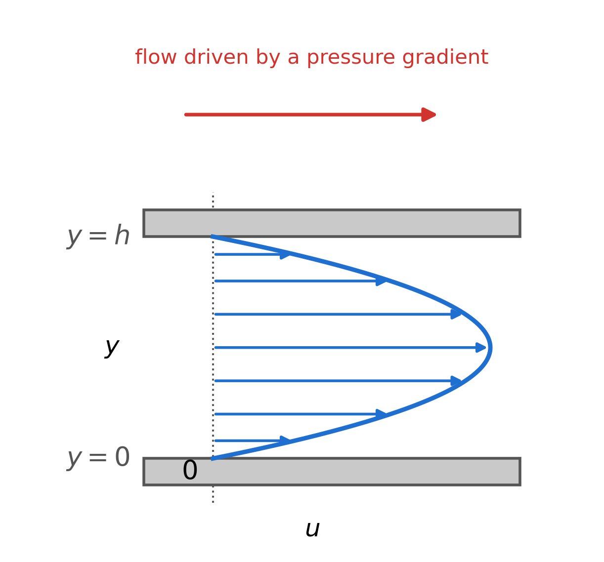{width="70%"}

::: {.stem}
Suppose we have this flow between two **fixed** plates, with no-slip at both walls, so $u=0$ at $y=0$ and $y=h$. Where is the shear stress $\tau$ largest in magnitude?
:::

::: {.opts}
- **(a)**  At the walls, $y=0$ and $y=h$
- **(b)**  At the centerline, $y=h/2$
- **(c)**  The same everywhere across the gap
- **(d)**  Can't tell without the pressure gradient
:::

:::::: {.clicker-answer}

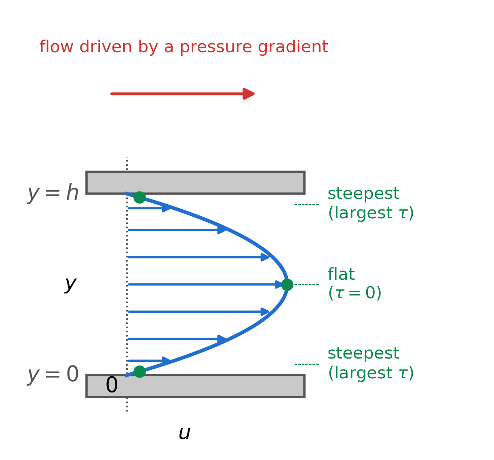{width="70%"}

::: {.stem}
$\tau = \mu\,du/dy$ — shear stress tracks the *slope* of the velocity
profile, not its value. The parabola is steepest right at the walls,
where no-slip forces $u$ from its interior value down to zero over a
short distance. At the centerline the profile flattens out ($du/dy=0$
there by symmetry), so $\tau=0$ at the exact point where the speed is
fastest.
:::

::: {.aside-note}
Fastest flow is not the most stress!
:::

::::::

:::::::

## 2.1 Units and dimensions

*Reading: [2.1 Units and Dimensions](units-and-dims.qmd)*

### Warm-ups

::::::: {#units-and-dims-q1 .clicker data-answer="c" data-tempting="d"}

::: {.clicker-title}
Q1 · Units check
:::

::: {.stem}
What are the SI units of energy?
:::

::: {.opts}
- **(a)**  N (Newton)
- **(b)**  Pa (Pascal)
- **(c)**  J (Joule)
- **(d)**  W (Watt)
:::

:::::: {.clicker-answer}

::: {.stem}
A Joule is the SI unit of energy. A Watt is energy *per time* —
tempting.
:::

::::::

:::::::

::::::: {#units-and-dims-q2 .clicker data-answer="a"}

::: {.clicker-title}
Q2 · Matching exponents
:::

::: {.stem}
An equation must hold for *any* value of $x$. One side of the equation
involves $x^a$, the other involves $x^b$. What must be true?
:::

::: {.opts}
- **(a)**  $a$ and $b$ must be equal
- **(b)**  $a$ and $b$ must add to zero
- **(c)**  $a$ and $b$ can be anything, as long as $x>0$
- **(d)**  Nothing — it depends on the value of $x$
:::

:::::: {.clicker-answer}

::: {.stem}
This is the logic behind matching exponents when we
balance dimensions.
:::

::::::

:::::::

::::::: {#units-and-dims-q3 .clicker data-answer="b"}

::: {.clicker-title}
Q3 · MLT vs. FLT
:::

::: {.stem}
Density has dimensions M/L³ in the MLT system. A classmate says: "so in
the FLT system it must be F/L³." Is that right?
:::

::: {.opts}
- **(a)**  Yes — just swap M for F
- **(b)**  No — density is FT²/L⁴ in FLT
- **(c)**  No — density doesn't have a consistent dimension across systems
- **(d)**  Yes, but only for incompressible fluids
:::

:::::: {.clicker-answer}

::: {.stem}
$\text{M}=\text{FT}^2/\text{L}$, so substituting into M/L³ gives $\text{FT}^2/\text{L}^4$. MLT and FLT are two equivalent descriptions of the same physical quantity.
:::

::::::

:::::::

::::::: {#units-and-dims-q4 .clicker data-answer="b"}

::: {.clicker-title}
Q4 · Catching a dimensional bug
:::

::: {.stem}
While deriving the max height of a tossed ball, you arrive at
$h_\text{max} = V_0 + g$. A classmate says this can't be right. Why not?
:::

::: {.opts}
- **(a)**  It's missing a factor of $1/2$
- **(b)**  $V_0$ and $g$ have different dimensions — you can't add them
- **(c)**  $h_\text{max}$ should also depend on the ball's mass
- **(d)**  The sign should be $V_0 - g$
:::

:::::: {.clicker-answer}

::: {.stem}
$[V_0]=\text{L/T}$ and $[g]=\text{L/T}^2$ — different dimensions can never be added.
:::

::::::

:::::::

### Discussion questions

::::::: {#units-and-dims-q5 .clicker data-answer="a"}

::: {.clicker-title}
Q5 · Terminal velocity: drag vs. weight
:::

::: {.stem}
A raindrop of size $L$ and density $\rho_s$ falls through air of density
$\rho$ at speed $U$. Drag scales like $\rho U^2 L^2$, and its weight
scales like $\rho_s\, g\, L^3$. Which combination of these is
dimensionless?
:::

::: {.opts}
- **(a)**  $\dfrac{\rho U^2}{\rho_s\, g\, L}$
- **(b)**  $\dfrac{\rho U^2 L}{\rho_s\, g}$
- **(c)**  $\dfrac{\rho U^2}{\rho_s\, g}$
- **(d)**  $\dfrac{\rho U}{\rho_s\, g\, L}$
:::

:::::: {.clicker-answer}

::: {.stem}
Drag and weight are both forces, so their ratio is automatically
dimensionless. Then some algebra gets you (a).
:::

::: {.aside-note}
At terminal velocity, drag balances weight, i.e. this ratio $\approx 1$
— set it equal to 1 and solve for $U$ and you get the *scaling* of
terminal velocity.
:::

::::::

:::::::

::::::: {#units-and-dims-q6 .clicker data-answer="b"}

::: {.clicker-title}
Q6 · Does a pendulum's period depend on its mass?
:::

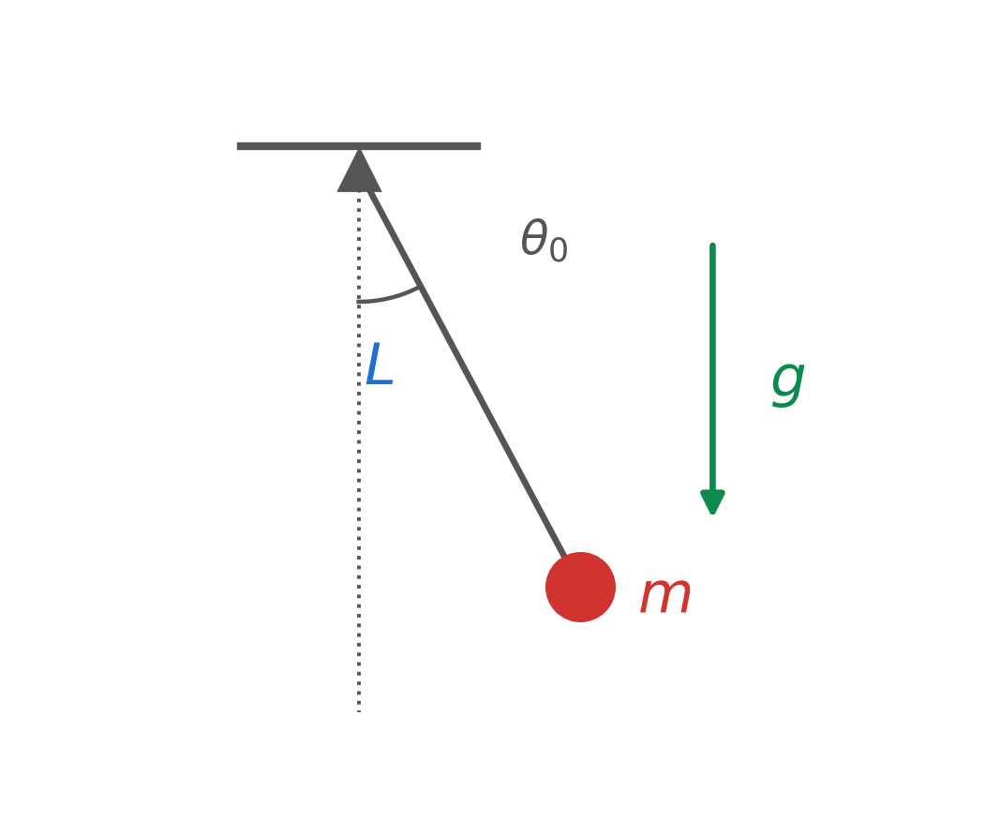{width="70%"}

::: {.stem}
Curves A, B, and C show three candidate relationships between a
pendulum's period $t_\text{osc}$ and its mass $m$, with $L$ and $g$ held fixed. We use dimensional analysis to determine $t_\text{osc}\sim\sqrt{L/g}$. Which plot is correct?
:::

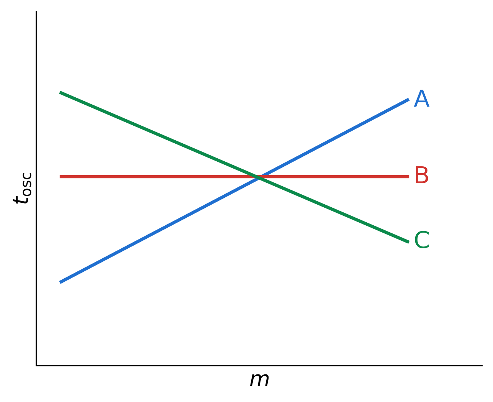{width="70%"}

::: {.opts}
- **(a)**  A
- **(b)**  B
- **(c)**  C
- **(d)**  Not enough information
:::

:::::: {.clicker-answer}

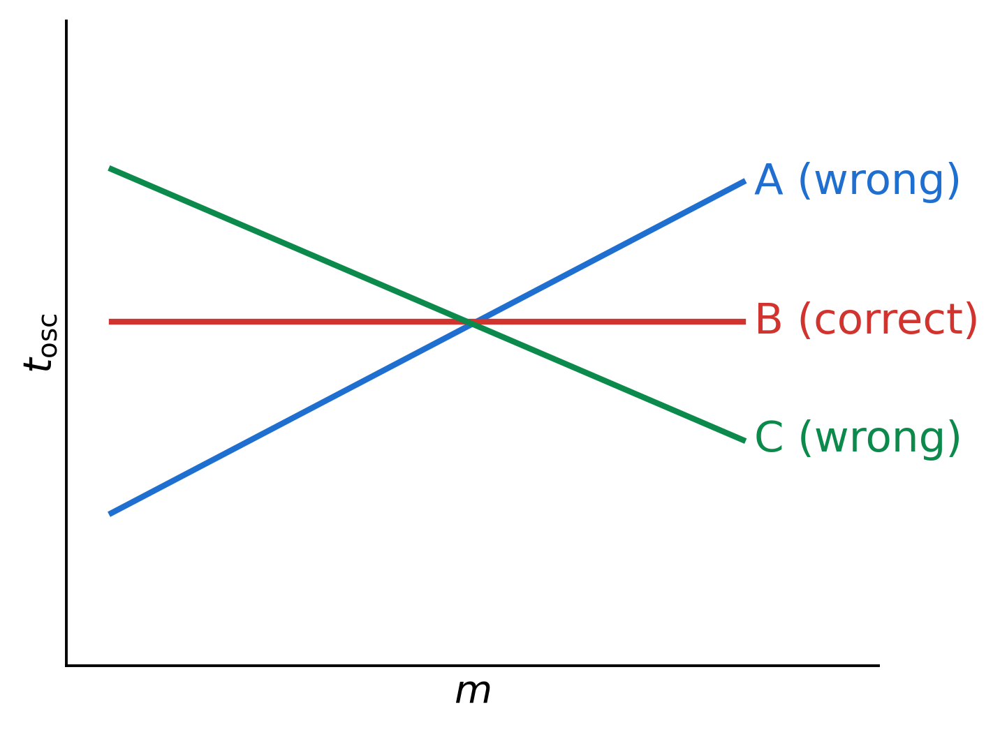{width="70%"}

::: {.stem}
The oscillation time is (perhaps unintuitively) independent of mass.
:::

::::::

:::::::

::::::: {#units-and-dims-q7 .clicker data-answer="c"}

::: {.clicker-title}
Q7 · Pendulum clock on the Moon
:::

::: {.stem}
Since $t_\text{osc}\sim\sqrt{L/g}$, and lunar gravity is about
$g_\text{moon}\approx g_\text{earth}/6$, what happens to a pendulum
clock's period if you bring it to the Moon (same $L$)?
:::

::: {.opts}
- **(a)**  About $\sqrt{6}\approx 2.4\times$ shorter
- **(b)**  About $6\times$ longer
- **(c)**  About $\sqrt{6}\approx 2.4\times$ longer
- **(d)**  About $6\times$ shorter
:::

:::::: {.clicker-answer}

::: {.stem}
$t_\text{osc}\sim g^{-1/2}$, so shrinking $g$ by a factor of 6 stretches
the period by $\sqrt{6}\approx 2.46$ — not by a full factor of 6.
:::

::::::

:::::::

::::::: {#units-and-dims-q8 .clicker data-answer="c"}

::: {.clicker-title}
Q8 · Tripling the launch speed
:::

::: {.stem}
Dimensional analysis gives $h_\text{max}\sim V_0^2/g$. If you *triple*
the launch speed $V_0$ (same $g$), by what factor does the max height
increase?
:::

::: {.opts}
- **(a)**  3
- **(b)**  6
- **(c)**  9
- **(d)**  Can't say without knowing the numerical prefactor
:::

:::::: {.clicker-answer}

::: {.stem}
$h_\text{max}\sim V_0^2$, so tripling $V_0$ multiplies $h_\text{max}$ by
$3^2=9$.
:::

::: {.aside-note}
Scaling arguments answer "how does the answer change with..." even when we
can't pin down the exact formula.
:::

::::::

:::::::

::::::: {#units-and-dims-q9 .clicker data-answer="d"}

::: {.clicker-title}
Q9 · Bending rigidity
:::

::: {.stem}
The bending rigidity of a cylinder is $B = \frac{\pi}{4}E R^4$, where $E$ is the
material's Young's modulus (a stress) and $R$ is the cylinder radius. What are the units of $B$?
:::

::: {.opts}
- **(a)**  Pa (Pascal)
- **(b)**  N (Newton)
- **(c)**  N$\cdot$m
- **(d)**  N$\cdot$m²
:::

:::::: {.clicker-answer}

::: {.stem}
$E$ is a stress, Pa = N/m², and $R^4$ has units m⁴.
:::

::::::

:::::::

::::::: {#units-and-dims-q10 .clicker data-answer="b"}

::: {.clicker-title}
Q10 · Scaling of a spring's oscillation frequency
:::

::: {.stem}
A mass $m$ on a spring of stiffness $k$ (force per
length) is pulled to an initial displacement $x_0$ and released. The
oscillation frequency $f$ (dimensions 1/T) should depend on $m$, $k$,
and $x_0$. Assume $f\sim m^a k^b x_0^c$. What is the scaling of $f$?
:::

::: {.opts}
- **(a)**  $f\sim \sqrt{m/k}$
- **(b)**  $f\sim \sqrt{k/m}$
- **(c)**  $f\sim \sqrt{k\,x_0/m}$
- **(d)**  $f\sim \sqrt{k/(m\,x_0)}$
:::

:::::: {.clicker-answer}

::: {.stem}
$[k]=\text{M/T}^2$ (force over length). Matching
$\text{T}^{-1}=\text{L}^c\text{M}^{a+b}\text{T}^{-2b}$ to the left-hand
side forces $b=1/2$, $a=-1/2$, $c=0$.
:::

::::::

:::::::

::::::: {#units-and-dims-q11 .clicker data-answer="b"}

::: {.clicker-title}
Q11 · Doubling the spring constant
:::

::: {.stem}
Same setup, $f\sim\sqrt{k/m}$. If you double the spring constant $k$
(same $m$), what happens to the oscillation frequency?
:::

::: {.opts}
- **(a)**  $f$ doubles
- **(b)**  $f$ increases by a factor of $\sqrt{2}\approx 1.41$
- **(c)**  $f$ is unchanged
- **(d)**  $f$ increases by a factor of 4
:::

:::::: {.clicker-answer}

::: {.stem}
$f\sim k^{1/2}$, so doubling $k$ multiplies $f$ by $2^{1/2}=\sqrt{2}$.
:::

::::::

:::::::

## 2.2 The Buckingham-Pi theorem and similitude

*Reading: [2.2 The Buckingham-Pi Theorem and Similitude](b-pi.qmd)*

### Warm-ups

::::::: {#buckingham-pi-q1 .clicker data-answer="c"}

::: {.clicker-title}
Q1 · Which one is dimensionless?
:::

::: {.stem}
For flow at speed $U$ past a sphere of diameter $D$ in a fluid of density
$\rho$ and viscosity $\mu$, which of the following is dimensionless?
:::

::: {.opts}
- **(a)**  $\rho U D$
- **(b)**  $\mu / \rho$
- **(c)**  $\rho U D / \mu$
- **(d)**  $U / D$
:::

:::::: {.clicker-answer}

::: {.stem}
$[\rho U D] = (\text{M/L}^3)(\text{L/T})(\text{L}) = \text{M}/(\text{LT})$, which
is exactly $[\mu]$ — so the ratio is dimensionless.
:::

::::::

:::::::

::::::: {#buckingham-pi-q2 .clicker data-answer="b" data-tempting="a"}

::: {.clicker-title}
Q2 · Counting $n$ and $r$
:::

::: {.stem}
The pressure drop $\Delta p$ along a length $L$ of pipe of diameter $D$
depends on the mean speed $U$, the density $\rho$, and the viscosity
$\mu$. How many independent dimensionless groups does Buckingham-$\Pi$
predict?
:::

::: {.opts}
- **(a)**  2
- **(b)**  3
- **(c)**  4
- **(d)**  6
:::

:::::: {.clicker-answer}

::: {.stem}
Six variables ($\Delta p, L, D, U, \rho, \mu$), so $n=6$; three fundamental
dimensions (MLT), so $r=3$; $n-r=3$.
:::

::::::

:::::::

::::::: {#buckingham-pi-q3 .clicker data-answer="d" data-tempting="a"}

::: {.clicker-title}
Q3 · Is it independent?
:::

::: {.stem}
For the sphere we settled on $\Pi_1 = \text{Re}_D = \rho U D/\mu$ and
$\Pi_2 = C_\text{D} = F_\text{D}/(\rho U^2 D^2)$. Which of these is a
genuinely **independent** third group?
:::

::: {.opts}
- **(a)**  $F_\text{D}/(\mu U D)$
- **(b)**  $\sqrt{\rho U D/\mu}$
- **(c)**  $\mu^2/(\rho F_\text{D})$
- **(d)**  $\varepsilon/D$, where $\varepsilon$ is the sphere's surface roughness (in mm)
:::

:::::: {.clicker-answer}

::: {.stem}
(a) is $C_\text{D}\!\times\!\text{Re}$, (b) is $\Pi_1^{1/2}$, (c) is
$1/(C_\text{D}\text{Re}^2)$ — all built from groups we already have. A
*new* independent group needs a **new variable**.
:::

::::::

:::::::

::::::: {#buckingham-pi-q4 .clicker data-answer="b"}

::: {.clicker-title}
Q4 · What is the Reynolds number a ratio of?
:::

::: {.stem}
Rewritten, $\text{Re}_D = \dfrac{\rho U^2}{\mu U/D}$. This is a ratio of:
:::

::: {.opts}
- **(a)**  pressure to viscous stress
- **(b)**  fluid momentum (inertia) to viscous dissipation
- **(c)**  gravity to viscosity
- **(d)**  kinetic energy to potential energy
:::

:::::: {.clicker-answer}

::: {.stem}
Upstairs is $(\rho U) U$, which kinda looks like $\dot{m}U$, which kinda looks like $mV$.
Downstairs is Newton's law of viscosity with $U/D$ instead of $\partial u/\partial y$.
:::

::::::

:::::::

### Discussion questions

::::::: {#buckingham-pi-q5 .clicker data-answer="c"}

::: {.clicker-title}
Q5 · Calculate a Re
:::

::: {.stem}
Water ($\rho \approx 1000$ kg/m³, $\mu \approx 10^{-3}$ Pa·s) flows at
$U = 2$ m/s through a $D = 5$ cm pipe. What is $\text{Re}_D$?
:::

::: {.opts}
- **(a)**  $10^2$
- **(b)**  $10^3$
- **(c)**  $10^5$
- **(d)**  $10^6$
:::

:::::: {.clicker-answer}

::::::

:::::::

::::::: {#buckingham-pi-q6 .clicker data-answer="a"}

::: {.clicker-title}
Q6 · Read the chart
:::

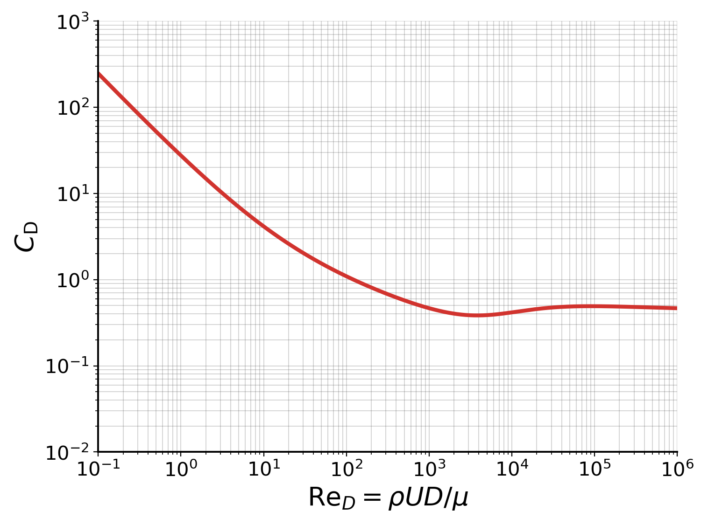{width="70%"}

::: {.stem}
You compute $\text{Re}_D = 10^4$ for your sphere. Reading the chart, what
is $C_\text{D}$? (This chart uses the frontal-area definition.)
:::

::: {.opts}
- **(a)**  $\approx 0.4$
- **(b)**  $\approx 4$
- **(c)**  $\approx 10^4$
- **(d)**  Can't tell — it depends on the fluid
:::

:::::: {.clicker-answer}

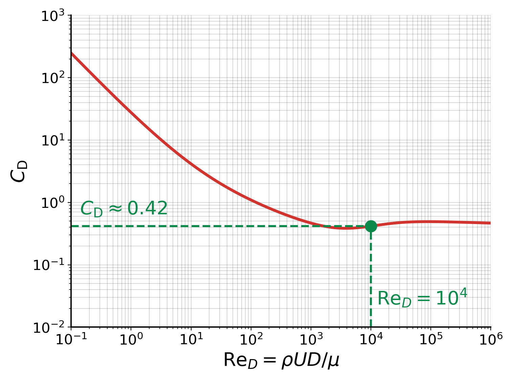{width="70%"}

::: {.stem}
Up to the curve, over to the axis: $C_\text{D}\approx 0.42$.
:::

::::::

:::::::

::::::: {#buckingham-pi-q7 .clicker data-answer="b"}

::: {.clicker-title}
Q7 · Now unpack it
:::

::: {.stem}
Same sphere, and you're out on the flat part of the curve, where
$C_\text{D}$ barely changes with Re. We have
$C_\text{D} = F_\text{D}/(\text{const}\times\rho U^2 D^2)$. If you
**double** the speed $U$, the drag force goes up by a factor of about:
:::

::: {.opts}
- **(a)**  2
- **(b)**  4
- **(c)**  8
- **(d)**  It doesn't change — $C_\text{D}$ is constant
:::

:::::: {.clicker-answer}

::: {.stem}
$F_\text{D} \propto C_\text{D}\,\rho U^2 D^2$, so $F_\text{D}\sim U^2$.
The *coefficient* is constant; the *force* is not. Careful in the steep part
of the chart — there $C_\text{D}$ changes with Re too, and the scaling is
different.
:::

::::::

:::::::

::::::: {#buckingham-pi-q8 .clicker data-answer="b"}

::: {.clicker-title}
Q8 · Six experiments, how many curves?
:::

::: {.stem}
You measure drag on six different sphere-and-fluid combinations and plot
$F_\text{D}$ vs. $U$ — six curves, a mess. You replot the *same data* as
$C_\text{D}$ vs. $\text{Re}_D$. How many curves now?
:::

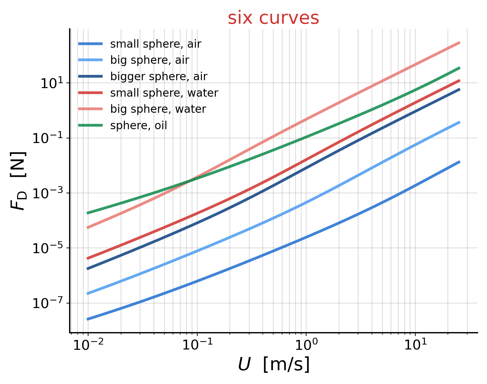{width="70%"}

::: {.opts}
- **(a)**  Still six — you only changed the axis labels
- **(b)**  One
- **(c)**  Three — one per fluid
- **(d)**  Six, but they'd be parallel
:::

:::::: {.clicker-answer}

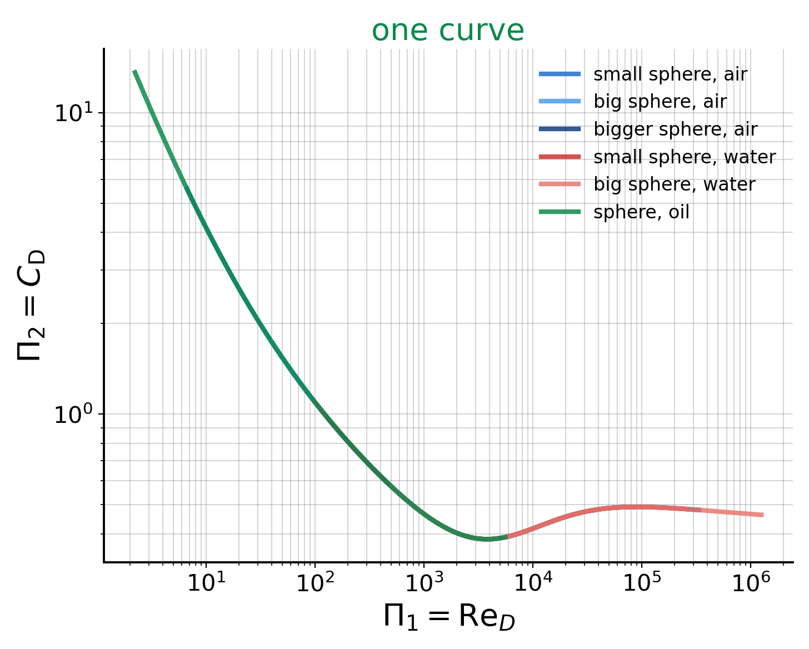{width="70%"}

::: {.stem}
All six collapse onto one curve.
:::

::::::

:::::::

::::::: {#buckingham-pi-q9 .clicker data-answer="b" data-tempting="c"}

::: {.clicker-title}
Q9 · Why must $h_\text{max}/(V_0^2/g)$ be a constant?
:::

::: {.stem}
A tossed ball with no air resistance: has

- $n=3$ ($h_\text{max}, V_0, g$)
- $r=2$, 

so $n-r=1$. Why does that force $h_\text{max}/(V_0^2/g)$ to be a *constant*?
:::

::: {.opts}
- **(a)**  Because gravity is constant near Earth's surface
- **(b)**  Because with only one group, there is nothing left for it to be a function of
- **(c)**  Because we know from mechanics that the answer is $1/2$
- **(d)**  It isn't — it depends on $V_0$
:::

:::::: {.clicker-answer}

::: {.stem}
"$\Pi_2$ is a function of $\Pi_1$" needs a $\Pi_2$. With $n-r=1$ we get
$\Pi_1 = \text{const}$, full stop. Mechanics *confirms* the constant is
$1/2$.
:::

::::::

:::::::

::::::: {#buckingham-pi-q10 .clicker data-answer="c"}

::: {.clicker-title}
Q10 · Similitude: the pipeline in the lab
:::

::: {.stem}
A pipeline will carry crude oil ($\nu = \mu/\rho = 6\times10^{-5}$ m²/s)
at $U = 3$ m/s through a $D = 0.60$ m pipe. Before building it, you test a
**1/10 scale model** — $D = 0.060$ m — running **water**
($\nu = 1\times10^{-6}$ m²/s). What water speed matches the $\text{Re}$ values?
:::

::: {.opts}
- **(a)**  30 m/s
- **(b)**  3 m/s — same as the prototype
- **(c)**  0.5 m/s
- **(d)**  0.05 m/s
:::

:::::: {.clicker-answer}

::: {.stem}
$\text{Re} = UD/\nu$, so $\text{Re}_p = (3)(0.6)/6\times10^{-5} = 30{,}000$.
Matching it: $U_m = \text{Re}\,\nu_m/D_m = (30{,}000)(10^{-6})/0.06 =
\mathbf{0.5}$ **m/s**.
:::

::: {.stem}
Shrinking by 10 pushes the required speed **up** by 10 — but swapping oil
for water drops the kinematic viscosity by 60, pushing it **down** by 60.
Net: $U_m = U_p \times \dfrac{10}{60} = U_p/6$.
:::

::: {.aside-note}
Contrast the wind tunnel: a 1/50 model airplane in the *same air* gets no
help from the fluid, so it needs 50× the flight speed — about 12,500 m/s,
which is hopeless. Choosing a different test fluid is what makes a model
experiment affordable.
:::

::::::

:::::::

::::::: {#buckingham-pi-q11 .clicker data-answer="b" data-tempting="a,c"}

::: {.clicker-title}
Q11 · ...and the catch
:::

::: {.stem}
The prototype is commercial steel, roughness $\varepsilon = 0.045$ mm. You
build the model from **the same commercial steel pipe**. Re is matched.
What's wrong?
:::

::: {.opts}
- **(a)**  Nothing — Re is matched, so the model is faithful
- **(b)**  $\varepsilon/D$ is 10× too large in the model; it needs a 10× smoother wall
- **(c)**  It's rougher, but that can't matter — both flows are turbulent
- **(d)**  Water and oil have different densities, so $\varepsilon/D$ can never be matched
:::

:::::: {.clicker-answer}

::: {.stem}
Roughness may be important too, and that means there is an additional parameter and additional Pi group, usually chosen as $\varepsilon/D$. We'd need to match $\varepsilon/D$ and Re to get the same behavior
:::

::::::

:::::::
