

These are the ConceptTests from class for Unit 2 (hydrostatics), in the order we asked them — so you can go back and vote again at your own pace. There are 41 of them, grouped by the reading they go with (hydrostatic pressure, pressure integrals, curved surfaces, and moments).

Here's how it works: click the option you'd pick. A wrong pick turns red and you can try again (no penalty, and talking it over on Slack is encouraged, not cheating). Land on the right one — or give up and hit *Show answer* — and you get the explanation. Nothing here is recorded or graded. (The answers are sitting in the page source, so this could never be an assessment anyway; it's just for practice.)

## 3.1 Hydrostatic pressure

*Reading: [3.1 Hydrostatic Pressure](hydrostatics.qmd)*

### Warm-ups (hydrostatic basics)

::::::: {#hydrostatics-q1 .clicker data-answer="c"}

::: {.clicker-title}
Q1 · Does width matter?
:::

::: {.stem}
A 10-cm diameter tube and a 10-m wide swimming pool are both filled with water to the
same depth $h$. How does the pressure at the bottom compare?
:::

::: {.opts}
- **(a)**  The pool has higher pressure — more water, more weight
- **(b)**  The tube has higher pressure — the water is more "concentrated"
- **(c)**  They're the same
- **(d)**  Need to know the shape of the container
:::

:::::: {.clicker-answer}

::: {.stem}
$p = \rho g h$ depends only on depth. Yes, the pool weighs vastly more
than the tube — but weight isn't what pressure measures. Pressure is
force *per area*, and the extra weight of the pool is spread over
proportionally more bottom area.
:::

::::::

:::::::

::::::: {#hydrostatics-q2 .clicker data-answer="a"}

::: {.clicker-title}
Q2 · Gauge pressure at the surface
:::

::: {.stem}
Using gauge pressure with $y=0$ defined at the free surface, what is
$p(y=0)$?
:::

::: {.opts}
- **(a)**  $0$
- **(b)**  $p_{atm}$
- **(c)**  Depends on the fluid's density
- **(d)**  Depends on how deep the container is
:::

:::::: {.clicker-answer}

::::::

:::::::

::::::: {#hydrostatics-q3 .clicker data-answer="b"}

::: {.clicker-title}
Q3 · Scuba diver vs. hiker
:::

::: {.stem}
A scuba diver descends 10 m underwater, and a hiker climbs 10 m up
Chautauqua trail. Whose ears notice a bigger pressure change?
:::

::: {.opts}
- **(a)**  The hiker — many miles of air above us
- **(b)**  The diver — water is much denser than air
- **(c)**  Both the same — it's the same $10$ m either way
- **(d)**  Neither — ears don't respond to pressure
:::

:::::: {.clicker-answer}

::: {.stem}
$\Delta p = \rho g \Delta y$. Water is about $800\times$ denser than air,
so the same $10$ m vertical change produces an $800\times$ larger
pressure underwater.
:::

::::::

:::::::

### Discussion questions (the hydrostatic equation)

::::::: {#hydrostatics-q4 .clicker data-answer="d"}

::: {.clicker-title}
Q4 · The hydrostatic "paradox"
:::

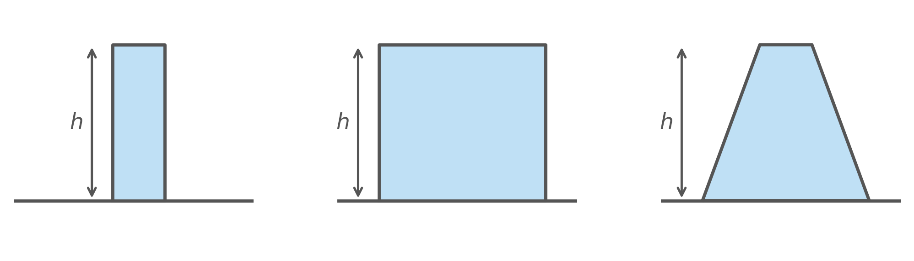{width="78%"}

::: {.stem}
Three containers — a narrow tube, a wide tank, and a funnel shape — are
all filled with the same fluid to the same depth $h$. How does the
pressure at the bottom compare across the three?
:::

::: {.opts}
- **(a)**  Highest in the narrow tube (all that water pressing down through a small opening)
- **(b)**  Highest in the wide tank (most total water)
- **(c)**  Highest in the funnel (the walls "focus" the weight downward)
- **(d)**  The same in all three
:::

:::::: {.clicker-answer}

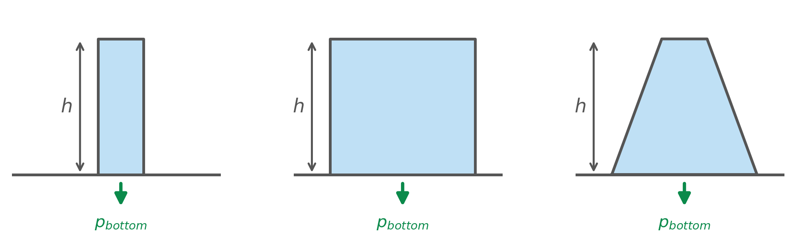{width="78%"}

::: {.stem}
$p(y) = -\rho g y$ only knows about depth, not the shape of the walls
around the fluid. It's historically called a "paradox" —
it feels wrong that a funnel can hold enormously more fluid than a tube
of the same height and depth, yet produce the identical bottom pressure.
:::

::::::

:::::::

::::::: {#hydrostatics-q5 .clicker data-answer="b"}

::: {.clicker-title}
Q5 · Direction of the pressure force
:::

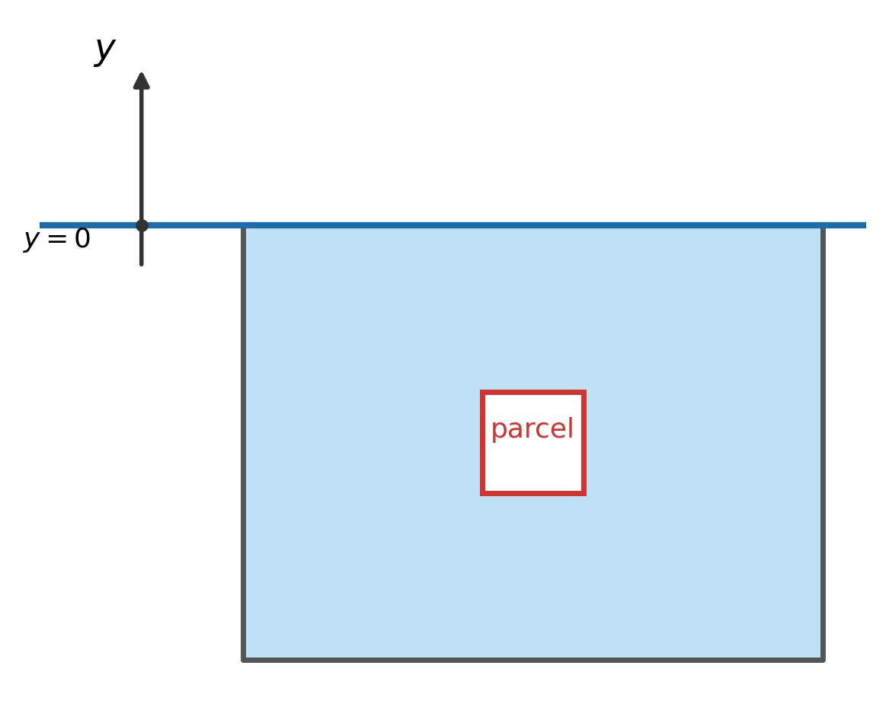{width="70%"}

::: {.stem}
With $y$ pointing up and $y=0$ at the free surface (as drawn), what
direction does $\nabla p$ point on the marked fluid parcel?
:::

::: {.opts}
- **(a)**  $+\hat{y}$ (up, toward the surface)
- **(b)**  $-\hat{y}$ (down, toward the bottom)
- **(c)**  $\mathbf{0}$ — pressure doesn't have a direction
- **(d)**  Sideways, since the parcel isn't centered in the tank
:::

:::::: {.clicker-answer}

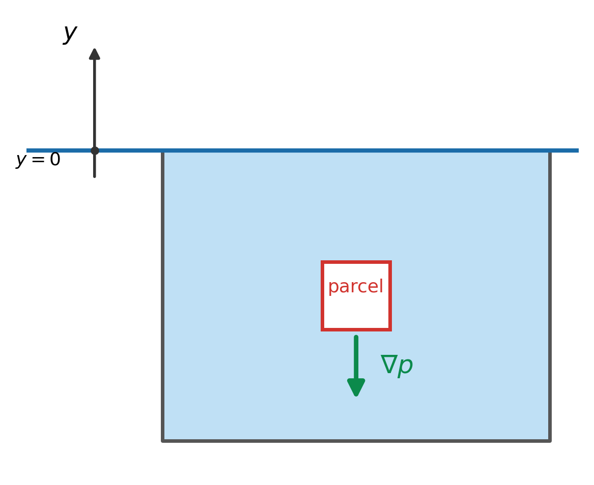{width="70%"}

::: {.stem}
$\nabla p = \rho \mathbf{g}$, and $\mathbf{g}$ points down. Pressure
increases as you go *down* (toward more negative $y$), so its gradient
— the direction of steepest increase — also points down.
:::

::::::

:::::::

::::::: {#hydrostatics-q6 .clicker data-answer="b"}

::: {.clicker-title}
Q6 · Reading the sign
:::

::: {.stem}
Someone defines $y$ pointing to the *right* and $z$ pointing *downward*, with $z=0$ at the surface (so
$z$ increases with depth). Which of these correctly gives gauge
pressure as a function of $y$ and/or $z$?
:::

::: {.opts}
- **(a)**  $p = -\rho g z$
- **(b)**  $p = \rho g z$
- **(c)**  $p = -\rho g y$
- **(d)**  $p = \rho g y$
:::

:::::: {.clicker-answer}

::: {.stem}
Pressure must *increase* as depth increases. Here $z$ itself increases with
depth, so we need a $+$ sign to match.
:::

::::::

:::::::

### Manometers

::::::: {#hydrostatics-q7 .clicker data-answer="b"}

::: {.clicker-title}
Q7 · What does a manometer read?
:::

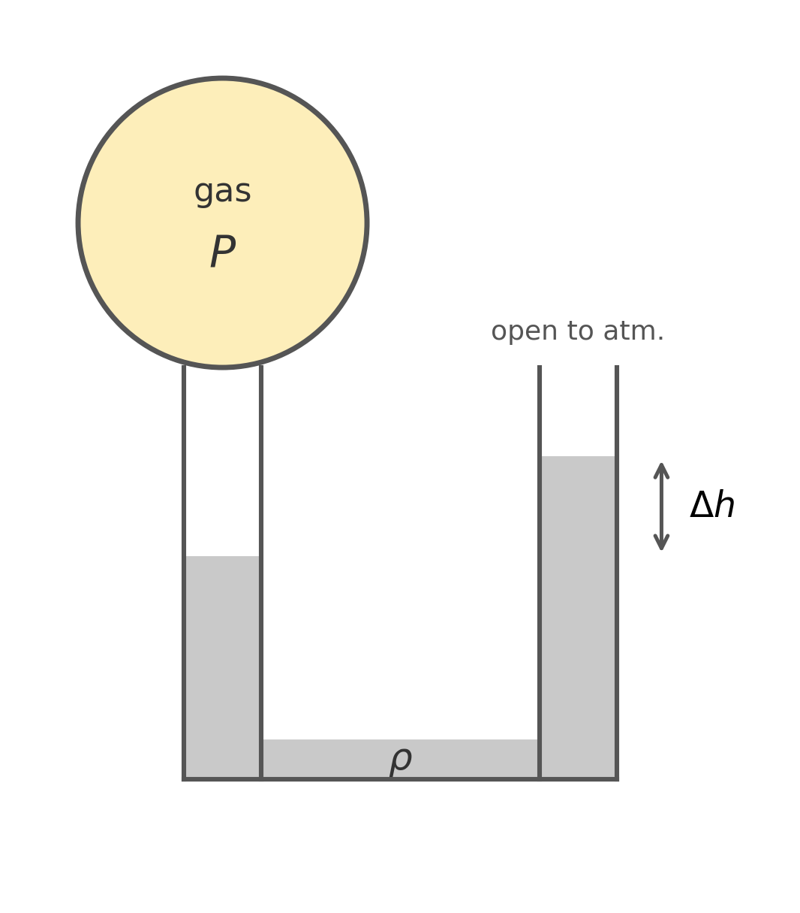{width="70%"}

::: {.stem}
A tank of gas at pressure $P$ sits on top of the left leg of a U-tube
manometer filled with a fluid of density $\rho$; the right leg is open
to the atmosphere. The fluid sits higher on the atmosphere side by
$\Delta h$. What does $\Delta h$ tell us?
:::

::: {.opts}
- **(a)**  $P = p_{atm} - \rho g \Delta h$
- **(b)**  $P = p_{atm} + \rho g \Delta h$
- **(c)**  $P = \rho g \Delta h$ (atmosphere doesn't matter)
- **(d)**  Nothing — we'd need to know the tube's diameter too
:::

:::::: {.clicker-answer}

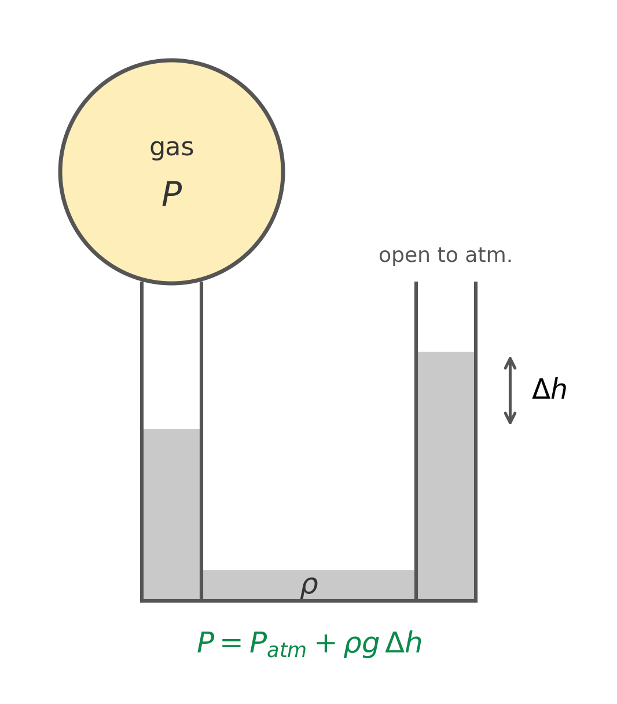{width="70%"}

::: {.stem}
Walk down the left leg to the bottom, then back up the right leg — the
pressure at the bottom is the same from either side (it's the same
fluid, same depth). The gas is pushing its fluid column down further
than the atmosphere pushes its own, so the gas must be at higher
pressure, higher by exactly $\rho g \Delta h$.
:::

::::::

:::::::

::::::: {#hydrostatics-q8 .clicker data-answer="b"}

::: {.clicker-title}
Q8 · Swap in a denser fluid
:::

::: {.stem}
For the *same* pressure difference $p - p_{atm}$, you swap the
manometer fluid for a denser one (say, mercury instead of water). What
happens to $\Delta h$?
:::

::: {.opts}
- **(a)**  $\Delta h$ increases
- **(b)**  $\Delta h$ decreases
- **(c)**  $\Delta h$ stays the same — it only depends on the pressure difference
- **(d)**  Depends on the tube's diameter
:::

:::::: {.clicker-answer}

::: {.stem}
$\Delta h = (p-p_{atm})/(\rho g)$ — fixed pressure difference, bigger
$\rho$ in the denominator, smaller $\Delta h$.
:::

::::::

:::::::

### Non-constant density

::::::: {#hydrostatics-q9 .clicker data-answer="b"}

::: {.clicker-title}
Q9 · Is $p(y)$ still a straight line?
:::

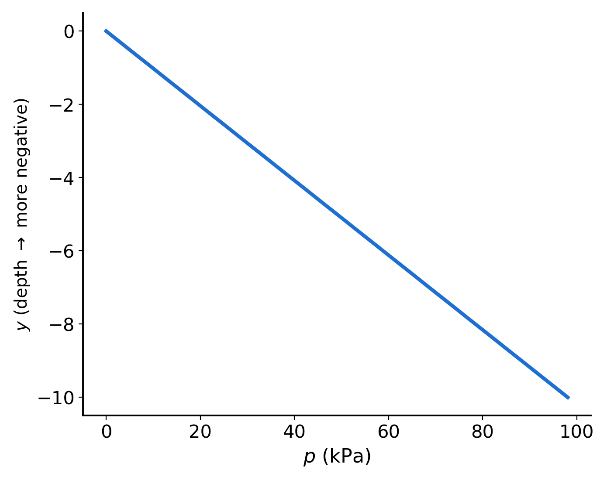{width="70%"}

::: {.stem}
Suppose density *increases with depth* (e.g. a salinity gradient in the
ocean), so $\rho = \rho(y)$ instead of a constant. Is $p(y)$ still a
straight line?
:::

::: {.opts}
- **(a)**  Yes — the hydrostatic equation always gives a straight line
- **(b)**  No — the slope $dp/dy$ gets steeper (more negative) with depth
- **(c)**  No — the slope $dp/dy$ gets shallower with depth
- **(d)**  $p$ stops depending on depth at all once $\rho$ varies
:::

:::::: {.clicker-answer}

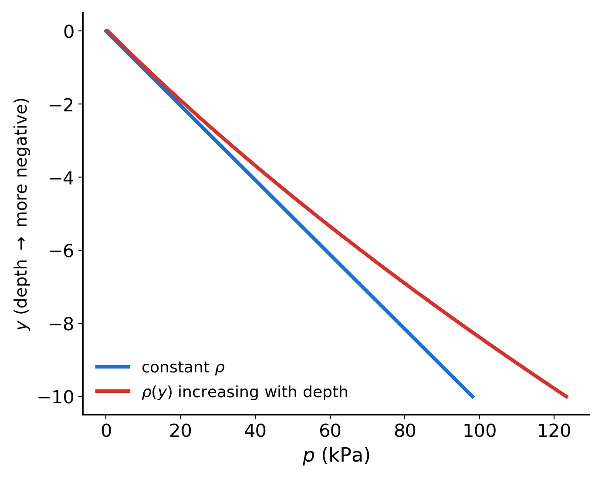{width="70%"}

::: {.stem}
$dp/dy = -\rho(y) g$ still holds *locally* — that part of the physics
never changed. But now the slope itself depends on $y$: as $\rho$ grows
with depth, $|dp/dy|$ grows too, and the curve bends steeper. The
straight-line result was a special case of constant $\rho$, not a
general law.
:::

::::::

:::::::

::::::: {#hydrostatics-q10 .clicker data-answer="b"}

::: {.clicker-title}
Q10 · The real atmosphere
:::

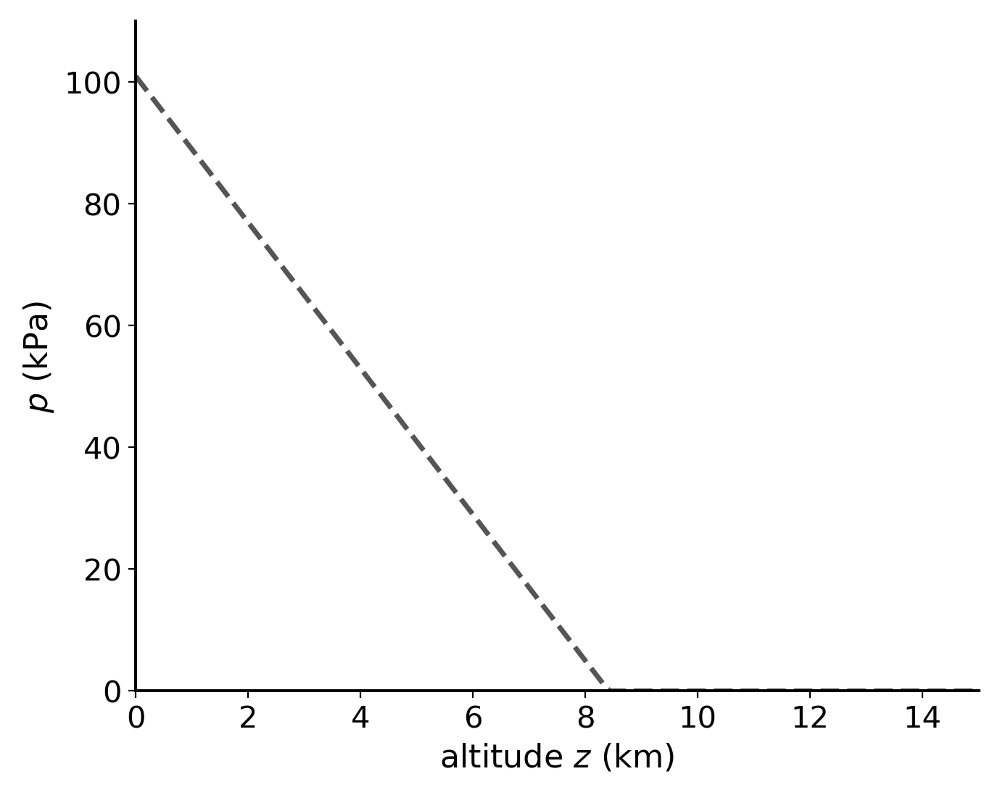{width="70%"}

::: {.stem}
Air density *decreases* with altitude (unlike the ocean example, where
it increased with depth). Compared to a naive constant-density
straight-line model, does the real atmosphere's pressure drop off
faster or slower as you climb?
:::

::: {.opts}
- **(a)**  Faster — real pressure falls below the straight line
- **(b)**  Slower — real pressure stays above the straight line
- **(c)**  Identical to the straight line
- **(d)**  It increases with altitude instead of decreasing
:::

:::::: {.clicker-answer}

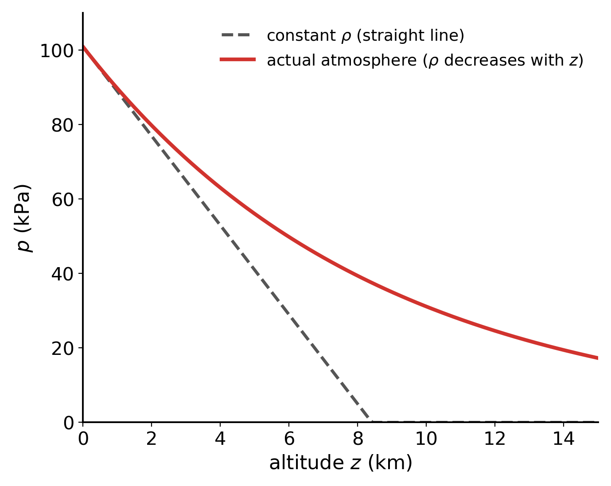{width="70%"}

::: {.stem}
Same logic as Q9, opposite direction: $\rho$ *decreases* as you climb,
so $|dp/dy|$ shrinks with altitude, and the curve flattens out instead
of running straight to zero (which is what the constant-$\rho$ line
would predict — and why that line is a bad model above a few km).
This is also why our $83$ kPa Boulder atmosphere isn't just "$101$ kPa
minus a little bit" — the curve, not a line, is doing the work.
:::

::::::

:::::::

::::::: {#hydrostatics-q11 .clicker data-answer="c"}

::: {.clicker-title}
Q11 · Finding $p$ over a big depth change
:::

::: {.stem}
You need the pressure change between the surface and a depth of $500$ m
in a fluid whose density varies substantially over that range. What's
the right approach?
:::

::: {.opts}
- **(a)**  Use $\Delta p = \rho_{avg} g \Delta y$ with some single average density
- **(b)**  $\nabla p = \rho \mathbf{g}$ no longer applies — need a different equation entirely
- **(c)**  Integrate $dp = -\rho(y)\, g\, dy$ using the actual $\rho(y)$
- **(d)**  Density variation only matters for gases, so just use $\rho g h$
:::

:::::: {.clicker-answer}

::: {.stem}
The hydrostatic equation itself never stopped being true — it's a
*local*, differential statement. What breaks is the shortcut of pulling
$\rho$ out of the integral as a constant. Averaging $\rho$ can get you
close in a pinch, [but it's an approximation, not the actual
answer]{.aside-note} — the honest fix is to integrate.
:::

::::::

:::::::

## 3.2 Pressure integrals

*Reading: [3.2 Pressure Integrals](p-int.qmd)*

### Warm-up: reading the distribution

::::::: {#pressure-integrals-q1 .clicker data-answer="c"}

::: {.clicker-title}
Q1 · Which one is it?
:::

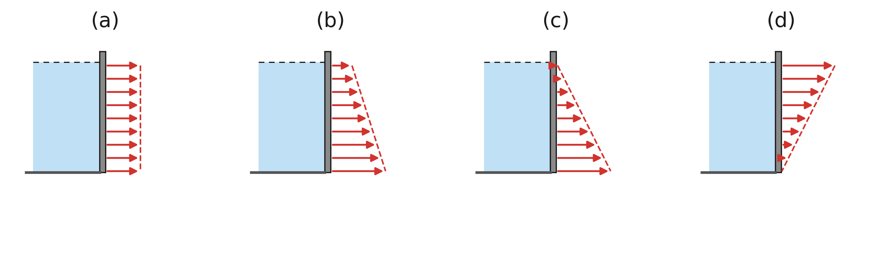{width="96%"}

::: {.stem}
A tank of constant-density fluid pushes on a vertical wall. Which figure
shows the **gauge** pressure distribution on that wall?
:::

::: {.opts .letters}
- **(a)**
- **(b)**
- **(c)**
- **(d)**
:::

:::::: {.clicker-answer}

::: {.stem}
$p = \rho g y$: zero at the free surface and growing linearly with depth because $\rho$ is constant. (b) is the shape of *absolute* pressure.
:::

::::::

:::::::

### Building the integral

::::::: {#pressure-integrals-q2 .clicker data-answer="a"}

::: {.clicker-title}
Q2 · The shape of the integral
:::

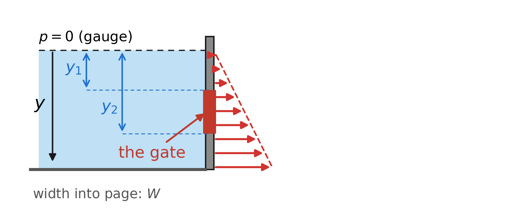{width="82%"}

::: {.stem}
We want the force on the red gate. Before worrying about *what* $p$ is or
*where* the gate is — which of these is the right **form**?
:::

::: {.opts}
- **(a)**  $F = \displaystyle\iint p(y) \, dy\, dz$
- **(b)**  $F = \displaystyle\iint p(y) \, dy$
- **(c)**  $F = \displaystyle\iint \frac{p(y)}{A} \, dy\, dz$
- **(d)**  $F = \displaystyle\iint p(y)\, A \, dy\, dz$
:::

:::::: {.clicker-answer}

::: {.stem}
Force is pressure times area so we need *two* differentials to
build an area, $dA = dy\,dz$.
:::

::::::

:::::::

::::::: {#pressure-integrals-q3 .clicker data-answer="a"}

::: {.clicker-title}
Q3 · The integrand
:::

{width="70%"}

::: {.stem}
Now the integrand. What goes in for $p$ if we want the force on **the
gate**?
:::

::: {.opts}
- **(a)**  $\rho g y$
- **(b)**  $\rho g (y - y_1)$
- **(c)**  $\rho g \dfrac{y_1 + y_2}{2}$
- **(d)**  $\rho g H$
:::

:::::: {.clicker-answer}

::: {.stem}
The integrand is *the pressure*, and pressure doesn't care that we drew a
gate there — it's still measured from the free surface.
:::

::::::

:::::::

::::::: {#pressure-integrals-q4 .clicker data-answer="b" data-tempting="d"}

::: {.clicker-title}
Q4 · The bounds
:::

{width="70%"}

::: {.stem}
Last piece. What are the correct bounds on $y$ when calculating the force on the gate?
:::

::: {.opts}
- **(a)**  $0 \to H$
- **(b)**  $y_1 \to y_2$
- **(c)**  $0 \to y_2$
- **(d)**  $0 \to (y_2 - y_1)$
:::

:::::: {.clicker-answer}

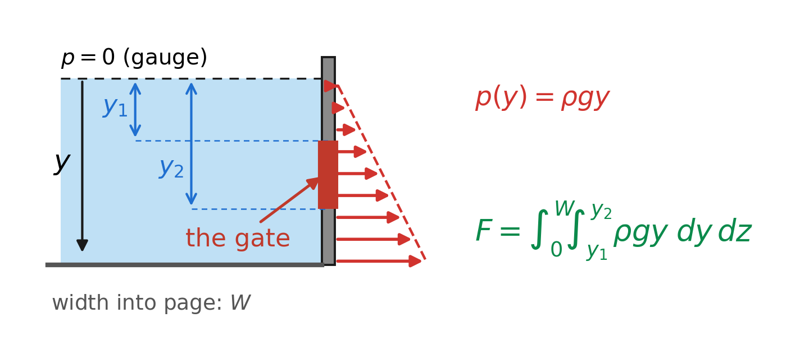{width="70%"}

::: {.stem}
Integrate over the surface we actually care about, in the coordinate we
actually chose. (d) has the right *length* of gate but starts counting from
the free surface.
:::

::::::

:::::::

### Now tilt the wall

::::::: {#pressure-integrals-q5 .clicker data-answer="b"}

::: {.clicker-title}
Q5 · Same question, new wall
:::

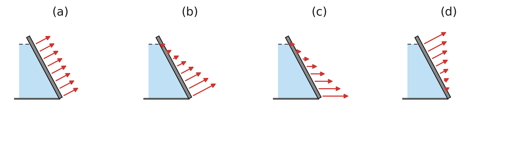{width="96%"}

::: {.stem}
This wall leans *over* the water — the fluid is underneath the overhang.
Which figure shows the gauge pressure on it?
:::

::: {.opts .letters}
- **(a)**
- **(b)**
- **(c)**
- **(d)**
:::

:::::: {.clicker-answer}

::: {.stem}
Pressure acts **normal to the surface** and it grows with **depth below the free surface**.
:::

::::::

:::::::

::::::: {#pressure-integrals-q6 .clicker data-answer="b" data-tempting="a"}

::: {.clicker-title}
Q6 · The shape of the integral, tilted
:::

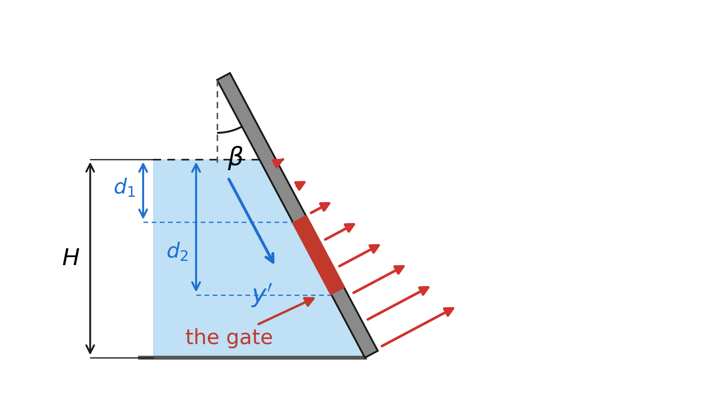{width="70%"}

::: {.stem}
Tilted wall with a gate. We define $y'$ as the distance measured
**down the face** from the free surface. Which is the right form?
:::

::: {.opts}
- **(a)**  $F = \displaystyle\iint p \, dy\, dz$
- **(b)**  $F = \displaystyle\iint p \, dy'\, dz$
- **(c)**  $F = \displaystyle\iint p \, dy\, dy'$
- **(d)**  $F = \displaystyle\iint p \cos\beta \, dy\, dz$
:::

:::::: {.clicker-answer}

::::::

:::::::

::::::: {#pressure-integrals-q7 .clicker data-answer="b" data-tempting="a"}

::: {.clicker-title}
Q7 · The integrand, tilted
:::

{width="70%"}

::: {.stem}
We're integrating in $y'$ now, so the integrand has to be written in $y'$
too. What is $p(y')$?
:::

::: {.opts}
- **(a)**  $\rho g y'$
- **(b)**  $\rho g y' \cos\beta$
- **(c)**  $\rho g y' / \cos\beta$
- **(d)**  $\rho g y' \sin\beta$
:::

:::::: {.clicker-answer}

::: {.stem}
Pressure only cares about *depth*: $p = \rho g y$. And the geometry
says $y = y' \cos\beta$.
:::

::::::

:::::::

::::::: {#pressure-integrals-q8 .clicker data-answer="b" data-tempting="a"}

::: {.clicker-title}
Q8 · The bounds, tilted
:::

{width="70%"}

::: {.stem}
The gate's top edge is at **depth** $d_1$ and its bottom edge at **depth**
$d_2$. What are the bounds on $y'$?
:::

::: {.opts}
- **(a)**  $d_1 \to d_2$
- **(b)**  $d_1/\cos\beta \to d_2/\cos\beta$
- **(c)**  $0 \to H/\cos\beta$
- **(d)**  $d_1\cos\beta \to d_2\cos\beta$
:::

:::::: {.clicker-answer}

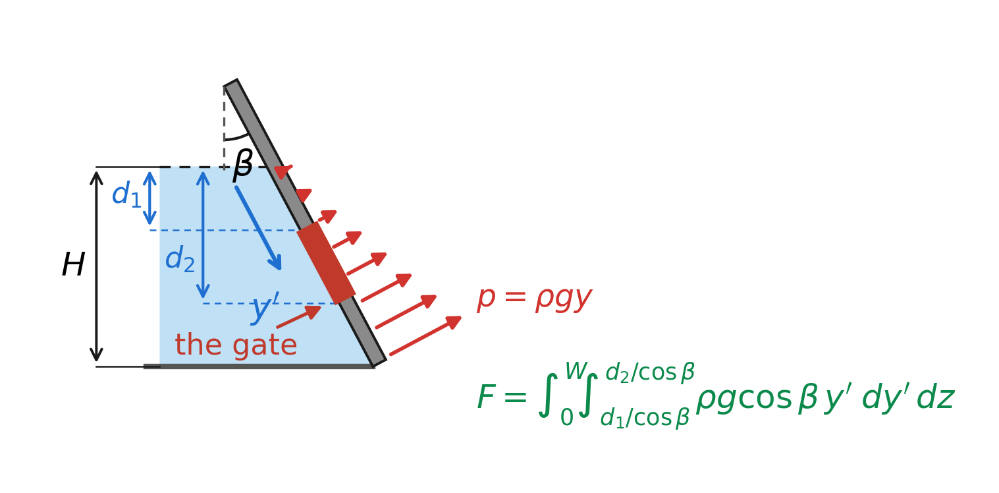{width="70%"}

::: {.stem}
The bounds have to be in the *same coordinate we're integrating in*. The
depths $d_1, d_2$ are vertical; converting to distance along the face
divides by $\cos\beta$.
:::

::::::

:::::::

### Add a hinge

::::::: {#pressure-integrals-q9 .clicker data-answer="a" data-tempting="b"}

::: {.clicker-title}
Q9 · The lever arm
:::

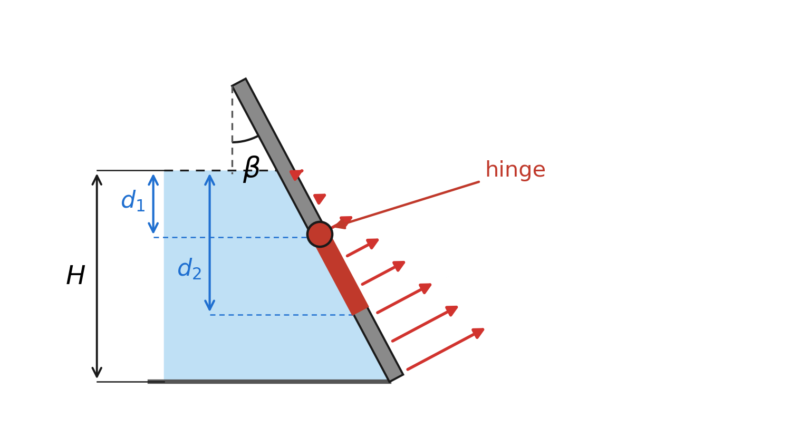{width="70%"}

::: {.stem}
Now the gate is hinged at its **upper** edge, at depth $d_1$. Torque needs
a lever arm — the distance from the hinge. What is $r(y')$?
:::

::: {.opts}
- **(a)**  $r = y' - d_1/\cos\beta$
- **(b)**  $r = d_1/\cos\beta - y'$
- **(c)**  $r = y'$
- **(d)**  $r = d_1 - y'$
:::

:::::: {.clicker-answer}

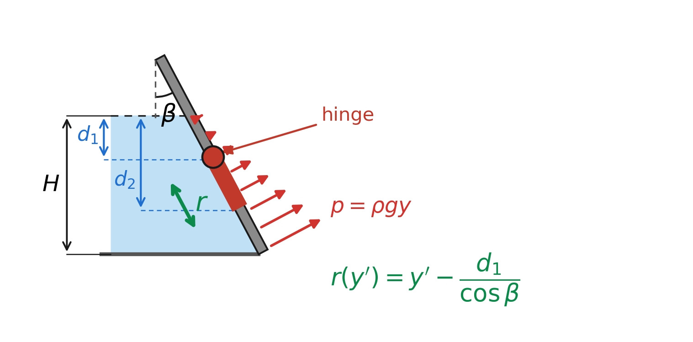{width="70%"}

::: {.stem}
The hinge sits at $y' = d_1/\cos\beta$, and everything on the gate is
*below* it, so $y' > d_1/\cos\beta$.
:::

::::::

:::::::

::::::: {#pressure-integrals-q10 .clicker data-answer="a" data-tempting="d"}

::: {.clicker-title}
Q10 · Put it all together
:::

::: {.stem}
Assemble the torque about the hinge, $M = \displaystyle\iint r\, p \, dA$.
:::

::: {.opts}
- **(a)**  $\displaystyle\int_0^W\!\!\int_{d_1/\cos\beta}^{d_2/\cos\beta} \left(y' - \tfrac{d_1}{\cos\beta}\right)\rho g \cos\beta\, y' \; dy'\, dz$
- **(b)**  $\displaystyle\int_0^W\!\!\int_{d_1/\cos\beta}^{d_2/\cos\beta} \left(\tfrac{d_1}{\cos\beta} - y'\right)\rho g \cos\beta\, y' \; dy'\, dz$
- **(c)**  $\displaystyle\int_0^W\!\!\int_{0}^{d_2/\cos\beta} \left(y' - \tfrac{d_1}{\cos\beta}\right)\rho g \cos\beta\, y' \; dy'\, dz$
- **(d)**  $M = \tfrac{\ell}{2}\, F$, using the force from Q8
:::

:::::: {.clicker-answer}

::::::

:::::::

::::::: {#pressure-integrals-q11 .clicker data-answer="b" data-tempting="a"}

::: {.clicker-title}
Q11 · Which way does it push?
:::

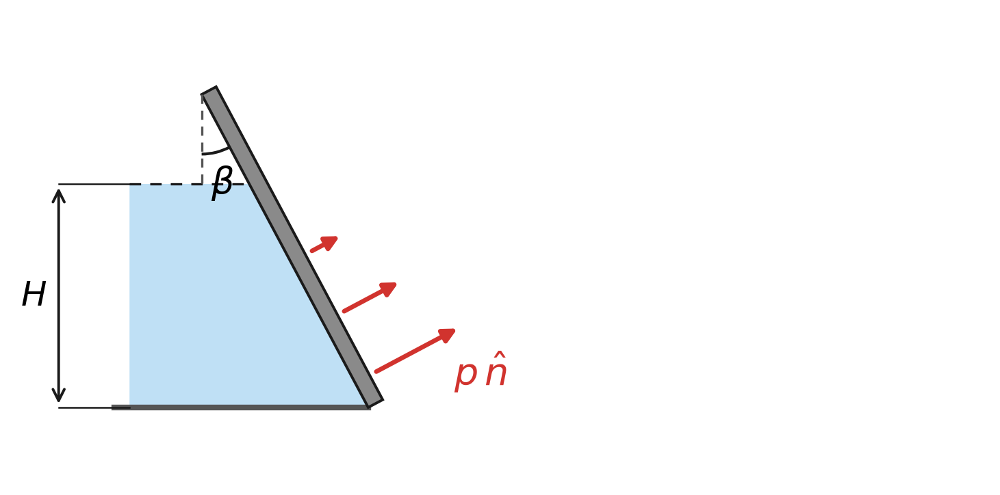{width="70%"}

::: {.stem}
The water is *underneath* this overhanging face. Which is the unit normal
$\hat{n}$ that the pressure force acts along?
:::

::: {.opts}
- **(a)**  $\langle \cos\beta, -\sin\beta \rangle$
- **(b)**  $\langle \cos\beta, \sin\beta \rangle$
- **(c)**  $\langle -\sin\beta, \cos\beta \rangle$
- **(d)**  $\langle 1, 0 \rangle$ — pressure on a wall is horizontal
:::

:::::: {.clicker-answer}

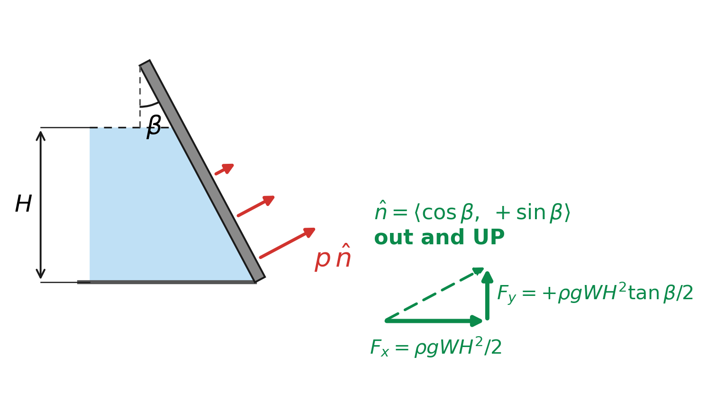{width="70%"}

::::::

:::::::

::::::: {#pressure-integrals-q12 .clicker data-answer="c" data-tempting="b"}

::: {.clicker-title}
Q12 · Curved surface
:::

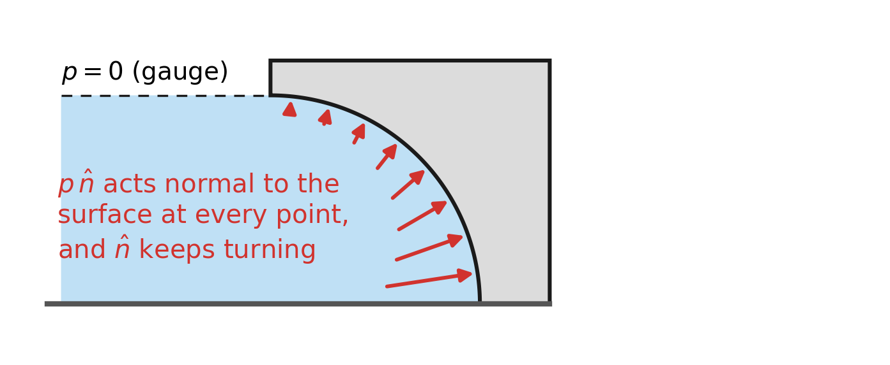{width="70%"}

::: {.stem}
The dam face is curved. Why can't we compute $p_{\rm avg}$, multiply by the
wetted area, and call it the force?
:::

::: {.opts}
- **(a)**  Nothing's wrong — $p_{\rm avg} A$ works fine here too
- **(b)**  Pressure isn't linear in depth anymore once the surface curves
- **(c)**  $\hat{n}$ changes from point to point, so the contributions don't all add along one direction
- **(d)**  The hydrostatic equation stops holding next to a curved wall
:::

:::::: {.clicker-answer}

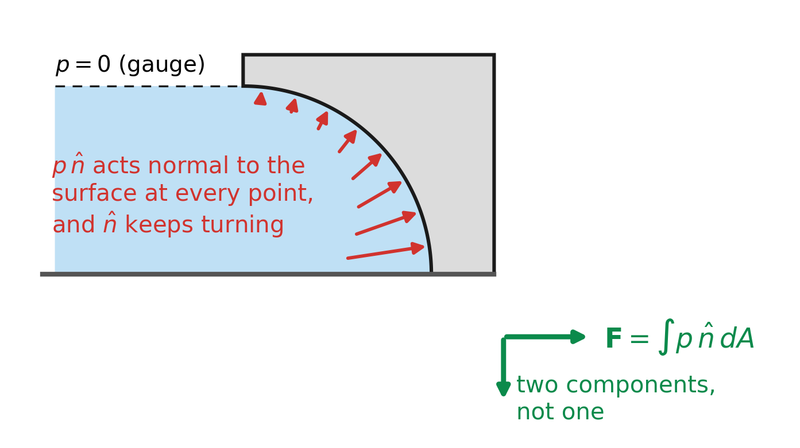{width="70%"}

::: {.stem}
Pressure is still $\rho g y$ — hydrostatics couldn't care less what shape
the wall is, so (b) and (d) blame the wrong thing. What breaks is that
**force is a vector and pressure is a scalar**. On a flat wall every
$p\,dA$ points the same way, so we could add magnitudes; on a curve they
don't. We need $\mathbf{F} = \int p\,\hat{n}\,dA$, component by component —
next reading.
:::

::::::

:::::::

## 4.1 Forces on curved surfaces

*Reading: [4.1 Forces on curved surfaces](curved-int.qmd)*

### Warm-up: a coordinate is not a direction

::::::: {#curved-surfaces-q1 .clicker data-answer="b" data-tempting="d"}

::: {.clicker-title}
Q1 · Which arrows move?
:::

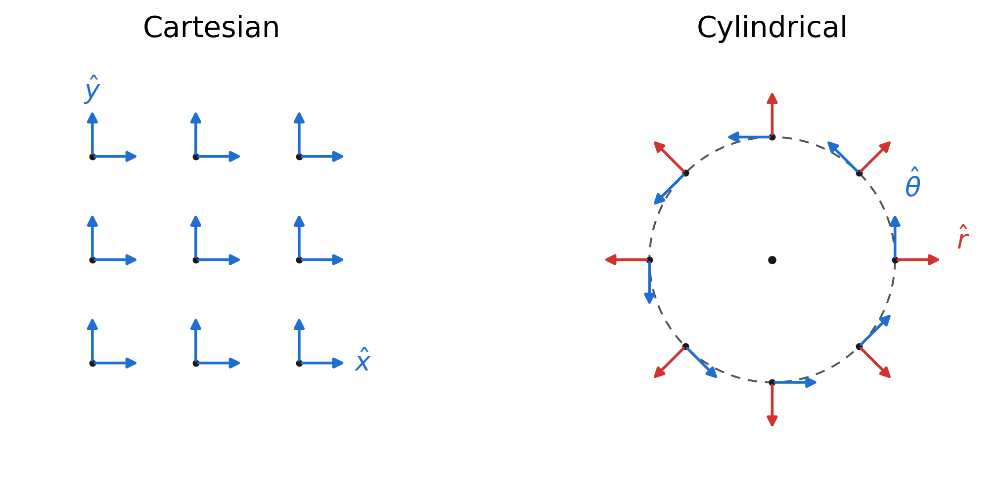{width="94%"}

::: {.stem}
Which of these unit vectors **changes the direction it points** depending on
where in space you stand?
:::

::: {.opts}
- **(a)**  $\hat{x}$ and $\hat{y}$
- **(b)**  $\hat{r}$ and $\hat{\theta}$
- **(c)**  all four of them — they're unit vectors, they're free to rotate
- **(d)**  none of them — unit vectors are constants
:::

:::::: {.clicker-answer}

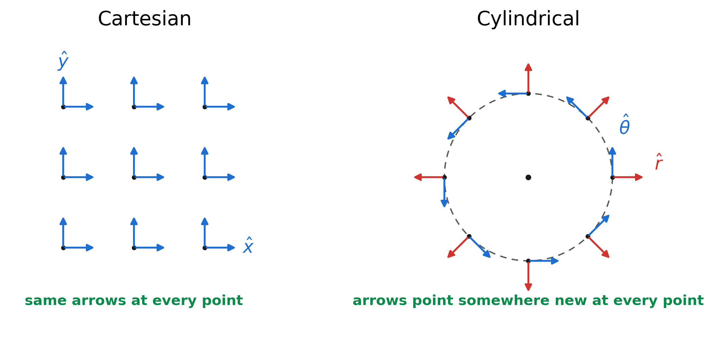{width="94%"}

::: {.stem}
All four have magnitude 1 everywhere. But
"radially outward" points in a different direction depending on where you are standing.
:::

::::::

:::::::

::::::: {#curved-surfaces-q2 .clicker data-answer="c"}

::: {.clicker-title}
Q2 · Orthogonality
:::

::: {.stem}
Unit vectors *within one coordinate system* are orthogonal. Which of these
dot products is **not** automatically zero?
:::

::: {.opts}
- **(a)**  $\hat{r} \cdot \hat{\theta}$
- **(b)**  $\hat{x} \cdot \hat{y}$
- **(c)**  $\hat{x} \cdot \hat{\theta}$
- **(d)**  $\hat{r} \cdot \hat{z}$
:::

:::::: {.clicker-answer}

::::::

:::::::

::::::: {#curved-surfaces-q3 .clicker data-answer="a"}

::: {.clicker-title}
Q3 · Radial unit vector
:::

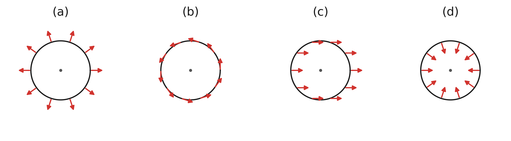{width="96%"}

::: {.stem}
Fluid surrounds a circular cylinder. Pressure pushes normal to the
surface — which family of arrows is $\hat{n} = \hat{r}$, the outward normal?
:::

::: {.opts .letters}
- **(a)**
- **(b)**
- **(c)**
- **(d)**
:::

:::::: {.clicker-answer}

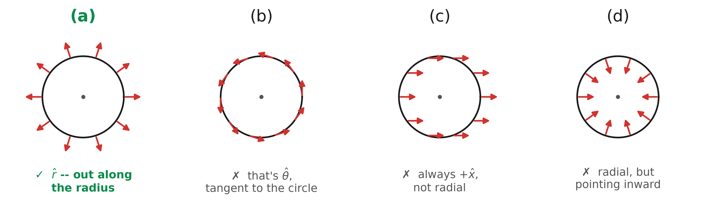{width="96%"}

::: {.stem}
Every arrow in (a) points straight away from the center. (b) is
$\hat{\theta}$ — orthogonal to the surface normal.
:::

::::::

:::::::

### What are we integrating over?

::::::: {#curved-surfaces-q4 .clicker data-answer="b" data-tempting="a"}

::: {.clicker-title}
Q4 · The flat bottom
:::

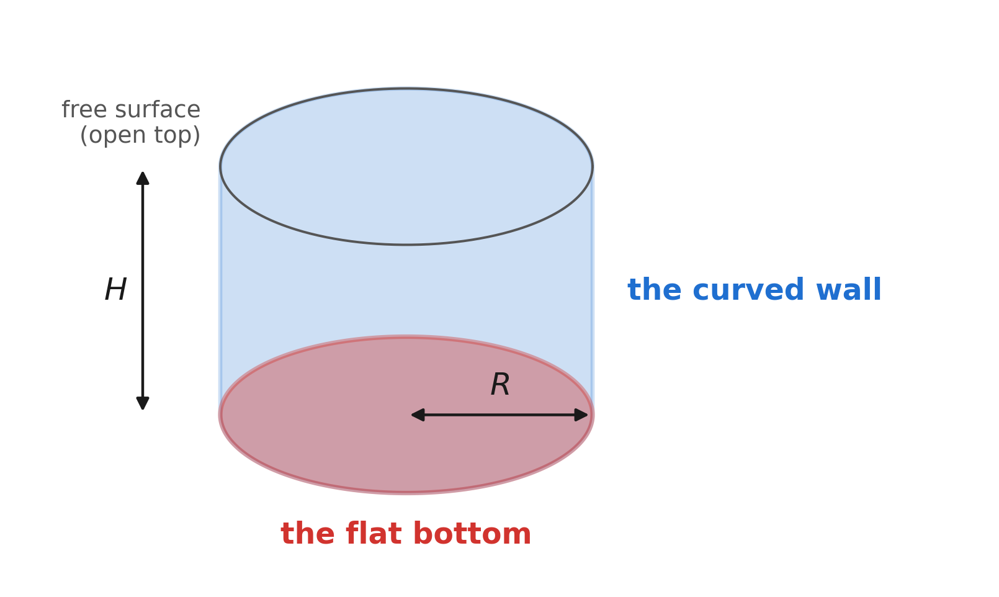{width="70%"}

::: {.stem}
A cylindrical pool, radius $R$, depth $H$. We want the force on the **flat
circular bottom**. What is $dA$?
:::

::: {.opts}
- **(a)**  $dA = dr\, d\theta$
- **(b)**  $dA = r\, dr\, d\theta$
- **(c)**  $dA = R\, d\theta\, dz$
- **(d)**  $dA = r\, d\theta\, dz$
:::

:::::: {.clicker-answer}

::::::

:::::::

::::::: {#curved-surfaces-q5 .clicker data-answer="b" data-tempting="c"}

::: {.clicker-title}
Q5 · The curved wall
:::

{width="70%"}

::: {.stem}
Same pool, different surface: now the force on the **curved side wall**.
What is $dA$, and what varies?
:::

::: {.opts}
- **(a)**  $dA = r\, dr\, d\theta$, with $r$ and $\theta$ varying
- **(b)**  $dA = R\, d\theta\, dz$, with $\theta$ and $z$ varying
- **(c)**  $dA = d\theta\, dz$, with $\theta$ and $z$ varying
- **(d)**  $dA = r\, d\theta\, dz$, with $r$, $\theta$, and $z$ all varying
:::

:::::: {.clicker-answer}

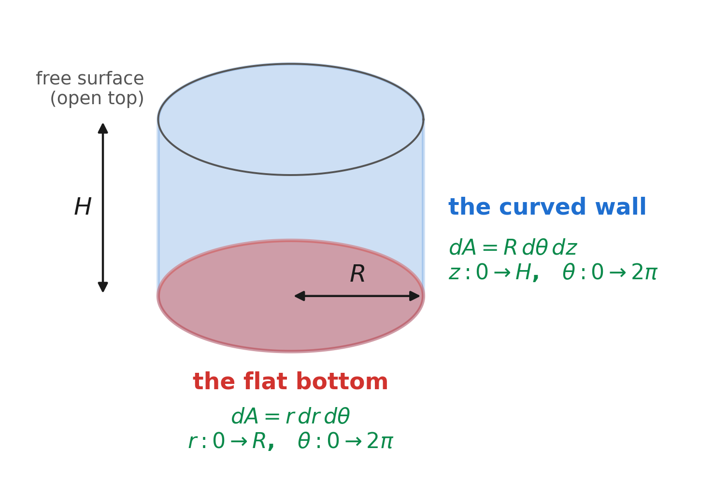{width="70%"}

::: {.stem}
A surface is a 2D object, so exactly **two** coordinates vary. On the wall $r=R$ everywhere.
:::

::::::

:::::::

### A submerged cylinder

::::: {.clicker-context}
*The set-up*

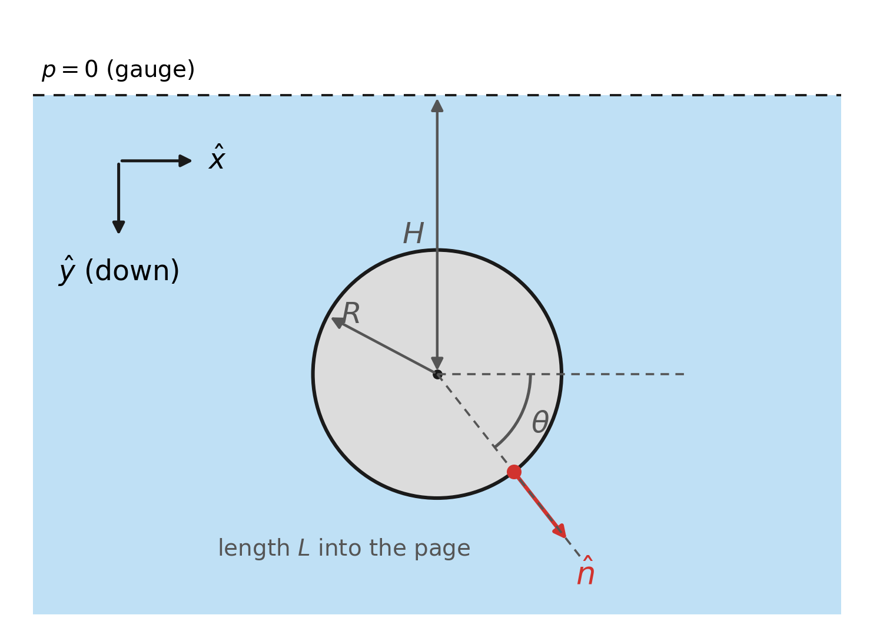{width="70%"}

::: {.stem}
A cylinder of radius $R$ and length $L$ (into the page) is held underwater,
axis at depth $H$. We want the total pressure force on it.

$y$ points **down** from the free surface, so $p = \rho g y$, and $\theta$
sweeps from $+\hat{x}$ toward $+\hat{y}$.
:::
:::::

::::::: {#curved-surfaces-q6 .clicker data-answer="b" data-tempting="c"}

::: {.clicker-title}
Q6 · Coordinates and bounds
:::

{width="70%"}

::: {.stem}
Which coordinates do we integrate over, and between what bounds?
:::

::: {.opts}
- **(a)**  $r: 0 \to R$ and $\theta: 0 \to 2\pi$
- **(b)**  $\theta: 0 \to 2\pi$ and $z: 0 \to L$
- **(c)**  $\theta: 0 \to \pi$ and $z: 0 \to L$
- **(d)**  $\theta: 0 \to 2\pi$ and $y: H-R \to H+R$
:::

:::::: {.clicker-answer}

::: {.stem}
Curved wall of a cylinder, $dA = R\,d\theta\,dz$ — same surface
as Q5. And the whole cylinder is wetted, so $\theta$ goes all the way
around.
:::

::::::

:::::::

::::::: {#curved-surfaces-q7 .clicker data-answer="b" data-tempting="a"}

::: {.clicker-title}
Q7 · The normal, in components
:::

{width="70%"}

::: {.stem}
$\hat{n}$ points radially out of the surface. We want the answer in
$\hat{x}$, $\hat{y}$, $\hat{z}$ **components** (we'd like a lift force, eventually), but
written in the $\theta$ **coordinate**. Which is it?
:::

::: {.opts}
- **(a)**  $\hat{n} = \langle 1,\, 0,\, 0 \rangle$
- **(b)**  $\hat{n} = \langle \cos\theta,\, \sin\theta,\, 0 \rangle$
- **(c)**  $\hat{n} = \langle -\sin\theta,\, \cos\theta,\, 0 \rangle$
- **(d)**  $\hat{n} = \langle \cos\theta,\, -\sin\theta,\, 0 \rangle$
:::

:::::: {.clicker-answer}

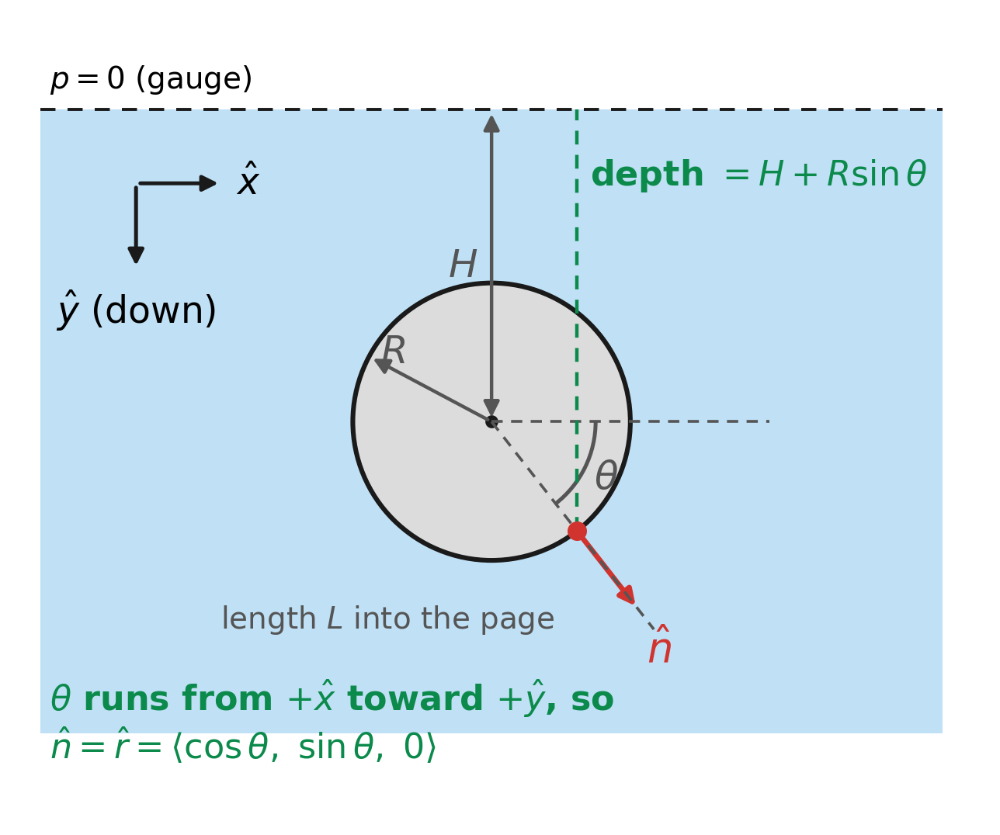{width="70%"}

::::::

:::::::

::::::: {#curved-surfaces-q8 .clicker data-answer="c" data-tempting="a"}

::: {.clicker-title}
Q8 · Pressure on the surface
:::

{width="70%"}

::: {.stem}
We're integrating in $\theta$, so $p$ has to be written in $\theta$. What is
$p(\theta)$ on the cylinder?
:::

::: {.opts}
- **(a)**  $p = \rho g H$
- **(b)**  $p = \rho g R \sin\theta$
- **(c)**  $p = \rho g (H + R\sin\theta)$
- **(d)**  $p = \rho g (H + R\cos\theta)$
:::

:::::: {.clicker-answer}

{width="70%"}

::: {.stem}
Pressure still only cares about **depth**, and we can write that in terms of $\theta$.
:::

::::::

:::::::

::::::: {#curved-surfaces-q9 .clicker data-answer="a" data-tempting="b"}

::: {.clicker-title}
Q9 · What does $p$ depend on here?
:::

::: {.stem}
On *this surface*, $p$ is a function of which coordinate(s)?
:::

::: {.opts}
- **(a)**  $\theta$ only
- **(b)**  $r$ and $\theta$
- **(c)**  $\theta$ and $z$
- **(d)**  $r$, $\theta$, and $z$
:::

:::::: {.clicker-answer}

::: {.stem}
$R$ shows up in the formula, but $r$ isn't *varying* — it's stuck at $R$, so
it's a **parameter, not a variable**. And the cylinder's axis is horizontal, so
nothing changes as we slide along $z$. (We can still integrate along $z$, but the integrand does not depend on $z$.
:::

::::::

:::::::

### Assemble

::::::: {#curved-surfaces-q10 .clicker data-answer="a" data-tempting="c,d"}

::: {.clicker-title}
Q10 · Build the vertical force
:::

{width="70%"}

::: {.stem}
$\mathbf{F} = \displaystyle\int -p\,\hat{n}\, dA$. Which one gives the
$\hat{y}$ (downward) **component**?
:::

::: {.opts}
- **(a)**  $-\displaystyle\int_0^L\!\!\int_0^{2\pi} \rho g (H + R\sin\theta)\,\sin\theta\; R\, d\theta\, dz$
- **(b)**  $-\displaystyle\int_0^L\!\!\int_0^{2\pi} \rho g (H + R\sin\theta)\,\cos\theta\; R\, d\theta\, dz$
- **(c)**  $-\displaystyle\int_0^L\!\!\int_0^{2\pi} \rho g (H + R\sin\theta)\; R\, d\theta\, dz$
- **(d)**  $-\displaystyle\int_0^L\!\!\int_0^{2\pi}\!\!\int_0^{R} \rho g (H + R\sin\theta)\,\sin\theta\; r\, dr\, d\theta\, dz$
:::

:::::: {.clicker-answer}

::: {.stem}
Pick off the component *first*: $\hat{n}\cdot\hat{y} = \sin\theta$.
:::

::::::

:::::::

::::::: {#curved-surfaces-q11 .clicker data-answer="c"}

::: {.clicker-title}
Q11 · Is there a sideways force?
:::

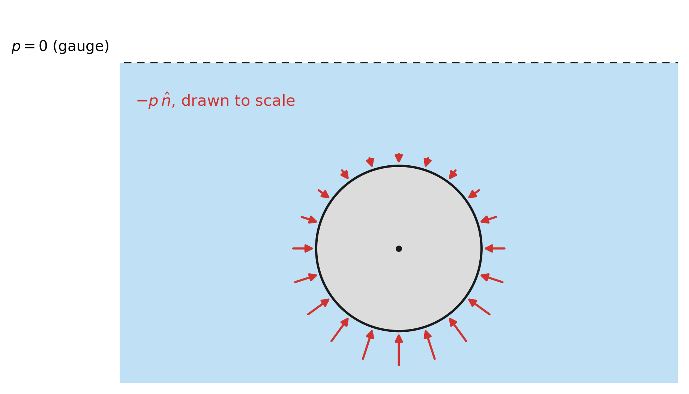{width="70%"}

::: {.stem}
Is there a net **horizontal** force due to pressure?
:::

::: {.opts}
- **(a)**  Yes, in $+\hat{x}$
- **(b)**  Yes, in $-\hat{x}$
- **(c)**  No — every patch has a mirror twin at the same depth pushing back just as hard
- **(d)**  No — the largest pressure is at the largest depth
:::

:::::: {.clicker-answer}

::::::

:::::::

::::::: {#curved-surfaces-q12 .clicker data-answer="c" data-tempting="b,d"}

::: {.clicker-title}
Q12 · A uniform squeeze
:::

::: {.stem}
Now pretend the pressure were the **same value** $\rho g H$ everywhere on
the cylinder — no variation with depth at all. What net force would that
uniform pressure produce?
:::

::: {.opts}
- **(a)**  $\rho g H$, upward
- **(b)**  $\rho g H\,(2\pi R L)$, i.e. pressure $\times$ total surface area
- **(c)**  Zero — a uniform squeeze on a closed surface has nothing to push it *toward*
- **(d)**  Zero, but only for a circle
:::

:::::: {.clicker-answer}

::: {.stem}
So the entire $\rho g H$ term in our integrand — the big one! — contributes
**nothing**. Only the $\rho g R\sin\theta$ variation survives.
:::

::::::

:::::::

::::::: {#curved-surfaces-q13 .clicker data-answer="c" data-tempting="a"}

::: {.clicker-title}
Q13 · So does depth matter?
:::

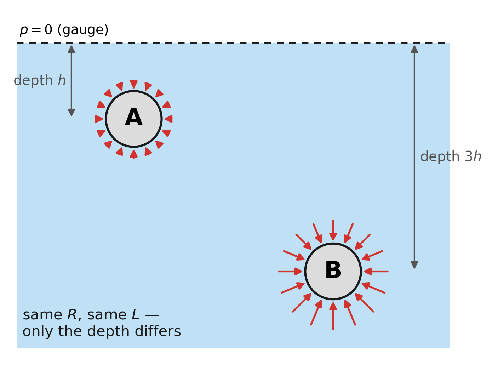{width="70%"}

::: {.stem}
Two identical cylinders, same $R$ and $L$. **B** is held three times as deep
as **A**. Which one feels the larger net force from the water?
:::

::: {.opts}
- **(a)**  **B**, about three times larger — it's much deeper
- **(b)**  **B**, larger, but not by as much as $3\times$
- **(c)**  The same
- **(d)**  **A** — the shallower one is closer to the free surface
:::

:::::: {.clicker-answer}

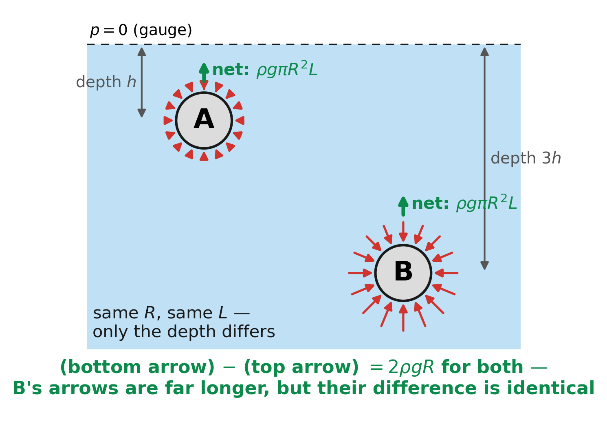{width="70%"}

::::::

:::::::

::::::: {#curved-surfaces-q14 .clicker data-answer="a" data-tempting="c"}

::: {.clicker-title}
Q14 · Combining
:::

{width="70%"}

::: {.stem}
Only $-\rho g R^2 L \displaystyle\int_0^{2\pi}\sin^2\theta\, d\theta$
is left, and $\int_0^{2\pi}\sin^2\theta\, d\theta = \pi$. So
$\mathbf{F} = ?$
:::

::: {.opts}
- **(a)**  $\mathbf{F} = -\rho g \pi R^2 L\, \hat{y}$ — magnitude $\rho g \times$ volume, pointing **up**
- **(b)**  $\mathbf{F} = +\rho g \pi R^2 L\, \hat{y}$ — same magnitude, pointing **down**
- **(c)**  $\mathbf{F} = -\rho g H\,(2RL)\, \hat{y}$ — up, and bigger the deeper you go
- **(d)**  $\mathbf{F} = 0$ — it's a closed surface
:::

:::::: {.clicker-answer}

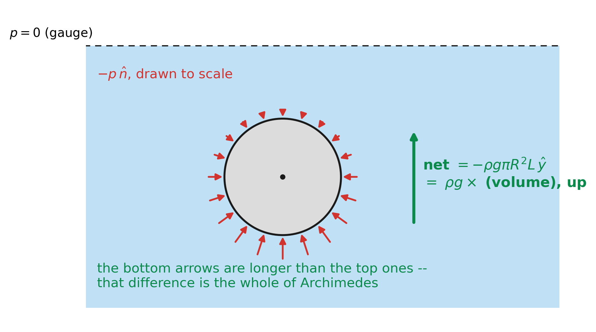{width="70%"}

::::::

:::::::

::::::: {#curved-surfaces-q15 .clicker data-answer="c"}

::: {.clicker-title}
Q15 · The recipe, in the abstract
:::

::: {.stem}
We just did four things in a fixed order. Which one has to come **first**?
:::

::: {.opts}
- **(a)**  Write $p$ in terms of the surface coordinates
- **(b)**  Write $\hat{n}$ in the components we want
- **(c)**  Decide which two coordinates vary on the surface, and get $dA$
- **(d)**  Split the integral into components
:::

:::::: {.clicker-answer}

::: {.stem}
The surface picks the coordinates, and *then* everything else has to be
rewritten to match — $p$, $\hat{n}$, and the bounds.
:::

::::::

:::::::

## 4.3 Moments and some more examples

*Reading: [4.3 Moments and some more examples](moments.qmd)*

### First: finishing off moments

::::::: {#moments-q1 .clicker data-answer="c" data-tempting="d"}

::: {.clicker-title}
Q1 · Moment on a gate hinge
:::

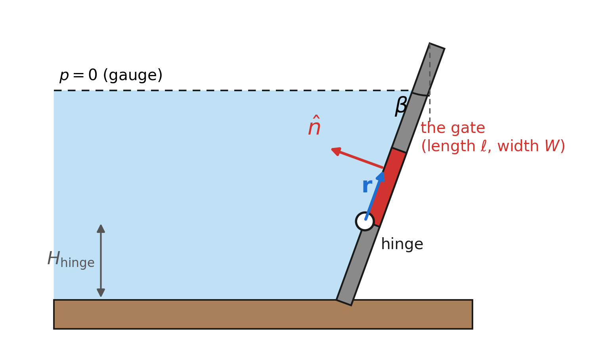{width="70%"}

::: {.stem}
The gate on the leaning wall. The lever arm $\mathbf{r}$ runs **up the wall**
from the hinge, and $\hat{n}$ points **into the fluid**. What is
$\mathbf{r}\wedge\hat{n}$?
:::

::: {.opts}
- **(a)**  $|\mathbf{r}|\cos\beta$
- **(b)**  $|\mathbf{r}|\sin\beta$
- **(c)**  $|\mathbf{r}|$
- **(d)**  $0$
:::

:::::: {.clicker-answer}

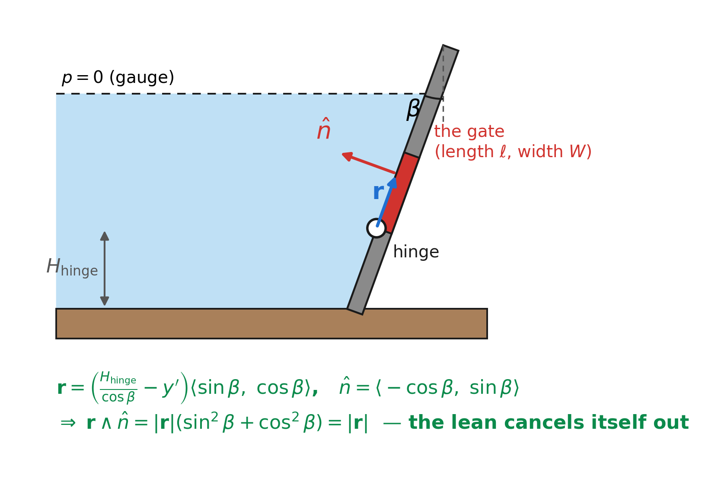{width="70%"}

::::::

:::::::

::::::: {#moments-q2 .clicker data-answer="b" data-tempting="a,c"}

::: {.clicker-title}
Q2 · The lever arm on the curved corner
:::

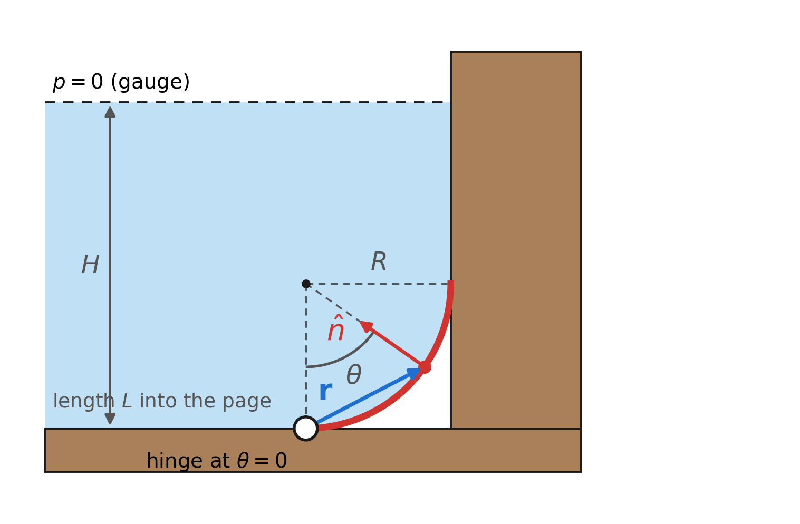{width="70%"}

::: {.stem}
The quarter-cylinder corner, now hinged at $\theta = 0$. What is $\mathbf{r}$,
from the hinge to the point at angle $\theta$?
:::

::: {.opts}
- **(a)**  $\langle R\sin\theta,\ -R\cos\theta\rangle$
- **(b)**  $\langle R\sin\theta,\ R - R\cos\theta\rangle$
- **(c)**  $\langle R\cos\theta,\ R - R\sin\theta\rangle$
- **(d)**  $\langle 0,\ R\rangle$
:::

:::::: {.clicker-answer}

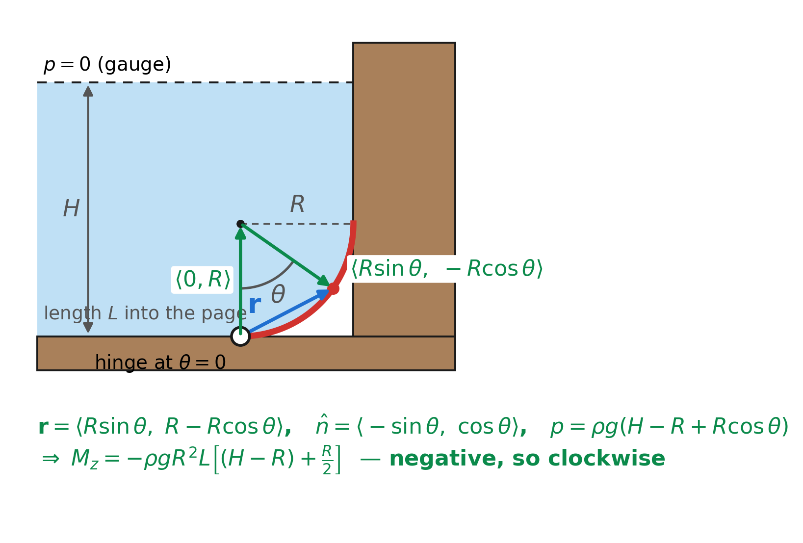{width="70%"}

::: {.stem}
Trace it in two hops: hinge $\to$ center is $\langle 0, R\rangle$, center
$\to$ surface is $\langle R\sin\theta,\ -R\cos\theta\rangle$.
:::

::: {.aside-note}
Check it at $\theta = 0$: you should get $\mathbf{r} = \mathbf{0}$.
:::

::::::

:::::::

::::::: {#moments-q3 .clicker data-answer="b"}

::: {.clicker-title}
Q3 · Which way does it swing?
:::

{width="70%"}

::: {.stem}
Same corner, same hinge. Which way does the water try to rotate it?
:::

::: {.opts}
- **(a)**  Counter-clockwise, $M_z > 0$
- **(b)**  Clockwise, $M_z < 0$
- **(c)**  Neither — by symmetry the moments cancel
- **(d)**  Can't tell without numbers for $H$, $R$, and $L$
:::

:::::: {.clicker-answer}

::::::

:::::::
