

These are the ConceptTests from class for Unit 3 (bernoulli's equation), in the order we asked them — so you can go back and vote again at your own pace. There are 20 of them, grouped by the reading they go with (Bernoulli's equation and its applications).

Here's how it works: click the option you'd pick. A wrong pick turns red and you can try again (no penalty, and talking it over on Slack is encouraged, not cheating). Land on the right one — or give up and hit *Show answer* — and you get the explanation. Nothing here is recorded or graded. (The answers are sitting in the page source, so this could never be an assessment anyway; it's just for practice.)

## 5.1 Bernoulli's equation

*Reading: [5.1 Bernoulli's Equation](bernoulli.qmd)*

### Streamlines

::::::: {#bernoulli-q1 .clicker data-answer="c"}

::: {.clicker-title}
Q1 · Pick the streamline
:::

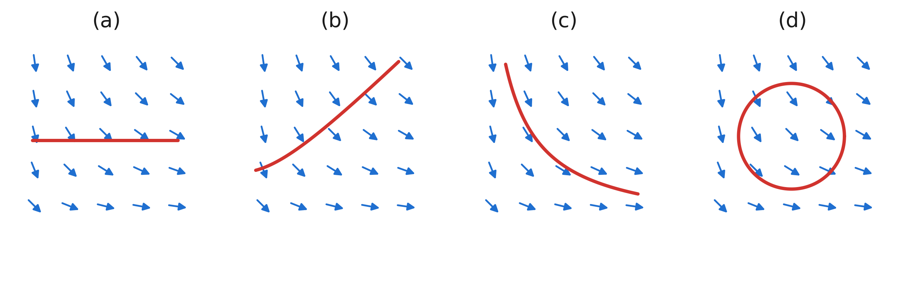{width="97%"}

::: {.stem}
Above the same velocity field is sketched four times with a different red curve drawn on each. Which red curve is a **streamline**?
:::

::: {.opts .letters}
- **(a)**
- **(b)**
- **(c)**
- **(d)**
:::

:::::: {.clicker-answer}

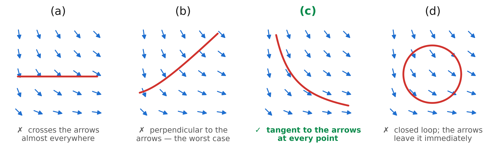{width="97%"}

::: {.stem}
Parallel to the velocity field at *every* point, not just a few.
:::

::::::

:::::::

::::::: {#bernoulli-q2 .clicker data-answer="a" data-tempting="b"}

::: {.clicker-title}
Q2 · What are we allowed to equate?
:::

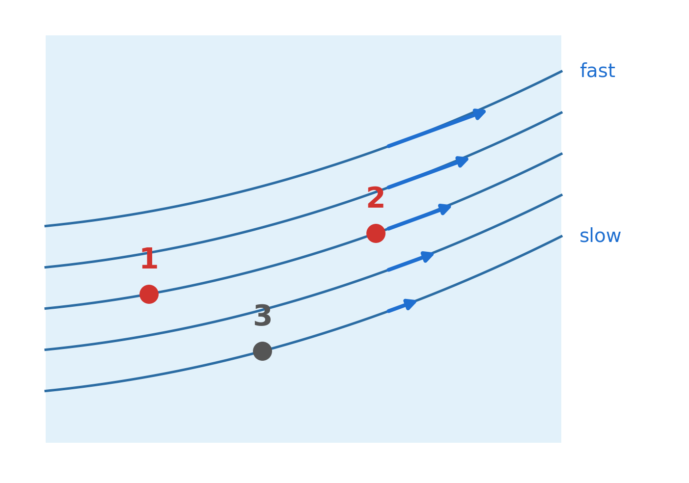{width="70%"}

::: {.stem}
In this flow where the top is moving faster than the bottom. Points **1** and **2**
share a streamline; **3** is on a different one. Which is true?
:::

::: {.opts}
- **(a)**  $p_1 + \tfrac12\rho V_1^2 + \rho g z_1 = p_2 + \tfrac12\rho V_2^2 + \rho g z_2$
- **(b)**  $p_1 + \tfrac12\rho V_1^2 + \rho g z_1 = p_3 + \tfrac12\rho V_3^2 + \rho g z_3$
- **(c)**  Both
- **(d)**  Neither
:::

:::::: {.clicker-answer}

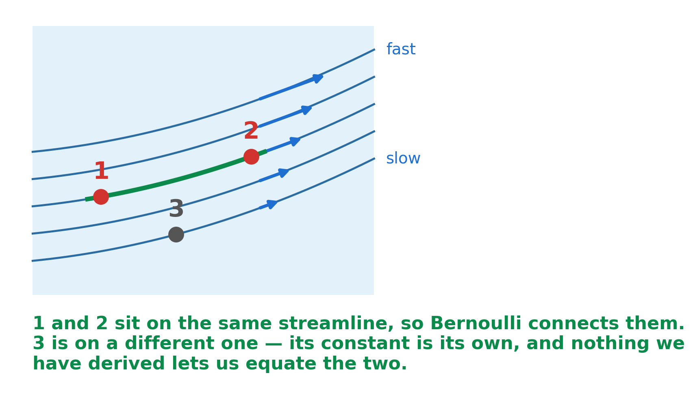{width="70%"}

::: {.stem}
We integrated along $s$.
:::

::::::

:::::::

### Where the equation came from

::::::: {#bernoulli-q3 .clicker data-answer="c" data-tempting="d"}

::: {.clicker-title}
Q3 · A discarded force
:::

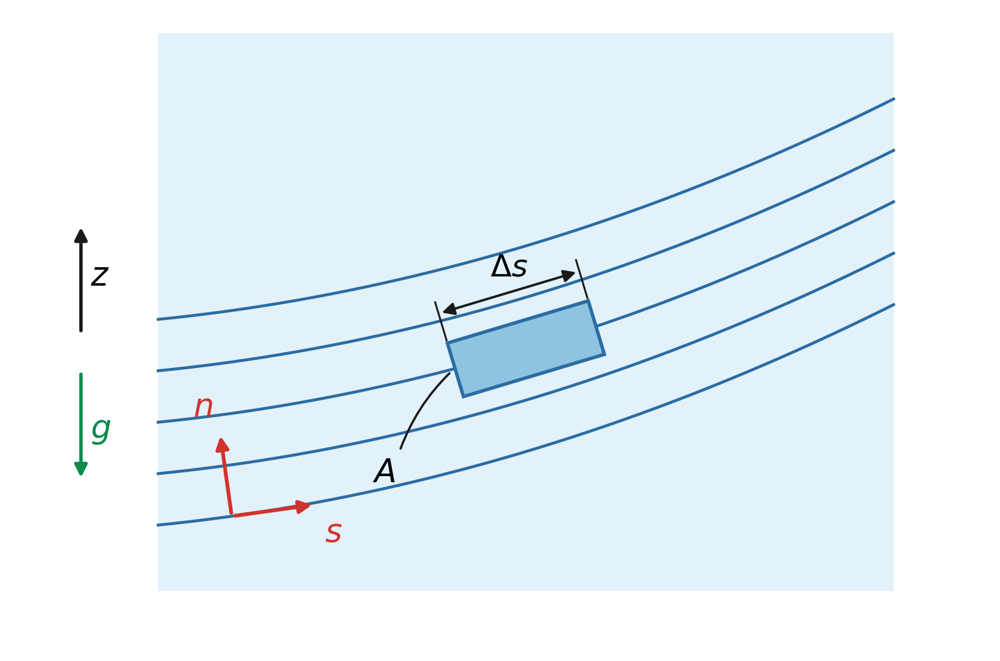{width="70%"}

::: {.stem}
In $\sum F_s = m a_s$ for this parcel, we kept two forces and dropped a
third. Which one did we drop?
:::

::: {.opts}
- **(a)**  The pressure difference between the two end faces
- **(b)**  The component of the parcel's weight along $\hat{s}$
- **(c)**  The shear from its neighboring streamlines
- **(d)**  Nothing — all three are in the balance
:::

:::::: {.clicker-answer}

::::::

:::::::

::::::: {#bernoulli-q4 .clicker data-answer="b" data-tempting="a,c"}

::: {.clicker-title}
Q4 · The net pressure force
:::

{width="70%"}

::: {.stem}
Pressure pushes **in** on both end faces, each of area $A$, and they're $\Delta s$
apart. After the Taylor series, what is the net force in $\hat{s}$?
:::

::: {.opts}
- **(a)**  $A\,p(s) + A\,p(s+\Delta s)$
- **(b)**  $-A\,\dfrac{\partial p}{\partial s}\,\Delta s$
- **(c)**  $-A\,\dfrac{\partial p}{\partial s}$
- **(d)**  $-\rho g A \Delta s \dfrac{\partial z}{\partial s}$
:::

:::::: {.clicker-answer}

::::::

:::::::

::::::: {#bernoulli-q5 .clicker data-answer="b" data-tempting="a,c"}

::: {.clicker-title}
Q5 · Steady flow, zero acceleration?
:::

{width="70%"}

::: {.stem}
The flow is **steady**: at any fixed point in space, nothing changes with time.
So what is the parcel's acceleration along the streamline?
:::

::: {.opts}
- **(a)**  Zero — steady means $\partial V_s/\partial t = 0$
- **(b)**  $V_s\,\dfrac{\partial V_s}{\partial s}$
- **(c)**  $\dfrac{\partial V_s}{\partial s}$
- **(d)**  $g\,\dfrac{\partial z}{\partial s}$
:::

:::::: {.clicker-answer}

::: {.stem}
Steady says the **field** is not varying with time, but a fluid parcel within it may be changing speed as it moves.
:::

::: {.aside-note}
Chain rule: $\dfrac{\partial V_s}{\partial t} = \dfrac{\partial s}{\partial t}\dfrac{\partial V_s}{\partial s}$, and $\partial s/\partial t$ is just $V_s$.
:::

::::::

:::::::

::::::: {#bernoulli-q6 .clicker data-answer="d" data-tempting="a"}

::: {.clicker-title}
Q6 · What kind of term is $\tfrac12\rho V^2$?
:::

::: {.stem}
$p + \tfrac12\rho V^2 + \rho g z = \text{constant}$. If we're allowed to add
these three together, they'd better share units. So $\tfrac12\rho V^2$ is...
:::

::: {.opts}
- **(a)**  an energy
- **(b)**  a pressure
- **(c)**  an energy per unit volume
- **(d)**  both (b) and (c) — those are the same units
:::

:::::: {.clicker-answer}

::: {.stem}
$$\frac{\mathrm{J}}{\mathrm{m}^3} = \frac{\mathrm{N}\cdot\mathrm{m}}{\mathrm{m}^3} = \frac{\mathrm{N}}{\mathrm{m}^2} = \mathrm{Pa}$$
:::

::::::

:::::::

::::::: {#bernoulli-q7 .clicker data-answer="b"}

::: {.clicker-title}
Q7 · Force, integrated over distance
:::

::: {.stem}
We got Bernoulli by integrating $\sum F_s = ma_s$ with respect to $s$ — a
distance. Force integrated over distance is...
:::

::: {.opts}
- **(a)**  a moment
- **(b)**  work, hence energy
- **(c)**  power
- **(d)**  impulse
:::

:::::: {.clicker-answer}

::::::

:::::::

### Putting it to work

::::::: {#bernoulli-q8 .clicker data-answer="b" data-tempting="a"}

::: {.clicker-title}
Q8 · Through the nozzle
:::

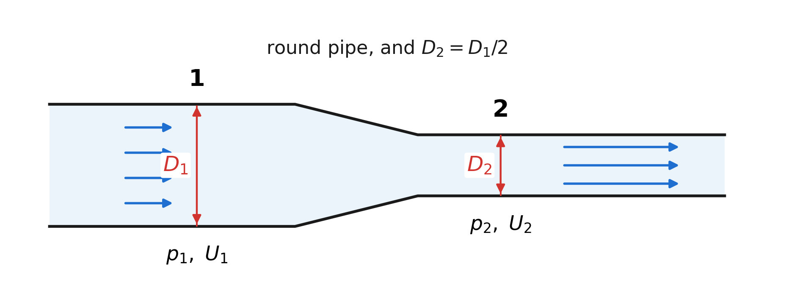{width="86%"}

::: {.stem}
Steady, incompressible, round pipe, and the throat has **half** the diameter.
If $U_1 = 1.0$ m/s, what is $U_2$?
:::

::: {.opts}
- **(a)**  $2.0$ m/s
- **(b)**  $4.0$ m/s
- **(c)**  $0.5$ m/s
- **(d)**  $1.0$ m/s — mass is conserved, so speed is conserved
:::

:::::: {.clicker-answer}

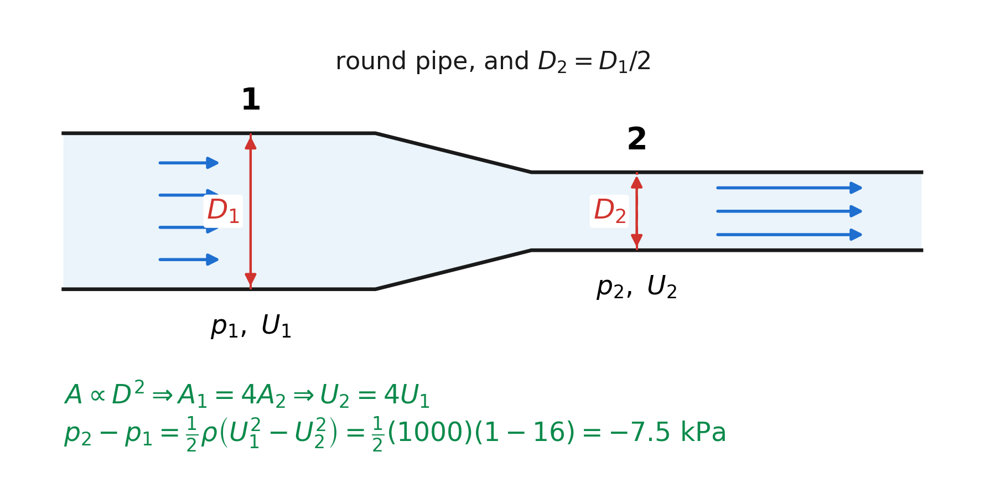{width="80%"}

::: {.stem}
$\dot m = \rho U A$ is what's conserved, not $U$. And area goes as $D^2$, so
halving the diameter quarters the area and quadruples the speed.
:::

::::::

:::::::

::::::: {#bernoulli-q9 .clicker data-answer="b"}

::: {.clicker-title}
Q9 · And the pressure?
:::

{width="70%"}

::: {.stem}
Same nozzle, water ($\rho = 1000$ kg/m³), lying horizontally so the $\rho g z$
terms cancel. By how much does the pressure change from **1** to **2**?
:::

::: {.opts}
- **(a)**  It *rises* by $7.5$ kPa
- **(b)**  It drops by $7.5$ kPa
- **(c)**  It rises by $15$ kPa
- **(d)**  It drops by $15$ kPa
:::

:::::: {.clicker-answer}

{width="70%"}

::::::

:::::::

::::::: {#bernoulli-q10 .clicker data-answer="a" data-tempting="b,d"}

::: {.clicker-title}
Q10 · The left-turn lane
:::

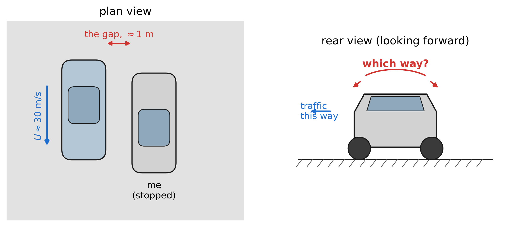{width="92%"}

::: {.stem}
Right before I turn into my neighborhood, I sit in the left-turn lane while
oncoming traffic zips by. My car ends up subtly tilting to one side with each
passing car. Which way?
:::

::: {.opts}
- **(a)**  It tilts to the **left**, leaning *towards* traffic
- **(b)**  It tilts to the **right**, leaning *away from* traffic
- **(c)**  It doesn't tilt, you're crazy
- **(d)**  It depends on turbulence
:::

:::::: {.clicker-answer}

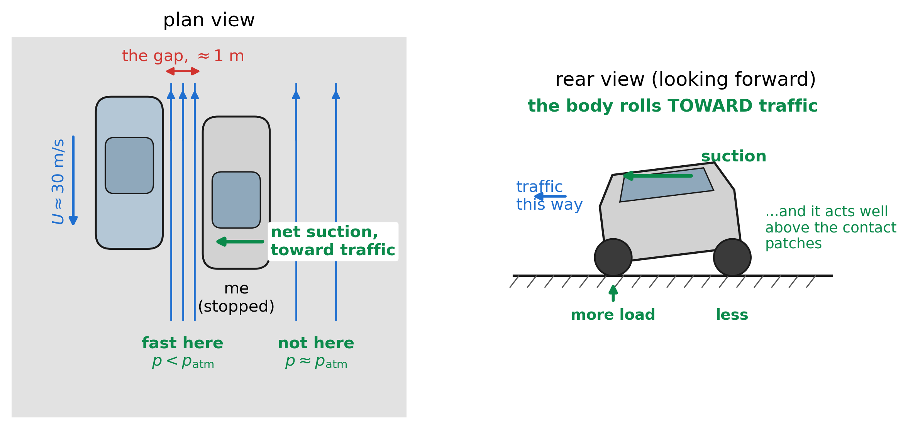{width="90%"}

::::::

:::::::

## 5.2 Applications of Bernoulli

*Reading: [5.2 Applications of Bernoulli](bernoulli-app.qmd)*

### Warm-ups: the three devices

::::::: {#bernoulli-applications-q1 .clicker data-answer="b"}

::: {.clicker-title}
Q1 · Where's the low pressure?
:::

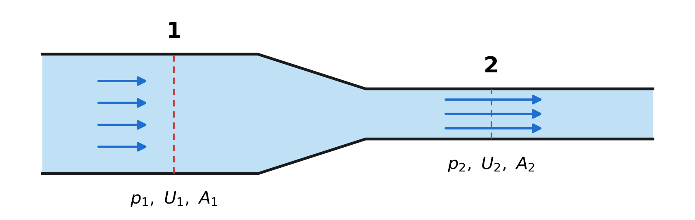{width="82%"}

::: {.stem}
Water flows steadily through this Venturi nozzle, from the wide section (1)
into the narrow throat (2). Where is the pressure lower?
:::

::: {.opts}
- **(a)**  At station 1, the wide section
- **(b)**  At station 2, the throat
- **(c)**  They're equal — pressure doesn't depend on area
- **(d)**  Can't tell without knowing the flow rate
:::

:::::: {.clicker-answer}

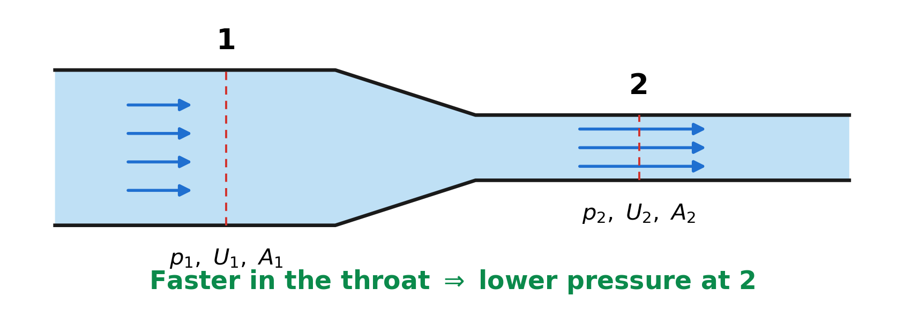{width="78%"}

::: {.stem}
Continuity (conservation of mass) means the flow is faster in the throat; Bernoulli says faster flow
means lower pressure.
:::

::::::

:::::::

::::::: {#bernoulli-applications-q2 .clicker data-answer="b"}

::: {.clicker-title}
Q2 · What does the nose of a Pitot tube measure?
:::

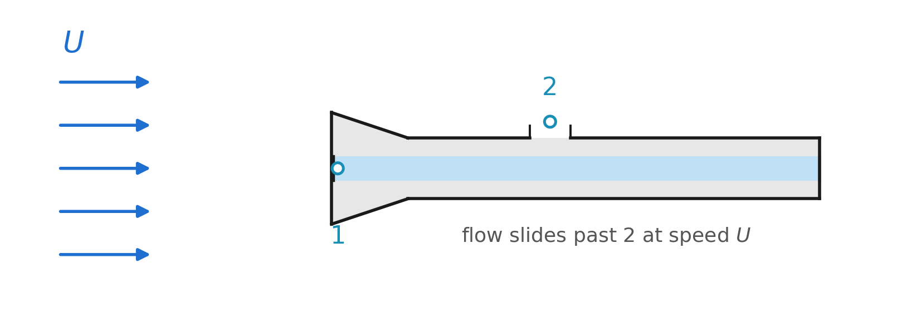{width="76%"}

::: {.stem}
At the nose (1), the oncoming flow is brought to a complete stop. What
pressure does a tap there read?
:::

::: {.opts}
- **(a)**  Static pressure
- **(b)**  Stagnation pressure
- **(c)**  Stoic pressure
- **(d)**  None — the nose measures temperature
:::

:::::: {.clicker-answer}

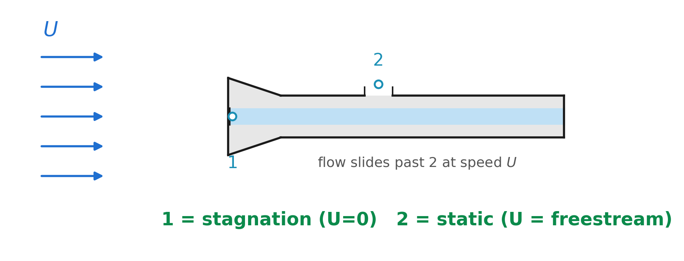{width="76%"}

::::::

:::::::

::::::: {#bernoulli-applications-q3 .clicker data-answer="a"}

::: {.clicker-title}
Q3 · Which reads higher?
:::

{width="76%"}

::: {.stem}
For the two ports — nose (stagnation) and side
(static) — which is true?
:::

::: {.opts}
- **(a)**  $p_\text{stagnation} \geq p_\text{static}$, always
- **(b)**  $p_\text{stagnation} \leq p_\text{static}$, always
- **(c)**  They're equal, always
- **(d)**  It depends on the flow speed — could go either way
:::

:::::: {.clicker-answer}

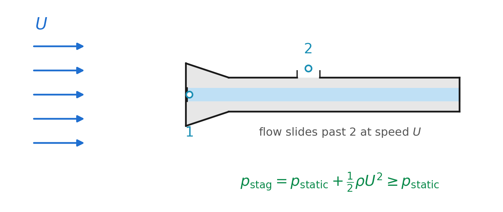{width="76%"}

::::::

:::::::

::::::: {#bernoulli-applications-q4 .clicker data-answer="b"}

::: {.clicker-title}
Q4 · Double the height, what happens to the jet speed?
:::

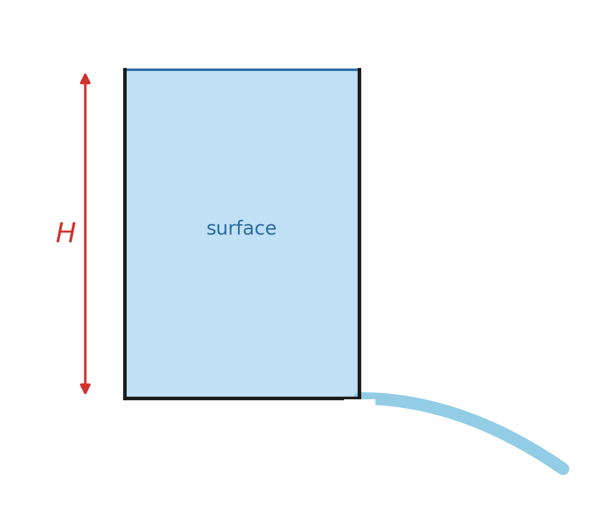{width="70%"}

::: {.stem}
A tank drains through a small hole a height $H$ below the surface. If we
double $H$, what happens to the exit speed $U_\text{jet}$?
:::

::: {.opts}
- **(a)**  It doubles
- **(b)**  It increases by a factor of $\sqrt{2}$
- **(c)**  It quadruples
- **(d)**  It's unchanged — speed only depends on the hole size
:::

:::::: {.clicker-answer}

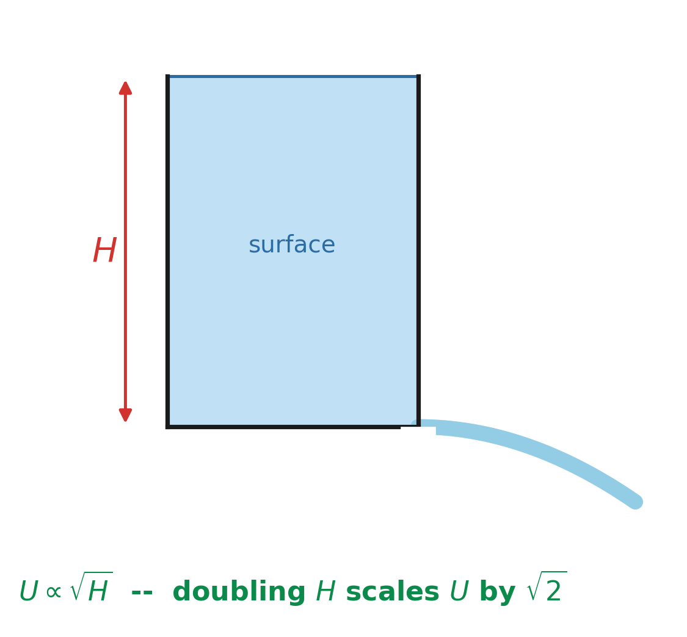{width="70%"}

::::::

:::::::

### Setting up the siphon

::::::: {#bernoulli-applications-q5 .clicker data-answer="b" data-tempting="a"}

::: {.clicker-title}
Q5 · Which two points?
:::

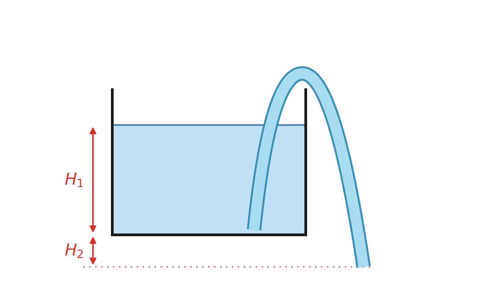{width="70%"}

::: {.stem}
A rain barrel drains through a siphon: the hose dips into the water, arcs
over the rim, and ends below the base of the barrel. We want to determine the exit
speed. Which two points should we connect with a streamline+Bernoulli's Equation?
:::

::: {.opts}
- **(a)**  The water surface and the crest (top of the hose)
- **(b)**  The water surface and the hose exit
- **(c)**  The crest and the hose exit
- **(d)**  Doesn't matter — any two points on the streamline work
:::

:::::: {.clicker-answer}

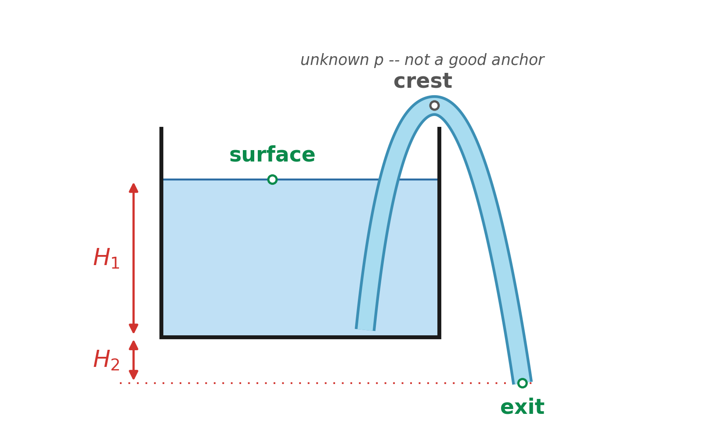{width="70%"}

::: {.stem}
Think about where you know information, and where you need information, and then connect those points with Bernoulli's Equation. Call the surface **1** and the exit **2** from here on.
:::

::::::

:::::::

::::::: {#bernoulli-applications-q6 .clicker data-answer="a" data-tempting="b,c"}

::: {.clicker-title}
Q6 · What's the pressure at each end?
:::

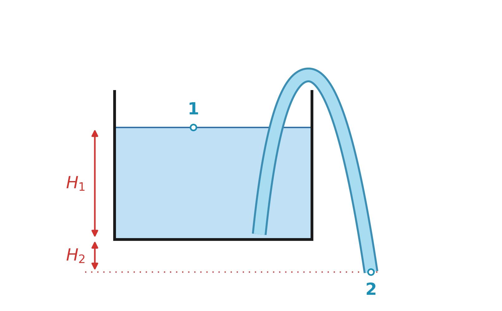{width="70%"}

::: {.stem}
Both the barrel's surface (1) and the hose's free end (2) are open to the
atmosphere. In gauge pressure, what can we say about $p_1$ and $p_2$?
:::

::: {.opts}
- **(a)**  $p_1 = p_2 = 0$ (gauge)
- **(b)**  $p_1 > p_2$, since the surface sits higher up
- **(c)**  $p_1 < p_2$, because the exit is moving faster
- **(d)**  We need the local barometric pressure to say anything
:::

:::::: {.clicker-answer}

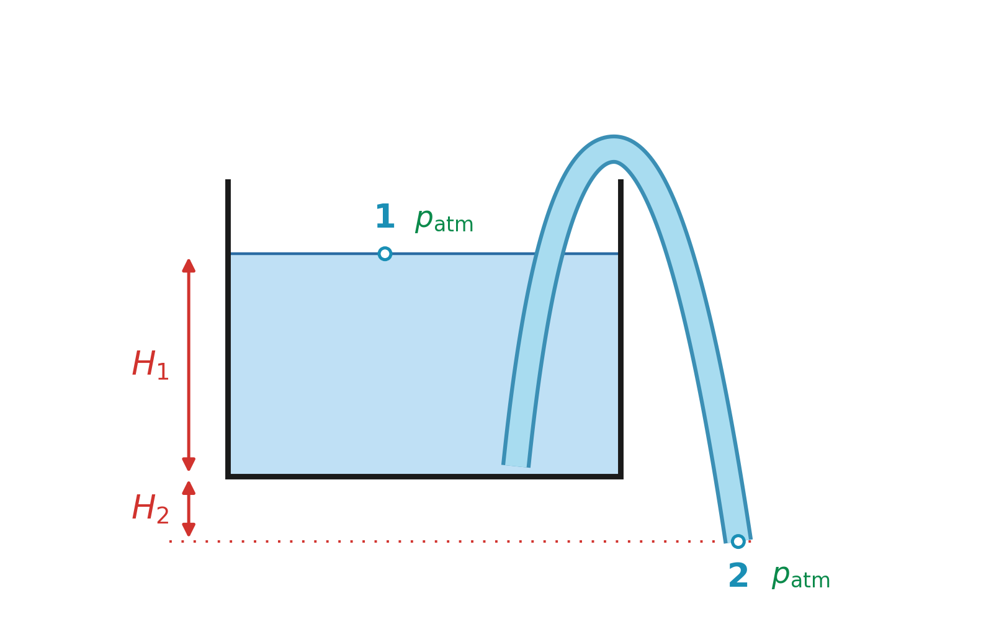{width="70%"}

::::::

:::::::

::::::: {#bernoulli-applications-q7 .clicker data-answer="c" data-tempting="a,b,d"}

::: {.clicker-title}
Q7 · Reading off the heights
:::

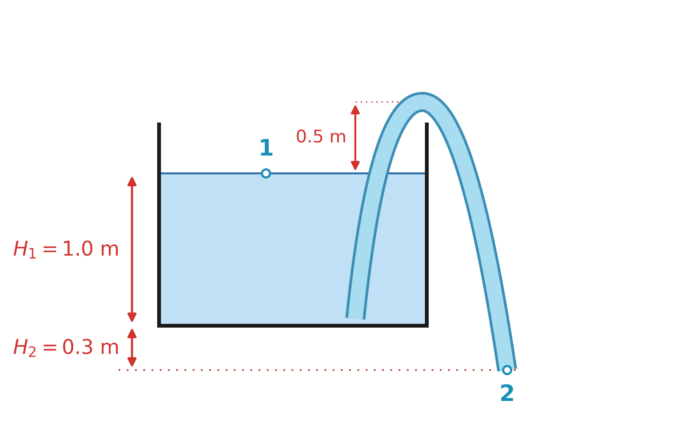{width="84%"}

::: {.stem}
Define $z=0$ at the tank's surface. Reading the
picture, what are $z_1$ and $z_2$?
:::

::: {.opts}
- **(a)**  $z_1 = 1.3$ m, $z_2 = 0$
- **(b)**  $z_1 = 0$, $z_2 = -1.0$ m
- **(c)**  $z_1 = 0$, $z_2 = -1.3$ m
- **(d)**  $z_1 = 0$, $z_2 = +1.3$ m
:::

:::::: {.clicker-answer}

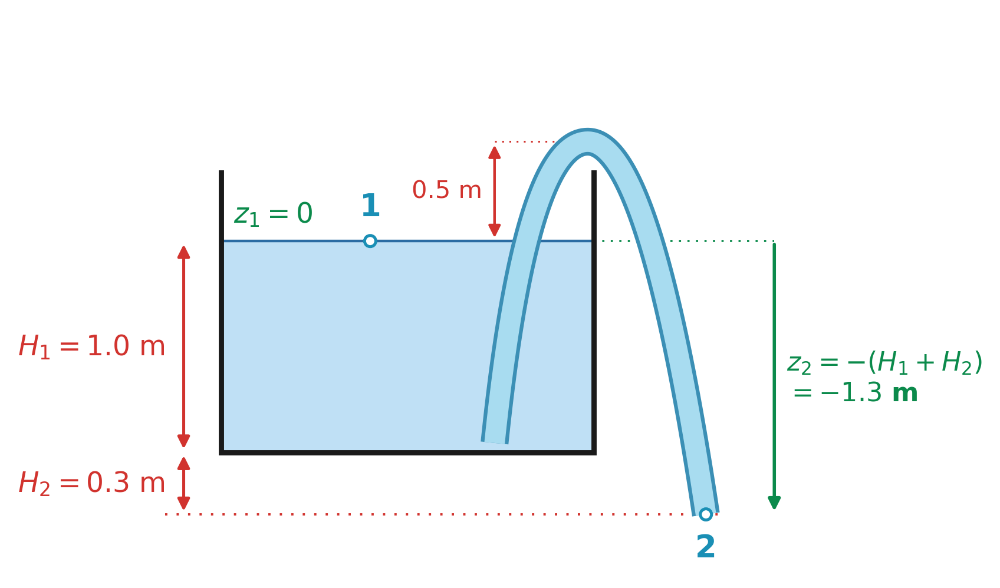{width="84%"}

::::::

:::::::

::::::: {#bernoulli-applications-q8 .clicker data-answer="d" data-tempting="a,b,c"}

::: {.clicker-title}
Q8 · Simplifying Bernoulli
:::

::: {.stem}
Surface (1) to exit (2), with $z=0$ at the surface: $p_1 = p_2$ (both
atmospheric), $U_1 \approx 0$ (wide barrel), $z_1 = 0$, and
$z_2 = -(H_1 + H_2)$. What is left?
:::

::: {.opts}
- **(a)**  $p_\text{atm} = \tfrac12 \rho U_2^2- \rho g (H_1 + H_2)$
- **(b)**  $\tfrac12 \rho U_1^2 + \rho g (H_1 + H_2) = \tfrac12 \rho U_2^2$
- **(c)**  $p_\text{atm}+\tfrac12\rho U_1^2 = \tfrac12\rho U_2^2 - \rho g (H_1+H_2)$
- **(d)**  $0 = \tfrac12 \rho U_2^2-\rho g (H_1 + H_2) $
:::

:::::: {.clicker-answer}

::::::

:::::::

::::::: {#bernoulli-applications-q9 .clicker data-answer="c" data-tempting="d"}

::: {.clicker-title}
Q9 · Raise the hose
:::

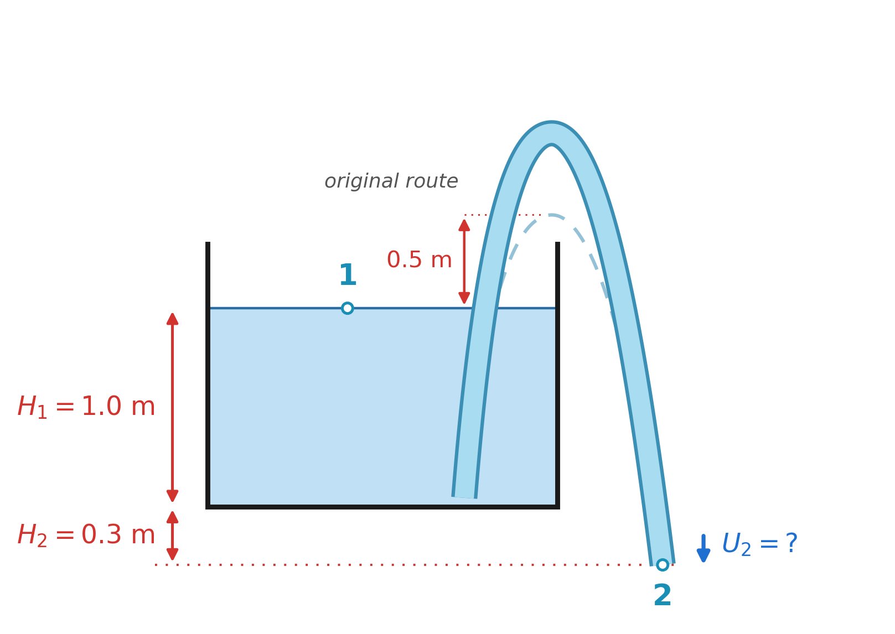{width="84%"}

::: {.stem}
Same barrel, same exit, but the hose now arcs higher over the wall — the
crest sits higher above the surface than before. What happens to $U_2$?
:::

::: {.opts}
- **(a)**  $U_2$ increases — more distance for the water to fall on the far side
- **(b)**  $U_2$ decreases — the water works harder to get over a higher crest
- **(c)**  $U_2$ is unchanged — it only cares about the surface-to-exit drop
- **(d)**  Eventually the siphon stops working altogether
:::

:::::: {.clicker-answer}

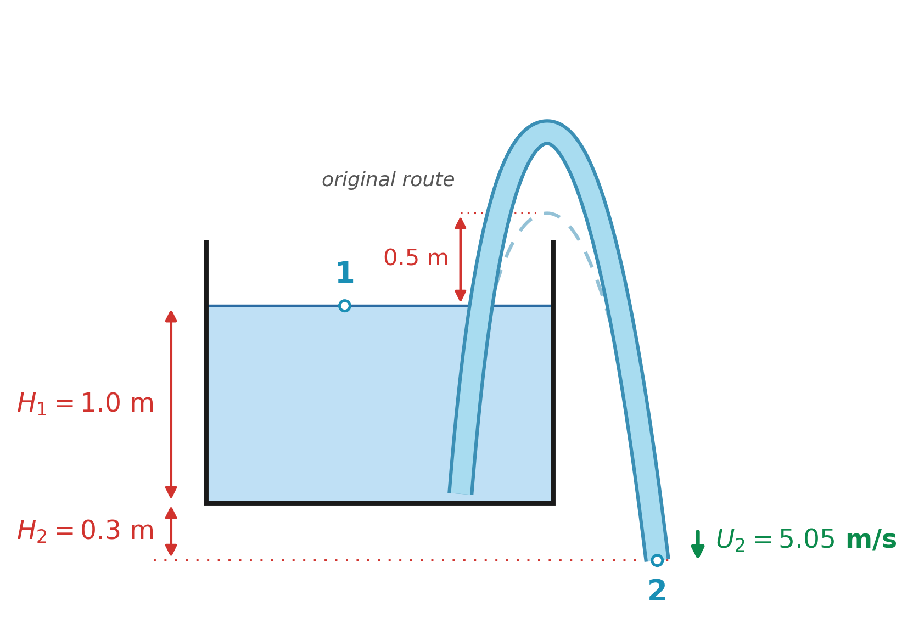{width="84%"}

::: {.aside-note}
(d) is actually *true*, but it's a different question: raise the crest far
enough and the pressure there eventually hits vapor pressure and the
column breaks.
:::

::::::

:::::::

::::::: {#bernoulli-applications-q10 .clicker data-answer="a"}

::: {.clicker-title}
Q10 · Lower the exit
:::

::: {.stem}
What happens if we have the same siphon inlet, same crest height, but the siphon sits 0.5 m lower (siphon is ~0.5 m longer)?
:::

::: {.opts}
- **(a)**  $U_2$ increases
- **(b)**  $U_2$ decreases
- **(c)**  $U_2$ is unchanged
- **(d)**  The siphon stops working
:::

:::::: {.clicker-answer}

::::::

:::::::
